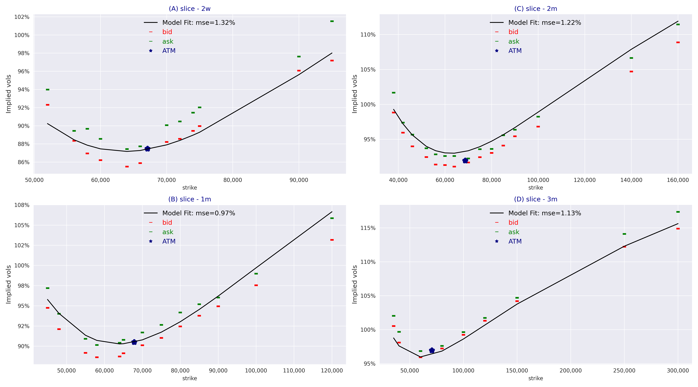
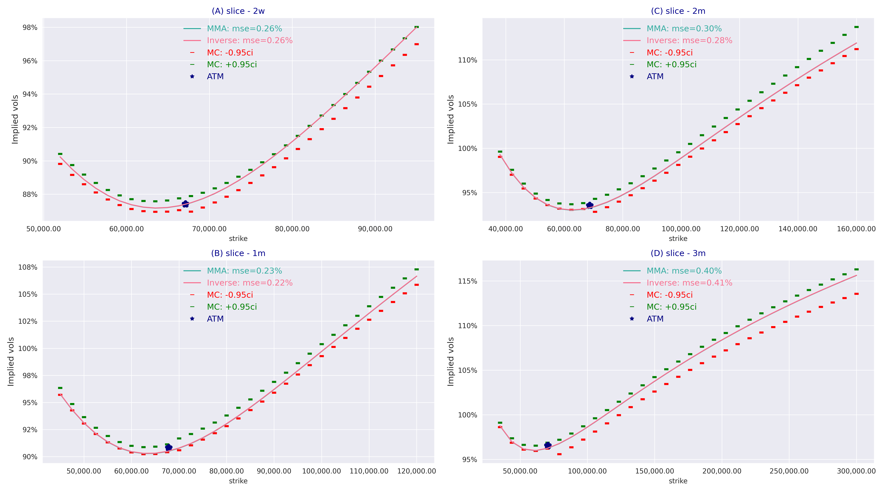

# StochVolModels
Implement pricing analytics and Monte Carlo simulations for stochastic volatility models including log-normal SV model and Heston SV model
The analytics for the lognormal is based on the paper

[Log-normal Stochastic Volatility Model with Quadratic Drift: Applications to Assets with Positive Return-Volatility Correlation and to Inverse Martingale Measures](https://papers.ssrn.com/sol3/papers.cfm?abstract_id=2522425) by Artur Sepp and Parviz Rakhmonov


# Table of contents
1. [Model Interface](#introduction)
    1. [Log-normal stochastic volatility model](#logsv)
    2. [Heston stochastic volatility model](#hestonsv)
3. [Running log-normal SV pricer](#paragraph1)
    1. [Computing model prices and vols](#subparagraph1)
   2. [Running model calibration to sample Bitcoin options data](#subparagraph2)
   3. [Running model calibration to sample Bitcoin options data](#subparagraph3)
4. [Analysis and figures for the paper](#paragraph2)


Running model calibration to sample Bitcoin options data

## Model Interface <a name="introduction"></a>
The package provides interfaces for a generic volatility model with the following features.
1) Interface for analytical pricing of vanilla options using Fourier transform with closed-form solution for moment generating function
2) Interface for Monte-Carlo simulations of model dynamics
3) Interface for visualization of model implied volatilities

The model interface is in svm/pricers/model_pricer.py

### Log-normal stochastic volatility model <a name="logsv"></a>

Implementation of Lognormal SV model is based on paper https://github.com/ArturSepp/StochVolModels/blob/main/docs/lognormal_stoch_vol_paper.pdf


The dynamics of the log-normal stochastic volatility model:

$$dS_{t}=r(t)S_{t}dt+\sigma_{t}S_{t}dW^{(0)}_{t}$$

$$d\sigma_{t}=\left(\kappa_{1} + \kappa_{2}\sigma_{t} \right)(\theta - \sigma_{t})dt+  \beta  \sigma_{t}dW^{(0)}_{t} +  \varepsilon \sigma_{t} dW^{(1)}_{t}$$

$$dI_{t}=\sigma^{2}_{t}dt$$

where $r(t)$ is the deterministic risk-free rate; $W^{(0)}_{t}$ and $W^{(1)}_t$  are uncorrelated Brownian motions, $\beta\in\mathbb{R}$ is the volatility beta which measures the sensitivity of the volatility to changes in the spot price, and $\varepsilon>0$ is the volatility of residual volatility. We denote by $\vartheta^{2}$, $\vartheta^{2}=\beta^{2}+\varepsilon^{2}$, the total instantaneous variance of the volatility process.


Implementation of Lognormal SV model is contained in logsv_pricer.py


### Heston stochastic volatility model <a name="hestonsv"></a>

The dynamics of Heston stochastic volatility model:

$$dS_{t}=r(t)S_{t}dt+\sqrt{V_{t}}S_{t}dW^{(S)}_{t}$$

$$dV_{t}=\kappa (\theta - V_{t})dt+  \vartheta  \sqrt{V_{t}}dW^{(V)}_{t}$$

where  $W^{(S)}$ and $W^{(V)}$ are correlated Brownian motions with correlation parameter $\rho$

Implementation of Heston SV model is contained in heston_pricer.py


## Running log-normal SV pricer <a name="paragraph1"></a>

Basic features are implemented in testing/run_lognormal_sv_pricer.py


### Computing model prices and vols <a name="subparagraph1"></a>

```python 
# instance of pricer
logsv_pricer = LogSVPricer()

# define model params    
params = LogSvParams(sigma0=1.0, theta=1.0, kappa1=5.0, kappa2=5.0, beta=0.2, volvol=2.0)

# 1. compute ne price
model_price, vol = logsv_pricer.price_vanilla(params=params,
                                             ttm=0.25,
                                             forward=1.0,
                                             strike=1.0,
                                             optiontype='C')
print(f"price={model_price:0.4f}, implied vol={vol: 0.2%}")

# 2. prices for slices
model_prices, vols = logsv_pricer.price_slice(params=params,
                                             ttm=0.25,
                                             forward=1.0,
                                             strikes=np.array([0.9, 1.0, 1.1]),
                                             optiontypes=np.array(['P', 'C', 'C']))
print([f"{p:0.4f}, implied vol={v: 0.2%}" for p, v in zip(model_prices, vols)])

# 3. prices for option chain with uniform strikes
option_chain = OptionChain.get_uniform_chain(ttms=np.array([0.083, 0.25]),
                                            ids=np.array(['1m', '3m']),
                                            strikes=np.linspace(0.9, 1.1, 3))
model_prices, vols = logsv_pricer.compute_chain_prices_with_vols(option_chain=option_chain, params=params)
print(model_prices)
print(vols)
```


### Running model calibration to sample Bitcoin options data  <a name="subparagraph2"></a>
```python 
btc_option_chain = chains.get_btc_test_chain_data()
params0 = LogSvParams(sigma0=0.8, theta=1.0, kappa1=5.0, kappa2=None, beta=0.15, volvol=2.0)
btc_calibrated_params = logsv_pricer.calibrate_model_params_to_chain(option_chain=btc_option_chain,
                                                                    params0=params0,
                                                                    constraints_type=ConstraintsType.INVERSE_MARTINGALE)
print(btc_calibrated_params)

logsv_pricer.plot_model_ivols_vs_bid_ask(option_chain=btc_option_chain,
                               params=btc_calibrated_params)
```



### Comparision of model prices vs MC  <a name="subparagraph2"></a>
```python 
btc_option_chain = chains.get_btc_test_chain_data()
uniform_chain_data = OptionChain.to_uniform_strikes(obj=btc_option_chain, num_strikes=31)
btc_calibrated_params = LogSvParams(sigma0=0.8327, theta=1.0139, kappa1=4.8609, kappa2=4.7940, beta=0.1988, volvol=2.3694)
logsv_pricer.plot_comp_mma_inverse_options_with_mc(option_chain=uniform_chain_data,
                                                  params=btc_calibrated_params,
                                                  nb_path=400000)
                                           
```



## Analysis and figures for the paper <a name="paragraph3"></a>

All figures in the paper can be reproduced using py scripts in svm/analysis/paper
