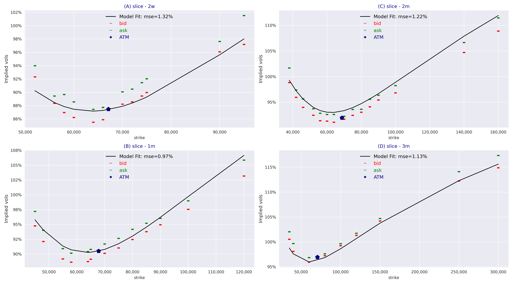
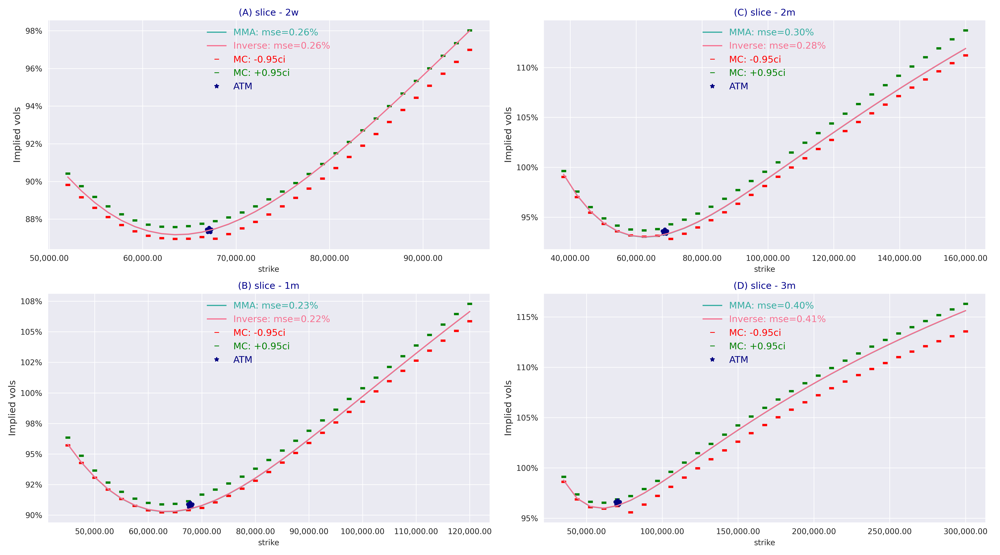

# StochVolModels (`stochvolmodels`)

**stochvolmodels package implements pricing analytics and Monte Carlo simulations for valuation of European call and put options and implied volatilities of different stochastic volatility models including Karasinski-Sepp log-normal stochastic volatility model and Heston stochastic volatility model.**

[](https://pypi.org/project/stochvolmodels/)
[](https://pypi.org/project/stochvolmodels/)
[](LICENSE.txt)
[](https://github.com/ArturSepp/StochVolModels/actions)
[](https://pepy.tech/project/stochvolmodels)
[](https://pepy.tech/project/stochvolmodels)

**Paper:** Sepp, A. and Rakhmonov, P. (2023), *Log-normal stochastic volatility model with quadratic drift*, [International Journal of Theoretical and Applied Finance, 26(8)](https://www.worldscientific.com/doi/10.1142/S0219024924500031). See [Citation](#citation) for the full BibTeX list.

---

## Why stochvolmodels

`stochvolmodels` is the reference implementation of the Karasinski-Sepp log-normal beta stochastic volatility model, maintained by one of the model's originators, with the Heston model implemented alongside as a benchmark. The design goal is a single generic interface for a stochastic volatility model — a closed-form moment generating function for Fourier-transform pricing on one side, Monte Carlo dynamics on the other — so that analytic prices, simulated prices, and calibrated implied volatilities are directly comparable model to model.

The same analytics power the research: the `papers` module reproduces the computations and figures of five papers, from the quadratic-drift log-normal SV model (IJTAF) to cryptocurrency inverse options (Quantitative Finance), robust stochastic volatility modelling, impermanent-loss hedging in DeFi, and stochastic volatility for the factor HJM framework — see [Supporting Illustrations](#papers).

## Overview

The StochVol package provides:
1) Analytics for Black-Scholes and Normal vols
2) Interfaces and implementation for stochastic volatility models,
including Karasinski-Sepp log-normal SV model and Heston SV model 
using analytical method with Fourier transform and Monte Carlo simulations
3) Visualization of model implied volatilities

For the analytic implementation of stochastic volatility models, the package provides interfaces for a generic volatility model with the following features.
1) Interface for analytical pricing of vanilla options 
using Fourier transform with closed-form solution for moment generating function
2) Interface for Monte-Carlo simulations of model dynamics


[Illustrations](#papers) of using package analytics for research 
work is provided in top-level package ```papers``` 
which contains computations and visualisations for several papers


## When to use it — and when not

Use `stochvolmodels` for European vanilla pricing and implied-volatility analytics under stochastic volatility, for model calibration to option chains (a calibration example to Bitcoin options data is included), and for replicating the papers above.

It is not a general derivatives platform: no American or path-dependent payoffs, no local-volatility or term-structure models. For fast Black-Scholes-Merton and Bachelier array pricing without stochastic volatility, use [`vanilla-option-pricers`](https://github.com/ArturSepp/VanillaOptionPricers); for strategy backtesting and reporting, use [`qis`](https://github.com/ArturSepp/QuantInvestStrats).

## Installation
Install using
```python 
pip install stochvolmodels
```
Upgrade using
```python 
pip install --upgrade stochvolmodels
```
Clone using
```python 
git clone https://github.com/ArturSepp/StochVolModels.git
```


### Core Dependencies
- `python >= 3.10`
- `numba >= 0.60.0`
- `numpy >= 2.0`
- `scipy >= 1.12.0`
- `pandas >= 2.2.0`
- `matplotlib >= 3.8.0`
- `seaborn >= 0.13.0`

### Optional extras

| Extra | Installs | Needed for |
|---|---|---|
| `research` | `qis >= 3.5.7` | scripts in `papers/` |
| `visualization` | `plotly >= 5.0.0` | interactive figures |
| `numerical` | `scikit-learn >= 1.3.0`, `statsmodels >= 0.14.0` | statistical fits |
| `jupyter` | `jupyter`, `notebook`, `jupyterlab`, `ipykernel`, `ipywidgets` | notebooks |
| `dev` | `pytest`, `pytest-cov`, `pytest-regressions`, `ruff` | tests and linting |

Install an extra using
```python
pip install stochvolmodels[research]
```
The library itself imports none of these: `import stochvolmodels` needs the core dependencies only.


# Table of contents
1. [Model Interface](#introduction)
    1. [Log-normal stochastic volatility model](#logsv)
    2. [Heston stochastic volatility model](#hestonsv)
2. [Running log-normal SV pricer](#paragraph1)
   1. [Computing model prices and vols](#subparagraph1)
   2. [Running model calibration to sample Bitcoin options data](#subparagraph2)
   3. [Comparison of model prices vs MC](#subparagraph3)
   4. [Analysis and figures for the paper](#subparagraph4)
3. [Running Heston SV pricer](#heston)
4. [Supporting Illustrations for Public Papers](#papers)


Running model calibration to sample Bitcoin options data

## Implemented Stochastic Volatility models <a name="introduction"></a>
The package provides interfaces for a generic volatility model with the following features.
1) Interface for analytical pricing of vanilla options using Fourier transform with closed-form solution for moment generating function
2) Interface for Monte-Carlo simulations of model dynamics
3) Interface for visualization of model implied volatilities

The model interface is in stochvolmodels/pricers/model_pricer.py

### Log-normal stochastic volatility model <a name="logsv"></a>

The analytics for Karasinski-Sepp log-normal stochastic volatility model is based on the paper

[Log-normal Stochastic Volatility Model with Quadratic Drift](https://www.worldscientific.com/doi/10.1142/S0219024924500031) by Artur Sepp and Parviz Rakhmonov


The dynamics of the log-normal stochastic volatility model:

$$dS_{t}=r(t)S_{t}dt+\sigma_{t}S_{t}dW^{(0)}_{t}$$

$$d\sigma_{t}=\left(\kappa_{1} + \kappa_{2}\sigma_{t} \right)(\theta - \sigma_{t})dt+  \beta  \sigma_{t}dW^{(0)}_{t} +  \varepsilon \sigma_{t} dW^{(1)}_{t}$$

$$dI_{t}=\sigma^{2}_{t}dt$$

where $r(t)$ is the deterministic risk-free rate; $W^{(0)}_{t}$ and $W^{(1)}_t$  are uncorrelated Brownian motions, $\beta\in\mathbb{R}$ is the volatility beta which measures the sensitivity of the volatility to changes in the spot price, and $\varepsilon>0$ is the volatility of residual volatility. We denote by $\vartheta^{2}$, $\vartheta^{2}=\beta^{2}+\varepsilon^{2}$, the total instantaneous variance of the volatility process.


Implementation of Lognormal SV model is contained in 
```python 
stochvolmodels/pricers/logsv_pricer.py
```

### Heston stochastic volatility model <a name="hestonsv"></a>

The dynamics of Heston stochastic volatility model:

$$dS_{t}=r(t)S_{t}dt+\sqrt{V_{t}}S_{t}dW^{(S)}_{t}$$

$$dV_{t}=\kappa (\theta - V_{t})dt+  \vartheta  \sqrt{V_{t}}dW^{(V)}_{t}$$

where  $W^{(S)}$ and $W^{(V)}$ are correlated Brownian motions with correlation parameter $\rho$

Implementation of Heston SV model is contained in 
```python 
stochvolmodels/pricers/heston_pricer.py
```

## Running log-normal SV pricer <a name="paragraph1"></a>

Basic features are implemented in 
```python 
examples/run_lognormal_sv_pricer.py
```

Imports:
```python
import numpy as np 
import stochvolmodels as sv
from stochvolmodels import LogSVPricer, LogSvParams, OptionChain
```


### Computing model prices and vols <a name="subparagraph1"></a>

```python 
# instance of pricer
logsv_pricer = LogSVPricer()

# define model params    
params = LogSvParams(sigma0=1.0, theta=1.0, kappa1=5.0, kappa2=5.0, beta=0.2, volvol=2.0)

# 1. compute the price
model_price, vol = logsv_pricer.price_vanilla(params=params,
                                             ttm=0.25,
                                             forward=1.0,
                                             strike=1.0,
                                             optiontype='C')
print(f"price={model_price:0.4f}, implied vol={vol: 0.2%}")

# 2. prices for slices
model_prices, vols = logsv_pricer.price_slice(params=params,
                                             ttm=0.25,
                                             forward=1.0,
                                             strikes=np.array([0.9, 1.0, 1.1]),
                                             optiontypes=np.array(['P', 'C', 'C']))
print([f"{p:0.4f}, implied vol={v: 0.2%}" for p, v in zip(model_prices, vols)])

# 3. prices for option chain with uniform strikes
option_chain = OptionChain.get_uniform_chain(ttms=np.array([0.083, 0.25]),
                                            ids=np.array(['1m', '3m']),
                                            strikes=np.linspace(0.9, 1.1, 3))
model_prices, vols = logsv_pricer.compute_chain_prices_with_vols(option_chain=option_chain, params=params)
print(model_prices)
print(vols)
```


### Running model calibration to sample Bitcoin options data  <a name="subparagraph2"></a>
```python 
btc_option_chain = chains.get_btc_test_chain_data()
params0 = LogSvParams(sigma0=0.8, theta=1.0, kappa1=5.0, kappa2=None, beta=0.15, volvol=2.0)
btc_calibrated_params = logsv_pricer.calibrate_model_params_to_chain(option_chain=btc_option_chain,
                                                                    params0=params0,
                                                                    constraints_type=ConstraintsType.INVERSE_MARTINGALE)
print(btc_calibrated_params)

logsv_pricer.plot_model_ivols_vs_bid_ask(option_chain=btc_option_chain,
                               params=btc_calibrated_params)
```



### Comparison of model prices vs MC  <a name="subparagraph3"></a>
```python 
btc_option_chain = chains.get_btc_test_chain_data()
uniform_chain_data = OptionChain.to_uniform_strikes(obj=btc_option_chain, num_strikes=31)
btc_calibrated_params = LogSvParams(sigma0=0.8327, theta=1.0139, kappa1=4.8609, kappa2=4.7940, beta=0.1988, volvol=2.3694)
logsv_pricer.plot_comp_mma_inverse_options_with_mc(option_chain=uniform_chain_data,
                                                  params=btc_calibrated_params,
                                                  nb_path=400000)
                                           
```



### Analysis and figures for the paper <a name="subparagraph4"></a>

All figures shown in the paper can be reproduced using py scripts in
```python 
examples/plots_for_paper
```


## Running Heston SV pricer <a name="heston"></a>

Examples are implemented here
```python 
examples/run_heston_sv_pricer.py
examples/run_heston.py
```

Content of run_heston.py
```python 
import numpy as np
import matplotlib.pyplot as plt
from stochvolmodels import HestonPricer, HestonParams, OptionChain

# define parameters for bootstrap
params_dict = {'rho=0.0': HestonParams(v0=0.2**2, theta=0.2**2, kappa=4.0, volvol=0.75, rho=0.0),
               'rho=-0.4': HestonParams(v0=0.2**2, theta=0.2**2, kappa=4.0, volvol=0.75, rho=-0.4),
               'rho=-0.8': HestonParams(v0=0.2**2, theta=0.2**2, kappa=4.0, volvol=0.75, rho=-0.8)}

# get uniform slice
option_chain = OptionChain.get_uniform_chain(ttms=np.array([0.25]), ids=np.array(['3m']), strikes=np.linspace(0.8, 1.15, 20))
option_slice = option_chain.get_slice(id='3m')

# run pricer
pricer = HestonPricer()
pricer.plot_model_slices_in_params(option_slice=option_slice, params_dict=params_dict)

plt.show()
```


## Supporting Illustrations for Public Papers <a name="papers"></a>

As illustrations of different analytics, this package includes module ```papers``` 
with codes for computations and visualisations featured in several papers
for 

1) "Log-normal Stochastic Volatility Model with Quadratic Drift" by Artur Sepp 
and Parviz Rakhmonov: https://www.worldscientific.com/doi/10.1142/S0219024924500031
```python 
stochvolmodels/papers/logsv_model_with_quadratic_drift
```


2) "What is a robust stochastic volatility model" by Artur Sepp and Parviz Rakhmonov, SSRN:
https://papers.ssrn.com/sol3/papers.cfm?abstract_id=4647027
```python 
stochvolmodels/papers/volatility_models
```


3) "Valuation and Hedging of Cryptocurrency Inverse Options" by Artur Sepp
and Vladimir Lucic, 
SSRN: https://papers.ssrn.com/sol3/papers.cfm?abstract_id=4606748 
```python 
stochvolmodels/papers/inverse_options
```

4) "Unified Approach for Hedging Impermanent Loss of Liquidity Provision" by 
Artur Sepp, Alexander Lipton and Vladimir Lucic, 
SSRN: https://papers.ssrn.com/sol3/papers.cfm?abstract_id=4887298 
```python 
stochvolmodels/papers/il_hedging
```

5) "Stochastic Volatility for Factor Heath-Jarrow-Morton Framework" by Artur Sepp and Parviz Rakhmonov, SSRN:
https://papers.ssrn.com/sol3/papers.cfm?abstract_id=4646925
```python 
stochvolmodels/papers/sv_for_factor_hjm
```

## Project Structure

```
StochVolModels/
├── stochvolmodels/
│   ├── data/
│   │   ├── option_chain.py           # OptionChain and OptionSlice containers
│   │   ├── sample_option_chains.py   # BTC, VIX, GLD, SQQQ and SPY sample chains
│   │   └── fetch_option_chain.py     # live chains via option-chain-analytics
│   ├── pricers/
│   │   ├── model_pricer.py           # ModelPricer and ModelParams interface
│   │   ├── logsv_pricer.py           # log-normal SV
│   │   ├── heston_pricer.py          # Heston
│   │   ├── hawkes_jd_pricer.py       # Hawkes jump-diffusion
│   │   ├── gmm_pricer.py             # Gaussian mixture
│   │   ├── tdist_pricer.py           # t-distribution
│   │   ├── analytic/                 # BSM, Bachelier and t-distribution formulas
│   │   ├── logsv/                    # affine expansion, params, vol moment ODEs
│   │   ├── rough_logsv/              # rough kernel and split simulation
│   │   └── factor_hjm/               # rates: factor HJM with log-normal SV
│   ├── utils/
│   │   ├── mgf_pricer.py             # MGF grids and transform pricing
│   │   ├── rate_core.py              # swap and bond conventions
│   │   ├── var_swap_pricer.py        # variance swap strike
│   │   └── config.py, funcs.py, mc_payoffs.py, plots.py
│   ├── examples/                     # runnable demonstrations
│   └── tests/                        # pytest regression tests and benchmarks
├── papers/                        # figures and calibrations for published papers
│   ├── logsv_model_with_quadratic_drift/paper/   # article PDF and LaTeX source
│   └── sv_for_factor_hjm/paper/                  # article PDF and LaTeX source
├── docs/
└── README.md
```

## Ecosystem

This package is part of an open-source Python stack for quantitative finance — full catalogue at [github.com/ArturSepp](https://github.com/ArturSepp):

| Package | Purpose |
|---|---|
| [`qis`](https://github.com/ArturSepp/QuantInvestStrats) | Performance analytics, factsheets, and visualisation |
| [`optimalportfolios`](https://github.com/ArturSepp/OptimalPortfolios) | Portfolio construction and backtesting |
| [`factorlasso`](https://github.com/ArturSepp/factorlasso) | Sparse factor models and factor covariance estimation |
| [`bbg-fetch`](https://github.com/ArturSepp/BloombergFetch) | Bloomberg data fetching |
| [`trendfollowing`](https://github.com/ArturSepp/TrendFollowingSystems) | Trend-following systems: closed-form theory and replication |
| [`goal-based-allocation`](https://github.com/ArturSepp/GoalBasedAllocation) | Dynamic MV allocation under regime-switching jump-diffusions |
| [`stochvolmodels`](https://github.com/ArturSepp/StochVolModels) *(this package)* | Stochastic volatility pricing analytics |
| [`vanilla-option-pricers`](https://github.com/ArturSepp/VanillaOptionPricers) | Vectorised vanilla option pricers and implied volatility fitters |

Dependency links within the stack: `optimalportfolios` builds on `qis` and `factorlasso`; `trendfollowing` builds on `qis`.

## Contributing

Contributions are welcome! Please feel free to submit a Pull Request. For major changes, please open an issue first to discuss what you would like to change.

## License

This project is licensed under the MIT License - see the [LICENSE.txt](LICENSE.txt) file for details.

## Citation

If you use this package in your research, please cite the relevant papers:

```bibtex
@misc{sepp2024stochvolmodels,
  title={StochVolModels: Python Implementation of Stochastic Volatility Models},
  author={Sepp, Artur},
  year={2024},
  howpublished={\url{https://github.com/ArturSepp/StochVolModels}},
  note={Python package for pricing analytics and Monte Carlo simulations}
}

@article{sepprakhmonov2023,
title={Log-normal stochastic volatility model with quadratic drift},
author={Sepp, Artur and Rakhmonov, Parviz},
journal={International Journal of Theoretical and Applied Finance},
volume={26},
number={8},
year={2023},
url={https://www.worldscientific.com/doi/epdf/10.1142/S0219024924500031}
}

@article{sepprakhmonov2023b,
title={What is a robust stochastic volatility model},
author={Sepp, Artur and Rakhmonov, Parviz},
year={2023},
note={Working paper},
url={http://ssrn.com/abstract=4647027}
}

@article{lucicsepp2024,
title={Valuation and hedging of cryptocurrency inverse options},
author={Lucic, Vladimir and Sepp, Artur},
journal={Quantitative Finance},
volume={24},
number={7},
pages={851--869},
year={2024},
url={https://www.tandfonline.com/doi/full/10.1080/14697688.2024.2364804}
}

@article{sepprakhmonov2024,
title={Stochastic volatility for factor Heath-Jarrow-Morton framework},
author={Sepp, Artur and Rakhmonov, Parviz},
year={2025},
journal={Review of Derivatives Research},
note={Accepted},
url={http://ssrn.com/abstract=4646925}
}
```

## Acknowledgments

Special thanks to co-authors and collaborators:
- Parviz Rakhmonov  
- Vladimir Lucic
- Alexander Lipton

For additional research and advanced analytics, see the companion modules and papers included in this package.
