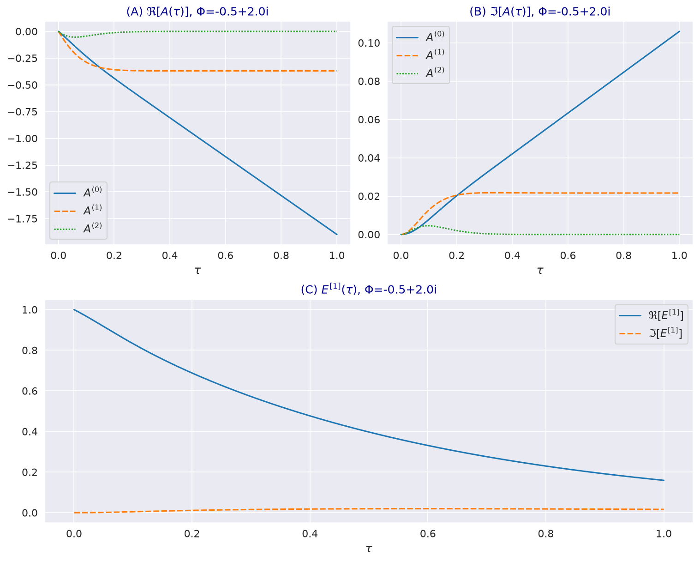
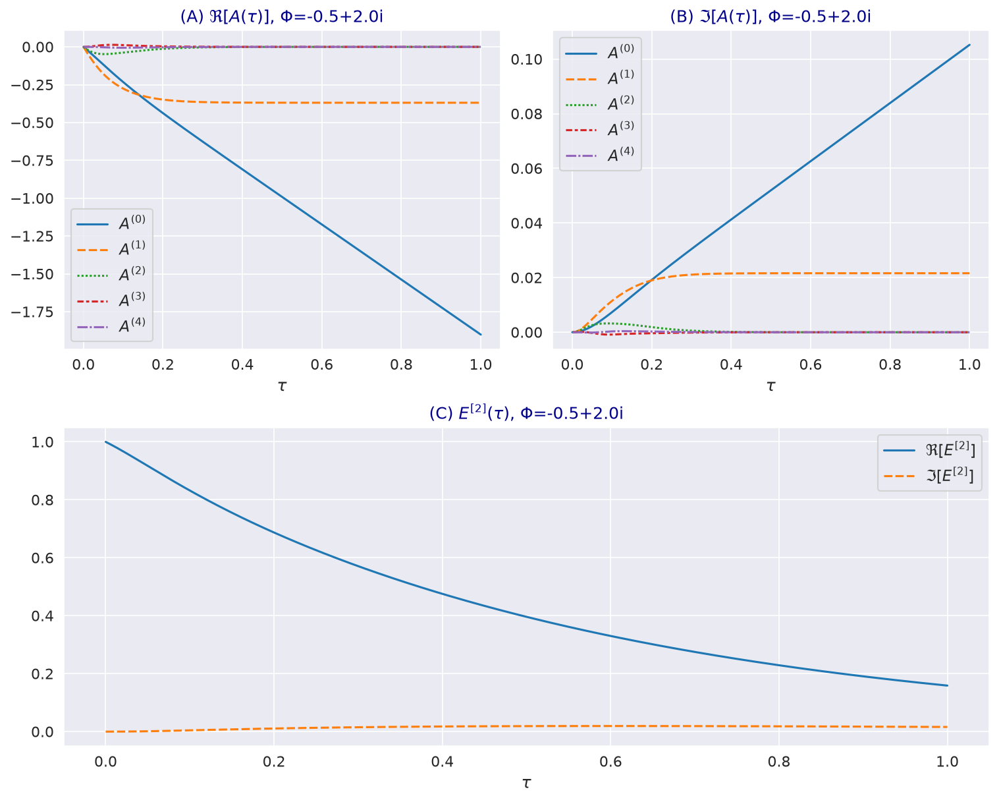
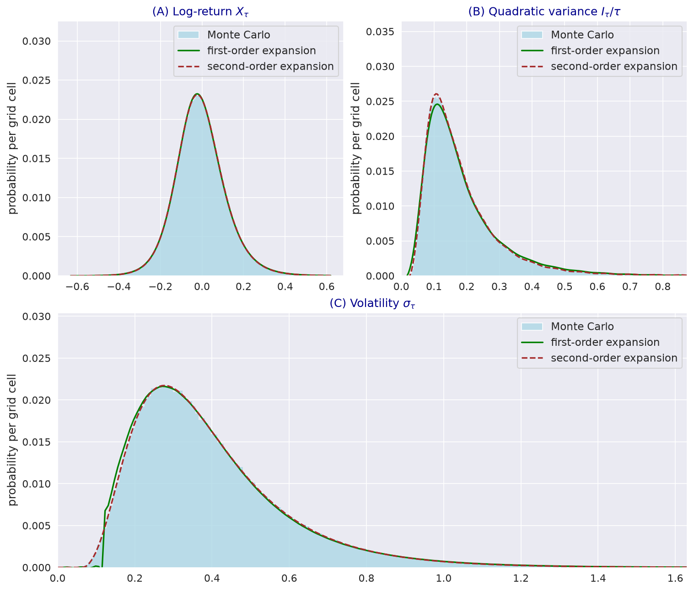

---
myst:
  html_meta:
    description: >-
      The moment generating function of the log-normal stochastic volatility model with quadratic
      drift and its affine expansion: the valuation PDE, existence conditions, the first- and
      second-order coefficient ODEs, martingale and moment properties, densities against Monte
      Carlo, and how stochvolmodels solves the expansion.
---

# The moment generating function and its affine expansion

*Author: [Artur Sepp](https://github.com/ArturSepp)*

Implemented in [stochvolmodels](https://github.com/ArturSepp/StochVolModels).
Software citation: [CITATION.cff](https://github.com/ArturSepp/StochVolModels/blob/main/CITATION.cff).

The log-normal stochastic volatility (SV) model with quadratic drift is not affine: its volatility
has a quadratic drift and a proportional diffusion, so the moment generating function (MGF) of the
log-price has no closed form. Sepp and Rakhmonov (2023, Section 4) approximate it by an affine
expansion, an exponential of a polynomial in the mean-adjusted volatility whose coefficients solve
a small system of quadratic ordinary differential equations (ODEs). This article states the MGF and
its partial differential equation (PDE), derives the first- and second-order expansions, lists the
properties they keep exactly, and shows how the package solves them. Every option price computed
by `LogSVPricer` goes through this expansion.

## Overview

For an affine model such as Heston's, the MGF is the exponential of a function linear in the state
variables, and its coefficients solve Riccati equations. In the log-normal SV model the generator
has terms in $\sigma^2$ and $\sigma^3$, so no finite exponential-affine form solves the PDE. The
expansion writes the logarithm of the MGF as a power series in $Y = \sigma - \theta$, truncates it
at $Y^2$ (first order) or $Y^4$ (second order), and solves the resulting quadratic ODE system for
the coefficients. The error is a remainder term driven by the central moments of volatility.

The expansion is exact for the properties that valuation relies on most: it gives an expected
price equal to the forward under both valuation measures, and at $\kappa_2 = 0$ the second-order
expansion reproduces the mean and variance of the log-price, the quadratic variance (QV) and the
volatility. Option prices, densities and QV options then follow by Fourier inversion (the
[Fourier pricing article](european_option_pricing.md), [inverse options](inverse_options.md) and
[QV options](quadratic_variance_options.md)).

## Inputs, notation, and assumptions

| Symbol | Meaning | Code |
|---|---|---|
| $\tau$ | Time to maturity | `ttm` |
| $X_\tau$, $I_\tau$ | Log-price and quadratic variance $\int_0^\tau \sigma_t^2 dt$ | `VariableType.LOG_RETURN`, `VariableType.Q_VAR` |
| $Y_\tau$ | Mean-adjusted volatility $\sigma_\tau - \theta$, Eq. (3.32) | `VariableType.SIGMA` |
| $\Phi$, $\Psi$, $\Theta$ | Complex transform variables of $X$, $I$ and $Y$ | `phi`, `psi`, `theta_grid` |
| $p$ | Measure: $p = 1$ for the MMA measure, $p = -1$ for the inverse measure | `is_spot_measure` |
| $A^{(k)}(\tau)$ | Coefficient of $Y^k$ in the exponent | rows of `a_t1` |
| $E^{[m]}$ | Leading term of the expansion of order $m$ | `log_mgf` is its logarithm |
| $\vartheta$ | Total vol-of-vol, $\vartheta^2 = \beta^2 + \varepsilon^2$ | `beta`, `volvol` |

The model and its parameters are those of the [model article](logsv_model.md), and the two
measures are those of the [martingale article](martingale_conditions_and_skews.md). Equation
numbers refer to the published article.

## Methodology

### The MGF and its PDE

The MGF of the three state variables is, Eq. (4.5),

$$
G(\tau, X, I, Y; \Phi, \Psi, \Theta; p) = E\left[ e^{-\Phi X_\tau - \Psi I_\tau - \Theta Y_\tau} \right] ,
$$

with the expectation under the money-market-account (MMA) measure for $p = 1$ and under the inverse
measure for $p = -1$, conditional on $X_0 = X$, $I_0 = I$ and $Y_0 = Y$. It solves, Eq. (4.6),
$-G_\tau + (\mathcal{L}^{(Y)} + \mathcal{L}^{(X)} + \mathcal{L}^{(I)}) G = 0$ with
$G(0) = e^{-\Phi X - \Psi I - \Theta Y}$, where, Eq. (4.3),

$$
\mathcal{L}^{(Y)} = \frac{1}{2} \vartheta^2 (Y + \theta)^2 \partial_{YY} + \left( \lambda^{(p)} - \kappa^{(p)} Y - \kappa_2^{(p)} Y^2 \right) \partial_Y ,
$$

$$
\mathcal{L}^{(X)} = (Y + \theta)^2 \left( \frac{1}{2} \partial_{XX} - \frac{p}{2} \partial_X + \beta \partial_{XY} \right) , \quad \mathcal{L}^{(I)} = (Y + \theta)^2 \partial_I .
$$

The measure enters through $\kappa_2^{(1)} = \kappa_2$ and $\kappa_2^{(-1)} = \kappa_2 - \beta$, and
through $\kappa^{(p)} = \kappa_1 - \kappa_2 \theta + 2 \kappa_2^{(p)} \theta$ and
$\lambda^{(p)} = (\kappa_2 - \kappa_2^{(p)}) \theta^2$. Theorem 4.1 shows that the value function
solves this PDE although the coefficients violate the usual linear growth condition.

### When the MGF exists

Theorems 4.2 to 4.4 give sufficient conditions on the real parts of the transform variables:

| Variable | Condition |
|---|---|
| Log-price, MMA measure | $\Re \Phi \in (-1, 0)$ if $Z_t$ is a martingale, that is $\kappa_2 \ge \beta$ |
| Log-price, inverse measure | $\Re \Phi \in (0, 1)$ if $R_t$ is a martingale, that is $\kappa_2 \ge 2 \beta$ |
| QV, MMA measure | $\Re \Psi < 0$ if $\kappa_2 > \vartheta \sqrt{-2 \Re \Psi}$ |
| Volatility | $\Re \Theta < 0$ if $\kappa_2^{(p)} > \frac{1}{2} \vartheta^2 \vert \Re \Theta \vert$ |

Option valuation integrates along $\Re \Phi = -1/2$ under the MMA measure and $\Re \Phi = 1/2$ under
the inverse measure, inside these strips.

### The expansion

The ansatz of Eq. (4.13) is $\exp\left( -\Phi X - \Psi I + \sum_k A^{(k)}(\tau) Y^k \right)$.
Substituting it into the PDE and collecting powers of $Y$ gives, for each $k$, Eq. (4.14),

$$
\frac{d A^{(k)}}{d\tau} = \mathbf{A}^\top M^{(k)} \mathbf{A} + \left( L^{(k)} \right)^\top \mathbf{A} + H^{(k)} , \qquad \mathbf{A}(0) = (0, -\Theta, 0, \ldots) .
$$

The quadratic terms $M^{(k)}$ come from $\frac{1}{2} \vartheta^2 (Y + \theta)^2 (\partial_Y S)^2$,
where $S = \sum_k A^{(k)} Y^k$, and do not depend on the measure (Remark 4.1). The free terms are
$H^{(0)} = \frac{1}{2} \theta^2 c$, $H^{(1)} = \theta c$ and $H^{(2)} = \frac{1}{2} c$, with
$c = \Phi^2 + p \Phi - 2 \Psi$, and zero above. The linear terms are, for the coefficient of
$A^{(j)}$ in the equation for $A^{(k)}$,

| Entry | Linear term $L^{(k)}_j$ |
|---|---|
| $j = k + 2$ | $\frac{1}{2} \vartheta^2 \theta^2 j (j - 1)$ |
| $j = k + 1$ | $\vartheta^2 \theta j (j - 1) + (\lambda^{(p)} - \theta^2 \beta \Phi) j$ |
| $j = k$ | $\frac{1}{2} \vartheta^2 j (j - 1) - (\kappa^{(p)} + 2 \theta \beta \Phi) j$ |
| $j = k - 1$ | $-(\kappa_2^{(p)} + \beta \Phi) j$ |

The powers of $Y$ above the truncation order are dropped. The **first-order expansion** keeps
$k = 0, 1, 2$, Eqs. (4.15) to (4.17); the **second-order expansion** keeps $k = 0, \ldots, 4$,
Eqs. (4.23) to (4.25). The leading term is $E^{[m]} = \exp\left( \sum_k A^{(k)}(\tau) Y^k \right)$,
Eqs. (4.16) and (4.24), and the MGF is approximated by $e^{-\Phi X - \Psi I} E^{[m]}$, Eqs. (4.22)
and (4.31).

**Erratum.** The published Eq. (4.17) prints the third entry of $L^{(2)}$ as
$\vartheta - 2 \kappa^{(p)} - 4 \theta \beta \Phi$. The derivation gives
$\vartheta^2 - 2 \kappa^{(p)} - 4 \theta \beta \Phi$, which is the entry of the second-order system
(4.25) and of the package.

### The remainder

The dropped powers leave a remainder $R^{[m]}$ that solves the same PDE with a source
$-E^{[m]} F^{[m]}$, where $F^{[m]}$ is a polynomial in $Y$ of degrees 3 to 4 at first order and 5 to
8 at second order, Eqs. (4.18), (4.19), (4.26) and (4.27). Its bound, Eqs. (4.20) and (4.28), is a
sum of the coefficients of $F^{[m]}$ times the central moments $E[Y^n]$ of volatility. The expansion
is therefore accurate when volatility is concentrated around $\theta$, and loses accuracy with a
large vol-of-vol, a long maturity or weak mean reversion.

### Properties that hold exactly

- **Martingale conditions** (Proposition 4.3, Eqs. (4.32) and (4.33)). For $\Phi = \Psi = \Theta = 0$,
  for $\Phi = -1$ under the MMA measure and for $\Phi = 1$ under the inverse measure, every
  $H^{(k)}$ vanishes, so $\mathbf{A} \equiv 0$ and $E^{[m]} = 1$: the expected price is the forward
  under both measures at any order.
- **Moments at $\kappa_2 = 0$** (Propositions 4.4 to 4.6). The second-order expansion reproduces the
  mean and the variance of $\sigma_\tau$, $X_\tau$ and $I_\tau$ exactly. The first-order expansion
  reproduces the means; in the check below it also reproduces the variance of $\sigma_\tau$, but
  not those of $X_\tau$ and $I_\tau$.
- **Log-normal limit.** With $\beta = \varepsilon = 0$ and $\sigma_0 = \theta$ volatility is
  constant, $M^{(k)} = 0$, and $A^{(0)}(\tau) = \frac{1}{2} \theta^2 \tau (\Phi^2 + p \Phi)$ is the
  log-normal MGF.
- **Existence of the solution.** A quadratic ODE system can blow up in finite time. Theorem 4.7
  gives conditions under which the solution stays continuous for the valuation contours; the code
  does not check them.

## Worked example

Every block below is an excerpt of
[`examples/docs/affine_expansion.py`](../examples/docs/affine_expansion.py), which asserts every
number quoted here.

```python
def coefficients(params: svm.LogSvParams, phi: complex, ttm: float = 1.0,
                 order: svm.ExpansionOrder = svm.ExpansionOrder.FIRST) -> np.ndarray:
    """A(tau) of Eq. (4.17) at first order or Eq. (4.25) at second order, under the MMA measure."""
    solution = svm.solve_ode_for_a(ttm=ttm, theta=params.theta, kappa1=params.kappa1,
                                   kappa2=params.kappa2, beta=params.beta, volvol=params.volvol,
                                   phi=phi, psi=0j, expansion_order=order, is_stiff_solver=True)
    return solution.y[:, -1]


def leading_term(params: svm.LogSvParams, a: np.ndarray) -> complex:
    """E^[m] = exp(sum_k A^(k) Y^k) at Y = sigma0 - theta, Eqs. (4.16) and (4.24)."""
    y = params.sigma0 - params.theta
    return np.exp(a @ y ** np.arange(len(a)))
```

With the parameters of the paper's figure code for Figs. 4 and 5 ($\sigma_0 = 0.8327$,
$\theta = 1.0139$, $\kappa_1 = 4.8606$, $\kappa_2 = 4.7938$, $\beta = 0.1985$, $\varepsilon = 2.369$)
and $\Phi = -0.5 + 2i$, the first-order coefficients at $\tau = 1$ are
$A^{(0)} = -1.8986 + 0.1060i$, $A^{(1)} = -0.3691 + 0.0216i$ and $A^{(2)}$ below $10^{-4}$, and
$E^{[1]} = 0.1593 + 0.0163i$. The second-order expansion changes $A^{(0)}$ and $A^{(1)}$ by less than
$0.003$, keeps $A^{(2)}$, $A^{(3)}$ and $A^{(4)}$ below $10^{-4}$, and gives
$E^{[2]} = 0.1589 + 0.0162i$. The coefficients $A^{(1)}$ and $A^{(2)}$ settle within a few months,
while $A^{(0)}$ grows linearly and carries the maturity dependence.

[](images/first_order_odes.png)

*IJTAF Fig. 4, regenerated by the paper module `ode_sol_in_time.py`: the first-order coefficients
of Eq. (4.17) for $\Phi = -0.5 + 2i$ under the MMA measure, and $E^{[1]}$. The published caption
cites the parameters of Eq. (6.4), but the figure code uses those above; with Eq. (6.4)
$A^{(0)}(1) = -0.3482 + 0.0517i$, far from the published value of about $-1.9$.*

[](images/second_order_odes.png)

*IJTAF Fig. 5, regenerated: the second-order coefficients of Eq. (4.25) with the same parameters.
The higher coefficients $A^{(3)}$ and $A^{(4)}$ stay close to zero.*

The script checks the exact properties. For $\Phi = 0$, $\Phi = -1$ under the MMA measure and
$\Phi = 1$ under the inverse measure, the integrated coefficients stay at zero to $10^{-14}$. With
$\beta = \varepsilon = 0$ and $\sigma_0 = \theta = 0.4$, both orders give
$\log E^{[m]} = -0.34$ at $\tau = 1$ and $\Phi = -0.5 + 2i$, the log-normal value, to $10^{-10}$.

For the moments at $\kappa_2 = 0$, the script computes exact means and variances independently: at
$\kappa_2 = 0$ the model is polynomial, so the moments of $X^a I^b \sigma^c$ with
$2a + 2b + c \le 4$ solve a finite linear ODE. With $\sigma_0 = 1.3$, $\theta = 1$, $\kappa_1 = 3$,
$\beta = 0.4$, $\varepsilon = 1.2$ and $\tau = 0.75$, the exact variances are 0.3995 for
$\sigma_\tau$, 1.2301 for $X_\tau$ and 1.6427 for $I_\tau$. Every expansion reproduces the three
means to $10^{-5}$. The relative errors of the variances are:

| Expansion | $\sigma_\tau$ | $X_\tau$ | $I_\tau$ |
|---|---|---|---|
| First order, package | 0.0% | -8.9% | -40.4% |
| Second order, package | 0.0% | -2.7% | -8.1% |
| Second order, Eq. (4.25) as printed | 0.0% | 0.0% | 0.0% |

The second-order system as printed reproduces Propositions 4.5 and 4.6; the package's does not, for
the reason given under [Implementation](#second-order-linear-terms).

The expansion also gives densities by Fourier inversion, Eq. (5.5). At one month, with the
parameters of the paper's Fig. 6 code, the densities of $X_\tau$ from $E^{[1]}$ and $E^{[2]}$ differ
from a histogram of 400,000 simulated paths by 0.0138 and 0.0125 in total absolute probability over
200 cells, about the 0.0127 expected from sampling noise alone.

[](images/expansion_pdfs_vs_mc.png)

*IJTAF Fig. 6, regenerated with the package: densities of $X_\tau$, $I_\tau / \tau$ and $\sigma_\tau$
at $\tau = 1/12$ from $E^{[1]}$ and $E^{[2]}$ against histograms of 400,000 Monte Carlo paths with
daily steps, seed 37. Parameters of the paper's figure code: Eq. (6.4) with the vol-of-vol scaled
by 0.6 ($\sigma_0 = 0.4083$, $\theta = 0.3789$, $\kappa_1 = 2.21$, $\kappa_2 = 2.18$, $\beta = 0.501$,
$\varepsilon = 1.838$); the caption of the published figure cites Eq. (6.4). The QV density uses a
transform grid of 5,001 points on $[0, 1000]$ instead of the package default of 40,000 points. The
first-order density of volatility shows a small inversion artefact near 0.12.*

## Implementation in stochvolmodels

| Name | Role |
|---|---|
| `ExpansionOrder` | `FIRST` or `SECOND`; `SECOND` is the default of every pricer |
| `get_expansion_n` | Number of coefficients: 3 or 5 |
| `func_a_ode_quadratic_terms` | Assembles $M^{(k)}$, $L^{(k)}(p)$ and $H^{(k)}(p)$ |
| `func_rhs`, `func_rhs_jac` | Right-hand side of Eq. (4.14) and its Jacobian, in the signature of `scipy.integrate.solve_ivp` |
| `solve_ode_for_a`, `solve_a_ode_grid` | Integrate the system with `solve_ivp` for one $\Phi$ or a grid; `is_stiff_solver=True` selects BDF with the Jacobian |
| `solve_analytic_ode_for_a`, `solve_analytic_ode_grid_phi` | Fixed-point integrator with 260 steps per year, selected by `is_analytic=True` |
| `solve_analytic_ode_for_a0` | Superseded fixed-point variant, kept for reference |
| `get_init_conditions_a` | $\mathbf{A}(0)$, with $-\Theta$ in the second entry for volatility transforms |
| `compute_logsv_a_mgf_grid` | Solves over a transform grid and returns $\mathbf{A}(\tau)$ and $\log E^{[m]}$ |

These names are in the advanced tier (see
[stability tiers](option_chains_and_conventions.md#stability-tiers)). `LogSVPricer` prices a chain
slice by slice, starting each maturity from the coefficients of the previous one, so the ODE is
integrated once up to the last maturity. The default integrator is `solve_ivp` with its default
tolerances. The argument `vol_backbone_eta` scales $\theta$ by maturity for the variance-swap
backbone of calibration; it is not part of the article and equals one by default.

In the checks for this article, the fixed-point path (`is_analytic=True`) returned a non-finite
price for the quickstart option, whose default price is 0.197331: its explicit treatment of the
quadratic term overflows at large transform values. The pages of this site use the default path.
Run the example from a checkout with `python examples/docs/affine_expansion.py`.

### Second-order linear terms

The package's first-order system matches the derivation above in every entry, under both measures.
Its second-order linear terms differ from the derivation and from the printed Eq. (4.25) in three
entries. The script builds the derived terms:

```python
def paper_linear_terms(params: svm.LogSvParams, phi: complex, is_spot_measure: bool = True,
                       n: int = 5) -> np.ndarray:
    """L^(k)(p) from matching powers of Y in PDE (4.6); row k is the equation for A^(k)."""
    vartheta2 = params.beta ** 2 + params.volvol ** 2
    theta, beta = params.theta, params.beta
    kappa2_p = params.kappa2 if is_spot_measure else params.kappa2 - beta
    kappa_p = params.kappa1 - params.kappa2 * theta + 2.0 * kappa2_p * theta
    lamda = (params.kappa2 - kappa2_p) * theta ** 2
    linear = np.zeros((n, n), dtype=np.complex128)
    for k in range(n):
        for j in range(1, n):
            if j == k + 2:  # vol-of-vol term theta^2 Y^(j-2)
                linear[k, j] = 0.5 * vartheta2 * theta ** 2 * j * (j - 1)
            elif j == k + 1:
                linear[k, j] = (vartheta2 * theta * j * (j - 1)
                                + (lamda - theta ** 2 * beta * phi) * j)
            elif j == k:
                linear[k, j] = (0.5 * vartheta2 * j * (j - 1)
                                - (kappa_p + 2.0 * theta * beta * phi) * j)
            elif j == k - 1:
                linear[k, j] = -(kappa2_p + beta * phi) * j
    return linear
```

| Entry | Derivation and Eq. (4.25) | Package |
|---|---|---|
| $L^{(4)}_4$, both measures | $2(3 \vartheta^2 - 2 \kappa^{(p)} - 4 \theta \beta \Phi)$ | $2(\vartheta^2 - 2 \kappa^{(p)} - 4 \theta \beta \Phi)$ |
| $L^{(2)}_3$, inverse measure | $3(2 \theta \vartheta^2 + \lambda^{(p)} - \theta^2 \beta \Phi)$ | without $\lambda^{(p)}$ |
| $L^{(3)}_4$, inverse measure | $4(3 \theta \vartheta^2 + \lambda^{(p)} - \theta^2 \beta \Phi)$ | without $\lambda^{(p)}$ |

Eq. (4.25) prints the $\lambda^{(p)}$ entry of $L^{(2)}$ as $3(2 q \vartheta^2 + \ldots)$, where $q$
stands for $\theta$. The consequences are the variance errors of the table above at $\kappa_2 = 0$,
and differences in option prices that grow with maturity. For the fitted parameters of the
[Bitcoin case study](app_bitcoin_options.md), the implied volatilities from the two systems differ
by at most $5 \times 10^{-5}$ at one month and 1.4 volatility points at one year, over strikes
within 2.5 standard deviations. At one year, against 400,000 Monte Carlo paths, the root-mean-square
difference is 0.17 volatility points for Eq. (4.25) and 0.99 for the package, with 11 and 6 of the
11 strikes inside the 95% interval. The comparison is the slow case `PRICE_IMPACT` of the script.
The prices quoted elsewhere on this site are the package's.

## Interpretation and limitations

- **An expansion, not a closed form.** The remainder bound grows with the central moments of
  volatility, so accuracy falls with the vol-of-vol and the maturity. Compare with Monte Carlo when
  parameters are extreme, as the [analytic versus Monte Carlo](analytic_vs_monte_carlo.md) page
  describes.
- **Blow-up.** The coefficient system is quadratic and can blow up in finite time; the conditions of
  Theorem 4.7 are not checked by the code.
- **Existence of the transforms.** The pricers use fixed contours: $\Re \Phi = \mp 1/2$ and, for QV
  options, $\Re \Psi = -1/2$. Theorem 4.3 guarantees the QV transform there when
  $\kappa_2 > \vartheta$.
- **Orders.** The first-order expansion is cheaper and keeps the martingale conditions, but not the
  variances; the second order is the default.

## See also

- [Log-normal stochastic volatility model with quadratic drift](logsv_model.md)
- [Fourier pricing of European options](european_option_pricing.md)
- [Inverse options and the inverse measure](inverse_options.md)
- [Expected quadratic variance, variance swaps and QV options](quadratic_variance_options.md)
- [Steady-state distribution, moments and expected quadratic variance](volatility_distribution_and_moments.md)

## References

- Coppel, W. (1966). A survey of quadratic systems. *Journal of Differential Equations* 2(3),
  293-304.
- Dickson, R. and Perko, L. (1970). Bounded quadratic systems in the plane. *Journal of
  Differential Equations* 7(2), 251-273.
- Sepp, A. and Rakhmonov, P. (2023). Log-normal stochastic volatility model with quadratic drift.
  *International Journal of Theoretical and Applied Finance* 26(8), 2450003.
  [DOI 10.1142/S0219024924500031](https://doi.org/10.1142/S0219024924500031).
- [stochvolmodels software citation](https://github.com/ArturSepp/StochVolModels/blob/main/CITATION.cff).
