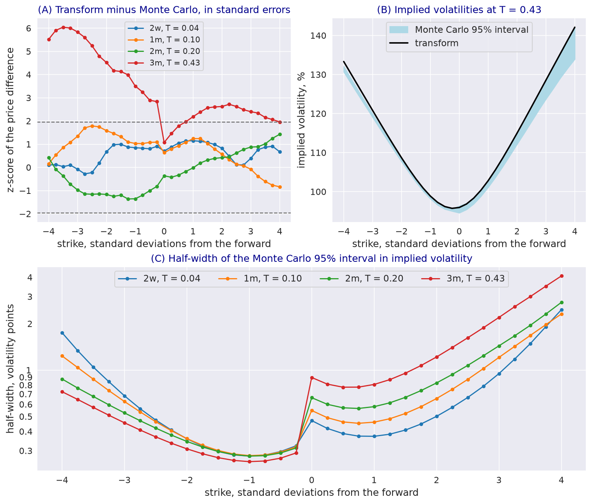

---
myst:
  html_meta:
    description: >-
      Validating transform prices against Monte Carlo in stochvolmodels: what agreement shows and
      what it does not, the errors on both sides, z-scores and implied-volatility intervals, and a
      worked comparison on the bundled Bitcoin chain that shows where the two separate.
---

# Analytic versus Monte Carlo validation

*Author: [Artur Sepp](https://github.com/ArturSepp) / First recorded: [2026-08-16](https://github.com/ArturSepp/StochVolModels/commit/e9e01403a6ba36aad7708049028c64438a606234)*

Implemented in [stochvolmodels](https://github.com/ArturSepp/StochVolModels).
Software citation: [CITATION.cff](https://github.com/ArturSepp/StochVolModels/blob/main/CITATION.cff).

The package prices European options twice: by Fourier inversion of the moment generating function
(MGF), and by Monte Carlo simulation of the same dynamics. Sepp and Rakhmonov (2023) use the second
route to check the first in their Figs. 2, 3, 6, 9 and 10. This article explains what such a check
establishes, which errors each route carries, how to read the comparison, and shows on the bundled
Bitcoin chain where the two routes agree and where they separate.

## Overview

The two routes share the model and its parameters and nothing else: the transform route truncates
the MGF (the [affine expansion](affine_expansion.md)) and integrates it on a grid
([Fourier pricing](european_option_pricing.md)); the simulation discretises the dynamics in time and
averages over a finite number of paths ([Monte Carlo schemes](monte_carlo_simulation.md)).
Agreement within the simulation's confidence interval therefore supports both implementations for
the options compared. A separation says that at least one route is not accurate enough there, and
the tests below help to tell which.

## Inputs, notation, and assumptions

| Symbol | Meaning | Code |
|---|---|---|
| $P_A$ | Transform price | `price_chain`, `compute_chain_prices_with_vols` |
| $P_{MC}$, $s$ | Monte Carlo price and its standard error | `model_mc_price_chain` |
| $z$ | $(P_A - P_{MC}) / s$ | |
| $[\sigma_{lo}, \sigma_{hi}]$ | Implied volatilities of $P_{MC} \mp 1.96 s$ | `compute_mc_chain_implied_vols` |

Both routes use the chain's forwards, discount factors and option codes, and the same measure; the
conventions are on the [conventions page](option_chains_and_conventions.md).

## Methodology

### What agreement shows

If both routes were exact, $z$ would be approximately standard normal, and about 95% of the strikes
would have $\vert z \vert \le 1.96$. Agreement shows that the transform and the simulation compute
the same prices under the same conventions: forwards, discounting, option codes, units and measure.
It does not show that the model fits a market, since both routes take the parameters as given, and it
does not show that the discounted price is a true martingale: the simulator shifts terminal prices so
that their mean equals the forward before taking payoffs, which hides a failure of the martingale
condition. Test that directly, as the [martingale article](martingale_conditions_and_skews.md) does.

### Errors on each side

| Route | Error | Control |
|---|---|---|
| Transform | Truncation of the MGF expansion, growing with maturity and vol-of-vol | [Affine expansion](affine_expansion.md) |
| Transform | Quadrature on the transform grid, below $10^{-6}$ in price at the default grid | [Fourier pricing](european_option_pricing.md) |
| Simulation | Sampling error, the standard error $s$ | More paths |
| Simulation | Time discretisation, not in $s$ | More steps on the same paths |

A separation that disappears with more time steps belongs to the simulation; one that persists
belongs to the expansion.

### Reading the comparison

Strikes of one maturity are priced on the same paths, so their $z$-scores are correlated, and the
share of strikes inside the interval from one run is noisy; look for a pattern across strikes and
maturities rather than a single exceedance. Compare prices first. Implied volatilities magnify a
price difference by the inverse of vega, so the interval in volatility widens quickly away from the
money, and the inversion returns `NaN` outside 1% to 500%.

## Worked example

Every block below is an excerpt of
[`examples/docs/analytic_vs_monte_carlo.py`](../examples/docs/analytic_vs_monte_carlo.py), which
asserts every number quoted here. The chain takes the maturities and forwards of the bundled
Bitcoin chain of 21 October 2021 and 33 strikes out to four standard deviations, with the parameters
fitted in the [Bitcoin case study](app_bitcoin_options.md):

```python
def wide_chain(deviations: float = 4.0, n: int = 33) -> svm.OptionChain:
    """The bundled chain's maturities and forwards with strikes out to four standard deviations."""
    btc = get_btc_test_chain_data()
    atm_vols = btc.get_chain_atm_vols()
    strikes = [forward * np.exp(np.linspace(-deviations, deviations, n) * vol * np.sqrt(ttm))
               for ttm, forward, vol in zip(btc.ttms, btc.forwards, atm_vols)]
    optiontypes = [np.where(k >= forward, "C", "P") for k, forward in zip(strikes, btc.forwards)]
    return svm.OptionChain(ids=btc.ids, ttms=btc.ttms, ticker="BTC", forwards=btc.forwards,
                           discfactors=btc.discfactors, strikes_ttms=tuple(strikes),
                           optiontypes_ttms=tuple(optiontypes))


def compare(chain: svm.OptionChain, params: svm.LogSvParams = FITTED, nb_path: int = 400000,
            nb_steps: int = 360, seed: int = 7) -> dict:
    """Transform and Monte Carlo prices and implied volatilities, with the 95% intervals."""
    pricer = svm.LogSVPricer()
    prices, vols = pricer.compute_chain_prices_with_vols(option_chain=chain, params=params)
    set_seed(seed)
    mc, _, _, mc_vols, mc_vols_up, mc_vols_down, errors = pricer.compute_mc_chain_implied_vols(
        option_chain=chain, params=params, nb_path=nb_path, nb_steps=nb_steps)
    return {"prices": prices, "vols": vols, "mc": mc, "errors": errors, "mc_vols": mc_vols,
            "mc_vols_up": mc_vols_up, "mc_vols_down": mc_vols_down}
```

With 400,000 paths and daily steps, 21 of the 33 strikes of the two-week slice are inside the 95%
interval, all of the one- and two-month slices, and 24 of the 0.43-year slice. With four steps a
day on the same seed, every strike of the first three slices is inside: the two-week separation came
from the simulation's time step. At 0.43 years only 3 of 33 strikes are inside, with $\vert z \vert$
up to 6.0. The transform implied volatility is above the simulated one by 1.9 volatility points at
four standard deviations below the forward, 0.5 points at the money and 3.6 points four deviations
above, where the interval's half-width is 4.1 points against 0.3 near the money. The separation
persists with finer steps, so it belongs to the expansion, whose error grows with maturity.

[](images/analytic_vs_mc_btc.png)

*Historical snapshot of 21 October 2021: the bundled chain's maturities and forwards, with 33
strikes out to four standard deviations and the fitted parameters of the Bitcoin case study.
400,000 paths with 1,440 steps per year, seed 7. (A) $z$-scores of the price differences, with the
95% band; (B) transform implied volatilities against the Monte Carlo interval at 0.43 years;
(C) half-width of the Monte Carlo interval in implied volatility. The chain uses puts below the
forward and calls from the forward up; their standard errors differ, hence the step at the
forward.*

On the quoted strikes of the same chain, which lie closer to the money, the case study finds the
Monte Carlo prices within two standard errors of the transform prices at all 49 quotes.

## Implementation in stochvolmodels

| Name | Role |
|---|---|
| `ModelPricer.price_chain`, `compute_chain_prices_with_vols` | Transform prices and implied volatilities |
| `ModelPricer.model_mc_price_chain` | Monte Carlo prices and standard errors; `nb_path`, `nb_steps` per year |
| `ModelPricer.compute_mc_chain_implied_vols` | Monte Carlo prices, their 95% bounds and the implied volatilities of all three, with the standard errors |
| `ModelPricer.plot_model_ivols_vs_mc`, `plot_comp_mma_inverse_options_with_mc` | Plots of the comparison, the second under both measures |

`compute_mc_chain_implied_vols` returns seven lists: the prices, their upper and lower 95% bounds
(the lower one floored at $10^{-10}$), the implied volatilities of the three, and the standard
errors. The simulators are seeded with `stochvolmodels.utils.funcs.set_seed`, which makes a
comparison repeatable. Run the example from a checkout with
`python examples/docs/analytic_vs_monte_carlo.py`.

## Interpretation and limitations

- **A check, not a proof.** Agreement on some options does not extend to others; the expansion error
  grows with maturity and away from the money.
- **Refine the simulation first.** Increase the steps on the same seed before blaming the expansion;
  a two-week slice needs more than daily steps in the wings.
- **The recentring hides forward errors.** Test the martingale condition separately.
- **Wings.** Far from the money the interval in volatility is wide and the inversion can fail;
  compare prices there.

## See also

- [The moment generating function and its affine expansion](affine_expansion.md)
- [Monte Carlo simulation schemes](monte_carlo_simulation.md)
- [Bitcoin options: MMA, inverse and QV valuation](app_bitcoin_options.md)
- [Numerical accuracy and performance](numerical_accuracy_and_performance.md)

## References

- Sepp, A. and Rakhmonov, P. (2023). Log-normal stochastic volatility model with quadratic drift.
  *International Journal of Theoretical and Applied Finance* 26(8), 2450003.
  [DOI 10.1142/S0219024924500031](https://doi.org/10.1142/S0219024924500031).
- [stochvolmodels software citation](https://github.com/ArturSepp/StochVolModels/blob/main/CITATION.cff).
