---
myst:
  html_meta:
    description: >-
      Gallery of the stochvolmodels documentation exhibits: for each figure the question it
      answers, its class, sample and parameters, the script and producer that generate it, and the
      article that explains it.
---

# Analytics gallery

*Author: [Artur Sepp](https://github.com/ArturSepp)*

Exhibits of [stochvolmodels](https://github.com/ArturSepp/StochVolModels).
Software citation: [CITATION.cff](https://github.com/ArturSepp/StochVolModels/blob/main/CITATION.cff).

Every figure in the documentation is listed here with the question it answers, the data behind
it and the code that produces it. Each figure belongs to one of four classes, and its caption says
which:

| Class | What it is |
|---|---|
| Paper replication | A published figure regenerated offline by calling the paper's own module with the paper's parameters |
| Paper reproduction | A crop of a figure of the open-access IJTAF article, under CC BY 4.0, where the inputs cannot be distributed |
| Historical snapshot | Computed from an option chain bundled with the package, with its quote date |
| Synthetic teaching exhibit | Drawn from a page's canonical script with fixed parameters and seed |

## Conventions

| Item | Convention |
|---|---|
| Measure | The money-market-account (MMA) measure unless a caption names another: the inverse measure, or the annuity and forward measures of the rates exhibits |
| Volatility | Annualised; implied volatilities are Black-Scholes-Merton, except in the rates exhibits, which show normal volatilities in basis points |
| Monte Carlo | Seeded; the number of paths, the steps per year and the seed are in the caption and the registry |
| Error measure | Root-mean-square difference of implied volatilities, labelled "mse" in the package's plot legends |
| One calculation | A figure's tables and the numbers its article quotes come from the same functions of the page's canonical script |
| Provenance | [`analytics_manifest.json`](images/analytics_manifest.json) records the configuration, the source commit and hashes, the package versions, the numerical checks and the image hashes |

Regenerate every exhibit into a new directory outside the checkout, validate it, and verify the
committed previews against the manifest:

```console
python -m scripts.docs_analytics.run --all --output-root <new directory outside the checkout>
python -m scripts.docs_analytics.validate --run-root <that directory>
python -m scripts.docs_analytics.run --verify
```

The registry is
[`scripts/docs_analytics/registry.json`](https://github.com/ArturSepp/StochVolModels/blob/main/scripts/docs_analytics/registry.json).

## The log-normal SV model

### Drift and paths of volatility

[](images/logsv_drift_and_paths.png)

| | |
|---|---|
| Question | How does the quadratic drift pull high volatility back faster, and what does that do to the paths of volatility? |
| Class | Synthetic teaching exhibit; panels A and B drawn by the paper module `vol_drift.py` |
| Parameters | $\kappa_1 = 4$, $\theta = 1$, $\vartheta = 1.75$, $\kappa_2 = 0, 4, 8$; 20,000 daily paths over one year with common increments, seed 7 |
| Result | The 99th percentile of one-year volatility falls from 3.94 to 1.91 as $\kappa_2$ rises from 0 to 8 |
| Script | [`examples/docs/logsv_model.py`](https://github.com/ArturSepp/StochVolModels/blob/main/examples/docs/logsv_model.py) |
| Producer | `scripts/docs_analytics/logsv_model.py`, `produce_logsv_drift_and_paths` |
| Article | [Log-normal stochastic volatility model with quadratic drift](logsv_model.md) |

### Steady-state distribution of volatility

[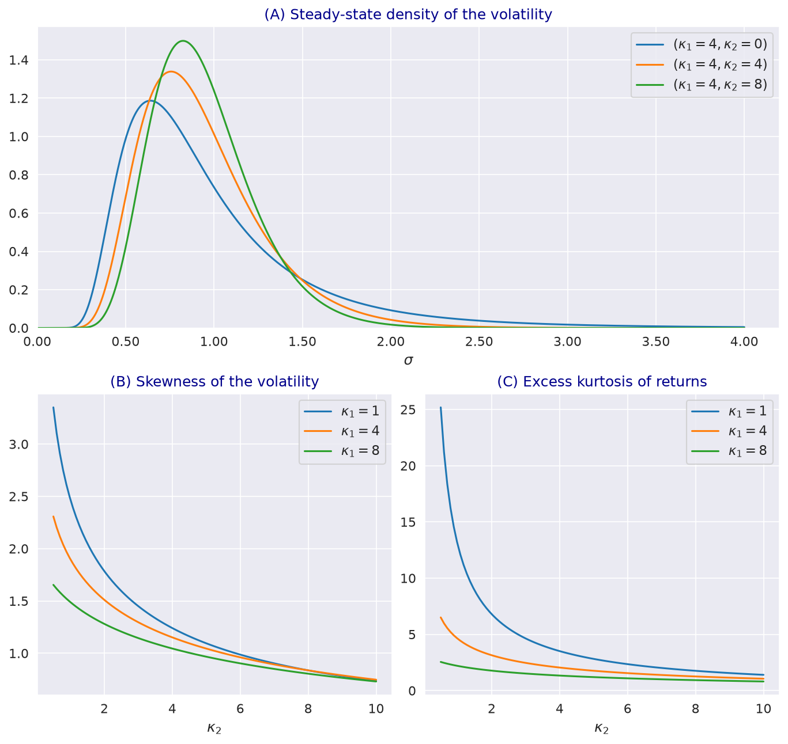](images/steady_state_density.png)

| | |
|---|---|
| Question | How does the quadratic mean reversion shape the steady-state density of volatility, its skewness and the kurtosis of returns? |
| Class | Paper replication, IJTAF Fig. 1 |
| Parameters | $\theta = 1$, $\vartheta = 1.5$; density for $\kappa_1 = 4$ and $\kappa_2 = 0, 4, 8$; skewness and kurtosis for $\kappa_1 = 1, 4, 8$ |
| Result | Excess kurtosis of returns 28.5, 2.05 and 1.26 for $\kappa_2 = 0, 4, 8$ with $\kappa_1 = 4$ |
| Paper module | `papers/logsv_model_with_quadratic_drift/steady_state_pdf.py` |
| Producer | `scripts/docs_analytics/logsv_model.py`, `produce_steady_state_density` |
| Article | [Steady-state distribution, moments and expected QV](volatility_distribution_and_moments.md) |

### Moments of volatility against Monte Carlo

[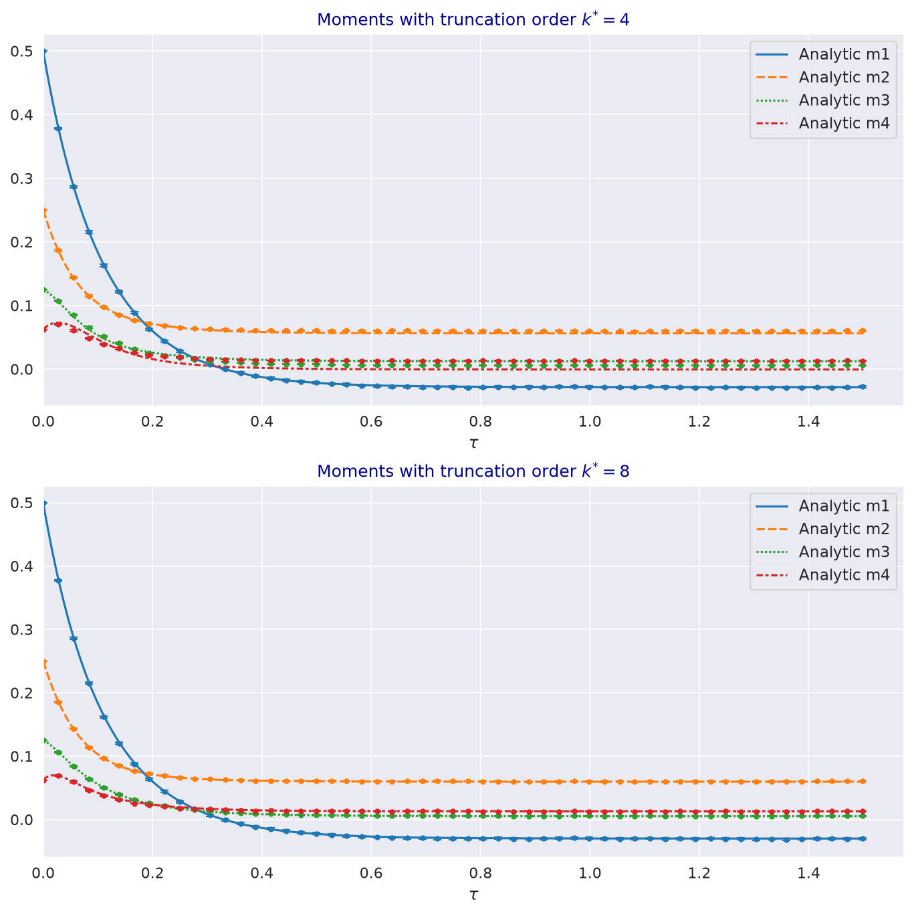](images/vol_moments_vs_mc.png)

| | |
|---|---|
| Question | How accurate is the truncated moment system at orders four and eight against Monte Carlo simulation? |
| Class | Paper replication, IJTAF Fig. 2 |
| Parameters | $\sigma_0 = 1.5$, $\theta = 1$, $\kappa_1 = \kappa_2 = 4$, $\vartheta = 1$; 100,000 paths, seed 37 |
| Result | At long horizons, order eight matches the stationary moments within 0.2%, order four within 6% |
| Paper module | `papers/logsv_model_with_quadratic_drift/moments_vol_qvar.py` |
| Producer | `scripts/docs_analytics/logsv_model.py`, `produce_vol_moments_vs_mc` |
| Article | [Steady-state distribution, moments and expected QV](volatility_distribution_and_moments.md) |

### Expected quadratic variance against Monte Carlo

[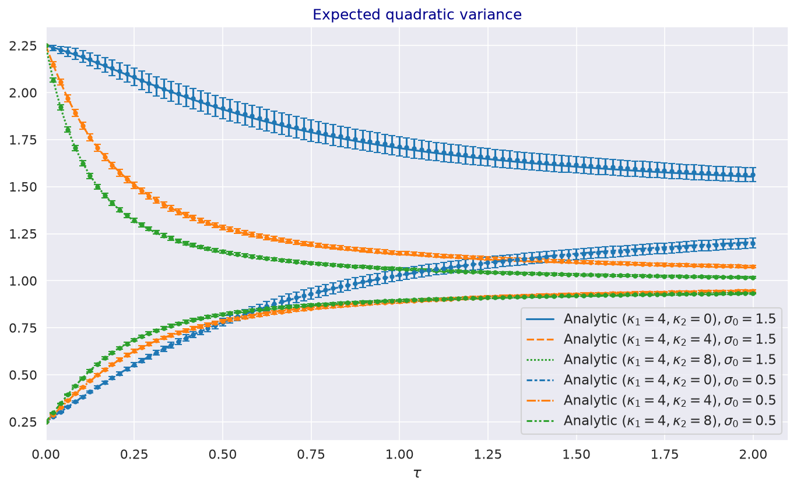](images/expected_qvar_vs_mc.png)

| | |
|---|---|
| Question | How does the expected quadratic variance evolve from a high and a low initial volatility, and does the truncated system agree with simulation? |
| Class | Paper replication, IJTAF Fig. 3 |
| Parameters | $\kappa_1 = 4$, $\kappa_2 = 0, 4, 8$, $\theta = 1$, $\vartheta = 1.5$, $\sigma_0 = 1.5$ and 0.5; 25,000 paths (the paper used 100,000), seed 37 |
| Result | From $\sigma_0 = 1.5$, the two-year expected QV is 1.55, 1.07 and 1.02 for $\kappa_2 = 0, 4, 8$ |
| Paper module | `papers/logsv_model_with_quadratic_drift/moments_vol_qvar.py` |
| Producer | `scripts/docs_analytics/logsv_model.py`, `produce_expected_qvar_vs_mc` |
| Article | [Steady-state distribution, moments and expected QV](volatility_distribution_and_moments.md) |

### A Monte Carlo test of the martingale condition

[](images/martingale_test.png)

| | |
|---|---|
| Question | Does the simulated expected price stay at its initial value inside the region of Theorem 3.7 and fall below it outside? |
| Class | Synthetic teaching exhibit |
| Parameters | $\kappa_2 = 0$ and 1, $\beta$ from -1 to 1.4, $\kappa_1 = 2$, $\theta = \sigma_0 = 1$, $\vartheta = 1.5$; 200,000 paths per point, seed 5 |
| Result | Well outside the region the one-year expected price falls to about 0.80 of its initial value |
| Script | [`examples/docs/martingale_conditions_and_skews.py`](https://github.com/ArturSepp/StochVolModels/blob/main/examples/docs/martingale_conditions_and_skews.py) |
| Producer | `scripts/docs_analytics/logsv_model.py`, `produce_martingale_test` |
| Article | [Martingale conditions, measures and positive skews](martingale_conditions_and_skews.md) |

### Smiles and the sign of the volatility beta

[](images/smiles_in_beta.png)

| | |
|---|---|
| Question | How does the sign of the volatility beta set the direction of the implied volatility skew? |
| Class | Synthetic teaching exhibit |
| Parameters | $\beta$ from -1 to 1, $\sigma_0 = \theta = 0.5$, $\kappa_1 = 2$, $\kappa_2 = 2.5$, $\vartheta = 1.5$; one month |
| Result | The difference between the implied volatilities at strikes 1.2 and 0.8 goes from -0.174 to 0.168 |
| Script | [`examples/docs/martingale_conditions_and_skews.py`](https://github.com/ArturSepp/StochVolModels/blob/main/examples/docs/martingale_conditions_and_skews.py) |
| Producer | `scripts/docs_analytics/logsv_model.py`, `produce_smiles_in_beta` |
| Article | [Martingale conditions, measures and positive skews](martingale_conditions_and_skews.md) |

## Transform pricing

### First-order expansion coefficients

[](images/first_order_odes.png)

| | |
|---|---|
| Question | How do the first-order expansion coefficients and the leading term evolve with maturity? |
| Class | Paper replication, IJTAF Fig. 4 |
| Parameters | $\Phi = -0.5 + 2i$, MMA measure; $\sigma_0 = 0.8327$, $\theta = 1.0139$, $\kappa_1 = 4.8606$, $\kappa_2 = 4.7938$, $\beta = 0.1985$, $\varepsilon = 2.369$, those of the paper's figure code (the caption cites Eq. (6.4)) |
| Result | $A^{(0)}(1) = -1.8986 + 0.1060i$ and $E^{[1]}(1) = 0.1593 + 0.0163i$ |
| Paper module | `papers/logsv_model_with_quadratic_drift/ode_sol_in_time.py` |
| Producer | `scripts/docs_analytics/transforms.py`, `produce_expansion_odes` |
| Article | [The moment generating function and its affine expansion](affine_expansion.md) |

### Second-order expansion coefficients

[](images/second_order_odes.png)

| | |
|---|---|
| Question | How do the second-order expansion coefficients evolve, and how small are the higher coefficients? |
| Class | Paper replication, IJTAF Fig. 5 |
| Parameters | As for Fig. 4 |
| Result | $A^{(2)}$, $A^{(3)}$ and $A^{(4)}$ stay below $10^{-4}$ at one year; $E^{[2]}(1) = 0.1589 + 0.0162i$ |
| Paper module | `papers/logsv_model_with_quadratic_drift/ode_sol_in_time.py` |
| Producer | `scripts/docs_analytics/transforms.py`, `produce_expansion_odes` |
| Article | [The moment generating function and its affine expansion](affine_expansion.md) |

### Densities from the expansion against Monte Carlo

[](images/expansion_pdfs_vs_mc.png)

| | |
|---|---|
| Question | How close are the densities from the first- and second-order expansions to simulation? |
| Class | Paper replication, IJTAF Fig. 6, computed with the package because the paper module needs `qis` |
| Parameters | One month; Eq. (6.4) with the vol-of-vol scaled by 0.6, as the paper's figure code; 400,000 paths with daily steps, seed 37 |
| Result | The log-return densities differ from the histogram by 0.0138 and 0.0125 in total absolute probability, about the sampling noise of 0.0127 |
| Script | [`examples/docs/affine_expansion.py`](https://github.com/ArturSepp/StochVolModels/blob/main/examples/docs/affine_expansion.py) |
| Producer | `scripts/docs_analytics/transforms.py`, `produce_expansion_pdfs_vs_mc` |
| Article | [The moment generating function and its affine expansion](affine_expansion.md) |

### Fourier prices against Black-Scholes

[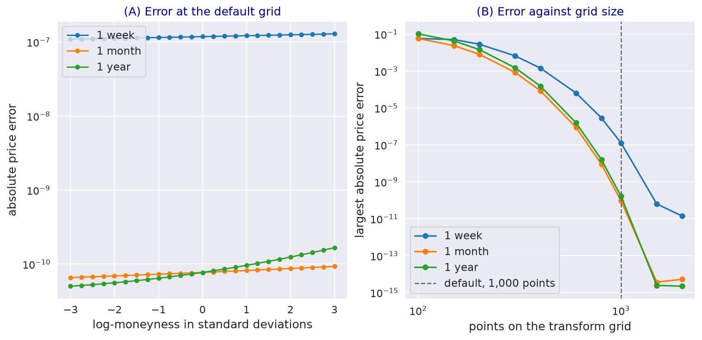](images/fourier_vs_bsm.png)

| | |
|---|---|
| Question | Does the Fourier pricer reproduce Black-Scholes at zero vol-of-vol, and how does the error fall with the grid? |
| Class | Synthetic teaching exhibit |
| Parameters | Zero vol-of-vol, $\sigma_0 = \theta = 0.4$; one week, one month and one year; 100 to 2,000 grid points |
| Result | At the default 1,000 points the largest price error is $1.3 \times 10^{-7}$ at one week and below $2 \times 10^{-10}$ at one month and one year |
| Script | [`examples/docs/european_option_pricing.py`](https://github.com/ArturSepp/StochVolModels/blob/main/examples/docs/european_option_pricing.py) |
| Producer | `scripts/docs_analytics/transforms.py`, `produce_fourier_vs_bsm` |
| Article | [Fourier pricing of European options](european_option_pricing.md) |

### Net delta of inverse options

[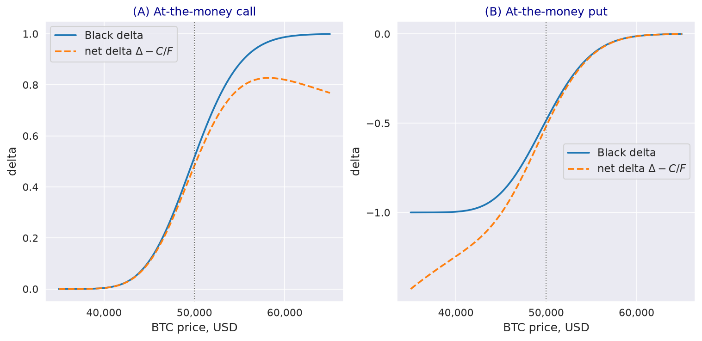](images/inverse_net_delta.png)

| | |
|---|---|
| Question | How does the net delta of an inverse option differ from its Black delta? |
| Class | Synthetic teaching exhibit; the computation of `papers/inverse_options/compare_net_delta.py` |
| Parameters | One week, 60% volatility, strike 50,000 dollars |
| Result | At the money, the call's Black delta 0.5166 against a net delta of 0.4834, and the put's -0.4834 against -0.5166 |
| Script | [`examples/docs/inverse_options.py`](https://github.com/ArturSepp/StochVolModels/blob/main/examples/docs/inverse_options.py) |
| Producer | `scripts/docs_analytics/transforms.py`, `produce_inverse_net_delta` |
| Article | [Inverse options and the inverse measure](inverse_options.md) |

### Options on quadratic variance

[](images/qvar_option_smiles.png)

| | |
|---|---|
| Question | What skew do call options on quadratic variance have, and do the MMA and inverse valuations agree with simulation? |
| Class | Paper replication, IJTAF Fig. 10, computed with the package because the paper module needs `qis` |
| Parameters | Eq. (6.4); packaged QV chain with strikes from 75% to 150% of the expected QV; 400,000 paths with 5,760 steps per year, seed 13 (the paper: 200,000 paths, the pricer's default steps) |
| Result | Upward skews, from 344% to 368% at one week; MMA and inverse within $5 \times 10^{-4}$; every strike inside the 95% Monte Carlo interval |
| Script | [`examples/docs/quadratic_variance_options.py`](https://github.com/ArturSepp/StochVolModels/blob/main/examples/docs/quadratic_variance_options.py) |
| Producer | `scripts/docs_analytics/transforms.py`, `produce_qvar_option_smiles` |
| Article | [Expected quadratic variance, variance swaps and QV options](quadratic_variance_options.md) |

## Simulation and validation

### Convergence of the simulation scheme

[](images/mc_convergence.png)

| | |
|---|---|
| Question | How do the strong and weak errors of the simulation scheme fall with the time step? |
| Class | Synthetic teaching exhibit |
| Parameters | `LOGSV_BTC_PARAMS`, one year, 12 to 384 steps against 3,072 on the same Brownian paths; 20,000 paths, seed 3 |
| Result | The error of $\ln \sigma_T$ falls from 0.1835 to 0.0040, order about one; that of $X_T$ with order about one half |
| Script | [`examples/docs/monte_carlo_simulation.py`](https://github.com/ArturSepp/StochVolModels/blob/main/examples/docs/monte_carlo_simulation.py) |
| Producer | `scripts/docs_analytics/logsv_model.py`, `produce_mc_convergence` |
| Article | [Monte Carlo simulation schemes](monte_carlo_simulation.md) |

### Transform against Monte Carlo on the Bitcoin chain

[](images/analytic_vs_mc_btc.png)

| | |
|---|---|
| Question | Where on the smile do transform and Monte Carlo implied volatilities separate? |
| Class | Historical snapshot: maturities and forwards of the Bitcoin chain of 21 October 2021 |
| Parameters | The case study's fit; 33 strikes within four standard deviations; 400,000 paths, 1,440 steps per year, seed 7 |
| Result | Every strike inside the 95% interval up to two months; 3 of 33 at 0.43 years, where the transform is above the simulation in the wings |
| Script | [`examples/docs/analytic_vs_monte_carlo.py`](https://github.com/ArturSepp/StochVolModels/blob/main/examples/docs/analytic_vs_monte_carlo.py) |
| Producer | `scripts/docs_analytics/transforms.py`, `produce_analytic_vs_mc_btc` |
| Article | [Analytic versus Monte Carlo validation](analytic_vs_monte_carlo.md) |

## Calibration

### Profiles of the calibration objective

[](images/calibration_objective_profiles.png)

| | |
|---|---|
| Question | How sharply does the calibration objective identify each fitted parameter? |
| Class | Historical snapshot: Bitcoin implied volatilities of 21 October 2021 |
| Parameters | The case study's fit; one parameter moved at a time |
| Result | A 10% change multiplies the objective by about 33 for $\sigma_0$, 9.5 for $\theta$ and 1.3 for $\varepsilon$; a change of 0.1 in $\beta$ doubles it |
| Script | [`examples/docs/calibration.py`](https://github.com/ArturSepp/StochVolModels/blob/main/examples/docs/calibration.py) |
| Producer | `scripts/docs_analytics/calibration.py`, `produce_calibration_objective_profiles` |
| Article | [Calibration to implied volatilities](calibration.md) |

### The approximate smile fitter

[](images/smile_fitter_fit.png)

| | |
|---|---|
| Question | How close is the approximate smile fitter to the full model? |
| Class | Synthetic teaching exhibit: a generated chain and a model smile |
| Parameters | `get_oca_simulated_chain_data`; one-month model smile with $\sigma_0 = 0.2$, $\beta = 0.3$, $\varepsilon = 0.8$ and no mean reversion |
| Result | The leading-order formula within 0.15 volatility points of the full pricer; the quadratic fit within 0.05 points, with its own vol-of-vol of 0.30 |
| Script | [`examples/docs/logsv_smile_fitter.py`](https://github.com/ArturSepp/StochVolModels/blob/main/examples/docs/logsv_smile_fitter.py) |
| Producer | `scripts/docs_analytics/calibration.py`, `produce_smile_fitter_fit` |
| Article | [Approximate log-normal SV smile fitter](logsv_smile_fitter.md) |

## Other models

### Heston against the log-normal SV model

[](images/heston_vs_logsv.png)

| | |
|---|---|
| Question | How do the two models differ in volatility distribution and in smile at matched dynamics? |
| Class | Synthetic teaching exhibit |
| Parameters | Heston $V_0 = \theta = 0.04$, $\kappa = 4$, $\vartheta = 0.4$; a log-normal SV model with the same initial volatility, correlation and stationary mean and variance of volatility |
| Result | Volatility above 50% with probability 0.005% under Heston and 0.31% under the log-normal SV model; smiles equal at the money at one and two years |
| Script | [`examples/docs/heston_model.py`](https://github.com/ArturSepp/StochVolModels/blob/main/examples/docs/heston_model.py) |
| Producer | `scripts/docs_analytics/other_models.py`, `produce_heston_vs_logsv` |
| Article | [The Heston model as a benchmark](heston_model.md) |

### Smiles of clustered jumps

[](images/hawkes_smiles.png)

| | |
|---|---|
| Question | What smile does jump clustering produce at the same mean jump intensity? |
| Class | Synthetic teaching exhibit |
| Parameters | `HawkesJDParams` defaults, self-excitation with branching ratios 0, 0.35 and 0.7; 200,000 paths, seed 2026 |
| Result | Clustering lowers the at-the-money volatility and lifts the wings; the simulation separates from the transform at six months for the strongest clustering |
| Script | [`examples/docs/hawkes_jump_diffusion.py`](https://github.com/ArturSepp/StochVolModels/blob/main/examples/docs/hawkes_jump_diffusion.py) |
| Producer | `scripts/docs_analytics/other_models.py`, `produce_hawkes_smiles` |
| Article | [Jump-diffusion with clustered jumps](hawkes_jump_diffusion.md) |

### Mixture and Student-t smiles

[](images/terminal_distribution_smiles.png)

| | |
|---|---|
| Question | What smiles can mixtures and Student-t laws produce without dynamics? |
| Class | Synthetic teaching exhibit |
| Parameters | Six months, forward 100; mixtures of two to four states; Student-t with $\nu$ of 3, 5 and 30 and 20% volatility at the forward |
| Result | Closed forms equal numerical integration to $10^{-12}$; more mixture states steepen the put wing; small $\nu$ curves both wings |
| Script | [`examples/docs/terminal_distribution_models.py`](https://github.com/ArturSepp/StochVolModels/blob/main/examples/docs/terminal_distribution_models.py) |
| Producer | `scripts/docs_analytics/other_models.py`, `produce_terminal_distribution_smiles` |
| Article | [Gaussian-mixture and Student-t smiles](terminal_distribution_models.md) |

### Swaption skews and the volatility beta

[](images/fhjm_swaption_skews.png)

| | |
|---|---|
| Question | How does the volatility beta shape swaption skews? |
| Class | Synthetic teaching exhibit |
| Parameters | RDR Table 2 base scenario with the betas multiplied by $-2$, 0 and 1; 2y expiry; 20,000 paths, seed 16 |
| Result | Symmetric smile without a beta, skew in the direction of its sign; the base scenario inside the Monte Carlo interval at all 21 strikes |
| Script | [`examples/docs/factor_hjm_stochastic_volatility.py`](https://github.com/ArturSepp/StochVolModels/blob/main/examples/docs/factor_hjm_stochastic_volatility.py) |
| Producer | `scripts/docs_analytics/rates.py`, `produce_fhjm_swaption_skews` |
| Article | [Stochastic volatility for factor HJM rates](factor_hjm_stochastic_volatility.md) |

## Applications

### Weekly calibrations to Bitcoin options, 2019 to 2023

[](images/ijtaf_fig7_btc_calibrations.png)

| | |
|---|---|
| Question | How well did weekly calibrations fit Bitcoin options, and how did the fitted parameters move? |
| Class | Paper reproduction, IJTAF Fig. 7, CC BY 4.0; cropped, sub-captions removed |
| Data | Deribit Bitcoin options, weekly, April 2019 to October 2023; not distributable |
| Result | Average model error 1.59 volatility points against an average bid-ask spread of 2.30 |
| Producer | `scripts/docs_analytics/paper_pdf.py`, `produce_pdf_crop`, page 45 of the article PDF |
| Article | [Bitcoin options: MMA, inverse and QV valuation](app_bitcoin_options.md) |

### A Bitcoin fit on one day

[](images/ijtaf_fig8_btc_fit.png)

| | |
|---|---|
| Question | How closely does the calibrated model match the bid and ask quotes of the three most liquid expiries? |
| Class | Paper reproduction, IJTAF Fig. 8, CC BY 4.0; cropped |
| Data | Deribit Bitcoin options; not distributable |
| Parameters | Eq. (6.4): $\sigma_0 = 0.41$, $\theta = 0.38$, $\beta = 0.50$, $\varepsilon = 3.06$, $\kappa_1 = 2.21$, $\kappa_2 = 2.18$ |
| Producer | `scripts/docs_analytics/paper_pdf.py`, `produce_pdf_crop`, page 47 of the article PDF |
| Article | [Bitcoin options: MMA, inverse and QV valuation](app_bitcoin_options.md) |

### The paper's configuration on the bundled Bitcoin chain

[](images/btc_case_fit.png)

| | |
|---|---|
| Question | Does the paper's calibration configuration fit the bundled Bitcoin chain within its bid-ask spread? |
| Class | Historical snapshot: Bitcoin implied volatilities of 21 October 2021 |
| Parameters | `FITTED` of the canonical script: $\sigma_0 = 0.863$, $\theta = 1.04$, $\beta = 0.130$, $\varepsilon = 1.63$ |
| Result | Error inside the average spread for three of the four expiries |
| Script | [`examples/docs/app_bitcoin_options.py`](https://github.com/ArturSepp/StochVolModels/blob/main/examples/docs/app_bitcoin_options.py) |
| Producer | `scripts/docs_analytics/calibration.py`, `produce_btc_case_fit` |
| Articles | [Bitcoin options: MMA, inverse and QV valuation](app_bitcoin_options.md), [Calibration to implied volatilities](calibration.md) |

### MMA and inverse valuation against Monte Carlo

[](images/btc_case_measures.png)

| | |
|---|---|
| Question | Do the MMA and inverse valuations agree with each other and with Monte Carlo simulation on the bundled chain? |
| Class | Historical snapshot: Bitcoin implied volatilities of 21 October 2021 |
| Parameters | `FITTED`; 400,000 paths, 360 steps per year, seed 7 |
| Result | Valuations within $10^{-4}$ of the forward of each other; Monte Carlo within two standard errors in the script's check |
| Script | [`examples/docs/app_bitcoin_options.py`](https://github.com/ArturSepp/StochVolModels/blob/main/examples/docs/app_bitcoin_options.py) |
| Producer | `scripts/docs_analytics/calibration.py`, `produce_btc_case_measures` |
| Articles | [Bitcoin options: MMA, inverse and QV valuation](app_bitcoin_options.md), [Inverse options and the inverse measure](inverse_options.md) |

### One model on five underlyings

[](images/cross_asset_calibrations.png)

| | |
|---|---|
| Question | Does one parameterisation fit equity, VIX, gold and inverse-ETF skews? |
| Class | Historical snapshots: SPY, GLD, SQQQ and VIX of 15 July 2022; Bitcoin of 21 October 2021 |
| Parameters | `FITTED` of the canonical script, recorded in `papers/logsv_model_with_quadratic_drift/calibrations.py`; the two-month maturity |
| Result | $\beta$ negative for SPY only; every fit satisfies $\kappa_2 \ge 2 \beta$ |
| Script | [`examples/docs/app_positive_and_negative_skews.py`](https://github.com/ArturSepp/StochVolModels/blob/main/examples/docs/app_positive_and_negative_skews.py) |
| Producer | `scripts/docs_analytics/calibration.py`, `produce_cross_asset_calibrations` |
| Article | [One model for equity, VIX, gold and leveraged-ETF skews](app_positive_and_negative_skews.md) |

### USD swaption fit

[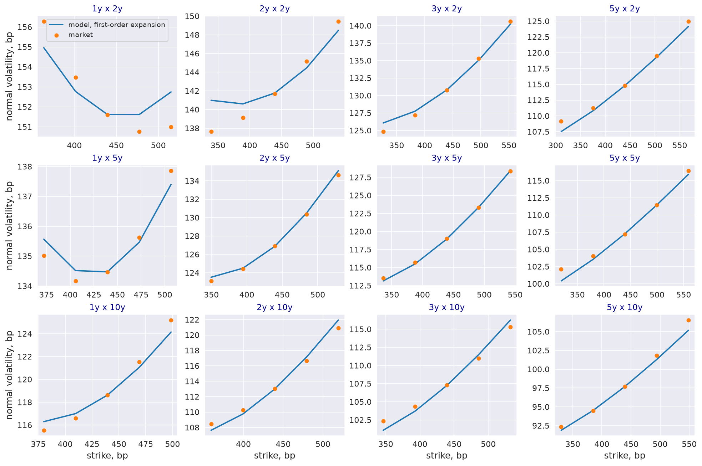](images/rdr_fig5_swaption_fit.png)

| | |
|---|---|
| Question | Does one set of parameters per expiry fit the swaption smiles of three tenors? |
| Class | Paper replication, RDR Fig. 5, regenerated from `papers/sv_for_factor_hjm/calibration_fig_5_6_7.py` with the module's parameters, which differ from the published tables |
| Parameters | USD swaptions of 18 August 2023, expiries 1y to 5y, tenors 2y, 5y, 10y; first-order expansion |
| Result | Root-mean-square error 1.15, 0.48 and 0.70 bp by tenor; 2.29, 1.38 and 1.95 bp with Table 1 |
| Script | [`examples/docs/app_swaptions_and_sofr_options.py`](https://github.com/ArturSepp/StochVolModels/blob/main/examples/docs/app_swaptions_and_sofr_options.py) |
| Producer | `scripts/docs_analytics/rates.py`, `produce_rdr_fig5_swaption_fit` |
| Article | [USD swaptions and SOFR futures options](app_swaptions_and_sofr_options.md) |

### Swaptions against Monte Carlo at 5y

[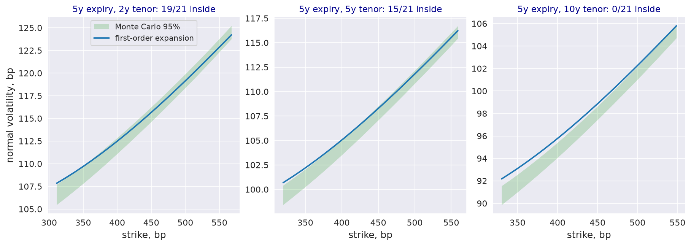](images/rdr_fig6_swaption_mc.png)

| | |
|---|---|
| Question | Is the first-order expansion accurate against Monte Carlo at the 5y expiry? |
| Class | Paper replication, RDR Fig. 6, regenerated from `papers/sv_for_factor_hjm/calibration_fig_5_6_7.py` with the module's parameters, which differ from the published tables |
| Parameters | 5y expiry; 200,000 paths in 20 batches, seeds 1 to 20 |
| Result | Inside the 95% interval at 19, 15 and 0 of 21 strikes; 0.55 to 1.46 bp above it for the 10y tenor |
| Script | [`examples/docs/app_swaptions_and_sofr_options.py`](https://github.com/ArturSepp/StochVolModels/blob/main/examples/docs/app_swaptions_and_sofr_options.py) |
| Producer | `scripts/docs_analytics/rates.py`, `produce_rdr_fig6_swaption_mc` |
| Article | [USD swaptions and SOFR futures options](app_swaptions_and_sofr_options.md) |

### Swaptions under parameter shocks

[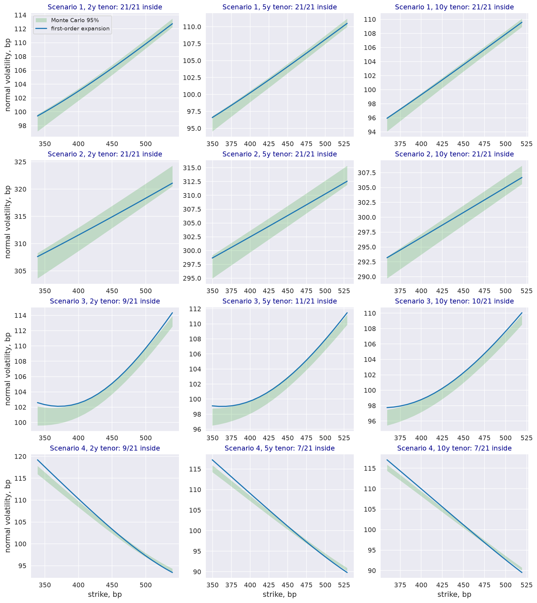](images/rdr_fig7_shock_scenarios.png)

| | |
|---|---|
| Question | Does the first-order expansion stay accurate under the parameter shocks of Table 2? |
| Class | Paper replication, RDR Fig. 7, regenerated from `papers/sv_for_factor_hjm/calibration_fig_5_6_7.py` with the module's parameters, which differ from the published tables |
| Parameters | The four scenarios of Table 2; 2y expiry; 200,000 paths per scenario |
| Result | All 63 strikes inside for the base and level-shifted scenarios; 9 to 11 and 7 to 9 of 21 per tenor with vol-of-vol times 4 and betas times $-2$ |
| Script | [`examples/docs/app_swaptions_and_sofr_options.py`](https://github.com/ArturSepp/StochVolModels/blob/main/examples/docs/app_swaptions_and_sofr_options.py) |
| Producer | `scripts/docs_analytics/rates.py`, `produce_rdr_fig7_shock_scenarios` |
| Article | [USD swaptions and SOFR futures options](app_swaptions_and_sofr_options.md) |

### SOFR futures option fit

[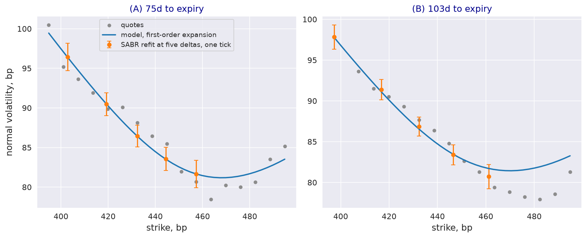](images/rdr_fig8_sofr_fit.png)

| | |
|---|---|
| Question | Does the model fit the smiles of short-dated SOFR futures options? |
| Class | Paper replication, RDR Fig. 8, regenerated from `papers/sv_for_factor_hjm/calibration_fig_8_9.py` with the module's parameters, which differ from the published tables |
| Parameters | 3M SOFR options at 75 and 103 days, SABR refit at five deltas; first-order expansion |
| Result | Root-mean-square error 0.03 and 0.48 bp against the refit, inside one tick at every strike; 18.84 and 12.33 bp with Table 3 |
| Script | [`examples/docs/app_swaptions_and_sofr_options.py`](https://github.com/ArturSepp/StochVolModels/blob/main/examples/docs/app_swaptions_and_sofr_options.py) |
| Producer | `scripts/docs_analytics/rates.py`, `produce_rdr_fig8_sofr_fit` |
| Article | [USD swaptions and SOFR futures options](app_swaptions_and_sofr_options.md) |

### SOFR options against Monte Carlo

[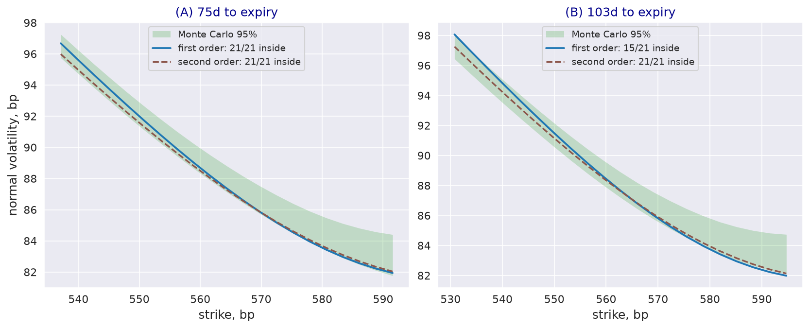](images/rdr_fig9_sofr_mc.png)

| | |
|---|---|
| Question | Are the first- and second-order expansions accurate against Monte Carlo for SOFR options? |
| Class | Paper replication, RDR Fig. 9, regenerated from `papers/sv_for_factor_hjm/calibration_fig_8_9.py` with the module's parameters, which differ from the published tables |
| Parameters | $2^{17}$ paths, seed 20; strikes re-centred on the model futures rate |
| Result | At 75 days both orders inside at 21 of 21 strikes; at 103 days 15 and 21 of 21 |
| Script | [`examples/docs/app_swaptions_and_sofr_options.py`](https://github.com/ArturSepp/StochVolModels/blob/main/examples/docs/app_swaptions_and_sofr_options.py) |
| Producer | `scripts/docs_analytics/rates.py`, `produce_rdr_fig9_sofr_mc` |
| Article | [USD swaptions and SOFR futures options](app_swaptions_and_sofr_options.md) |

### Impermanent loss and its replication

[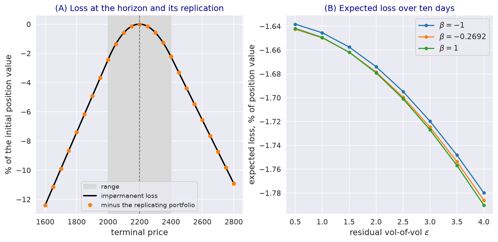](images/il_replication.png)

| | |
|---|---|
| Question | Do European payoffs replicate the impermanent loss, and how does its value depend on vol-of-vol? |
| Class | Synthetic teaching exhibit |
| Parameters | `PARAMS` of the canonical script, the example of `papers/il_hedging/run_logsv_for_il_payoff.py`: range 2,000 to 2,400 around 2,200, ten days |
| Result | Replication exact to $10^{-12}$; expected loss 1.650% of the position at $\varepsilon = 1$ and 1.786% at $\varepsilon = 4$ |
| Script | [`examples/docs/app_impermanent_loss_hedging.py`](https://github.com/ArturSepp/StochVolModels/blob/main/examples/docs/app_impermanent_loss_hedging.py) |
| Producer | `scripts/docs_analytics/applications.py`, `produce_il_replication` |
| Article | [Hedging impermanent loss with the LogSV MGF](app_impermanent_loss_hedging.md) |

### Persistence and stationary laws of four volatility indices

[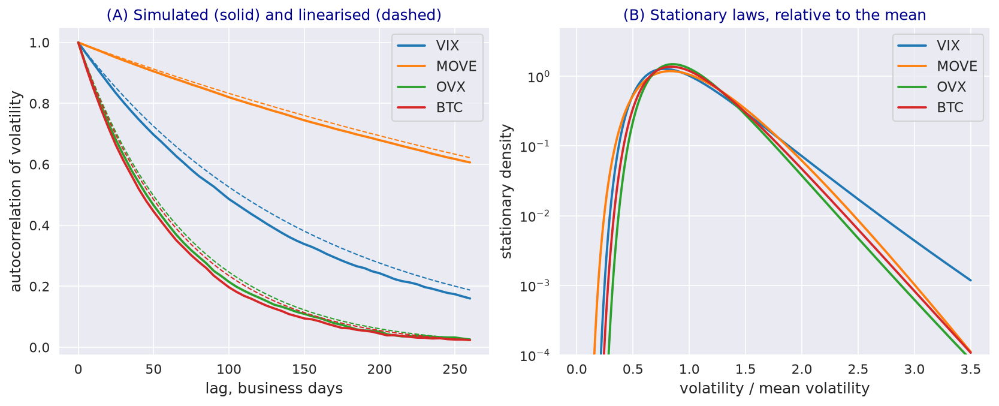](images/robust_vol_models.png)

| | |
|---|---|
| Question | What persistence and stationary distribution do the recorded parameters imply for four volatility indices? |
| Class | Synthetic teaching exhibit: parameters recorded in `papers/volatility_models/article_figures.py`, no market data |
| Parameters | VIX, MOVE, OVX and Bitcoin; 50,000 paths from stationary starts, seed 7 |
| Result | Half-lives of 108, 380, 50 and 48 business days; right-skewed laws with similar dispersion of log-volatility |
| Script | [`examples/docs/app_robust_volatility_models.py`](https://github.com/ArturSepp/StochVolModels/blob/main/examples/docs/app_robust_volatility_models.py) |
| Producer | `scripts/docs_analytics/other_models.py`, `produce_robust_vol_models` |
| Article | [What makes a stochastic volatility model robust](app_robust_volatility_models.md) |

## See also

- [Documentation standard](documentation_standard.md): exhibit classes and publication rules.
- [Examples and recipes](examples.md)
