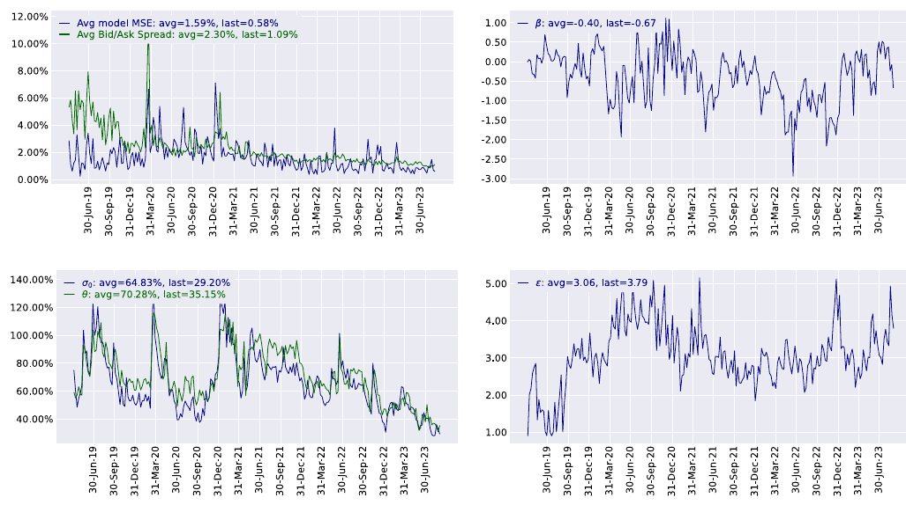
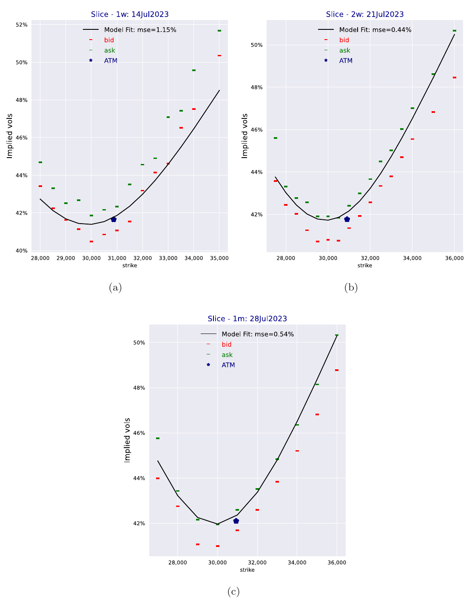
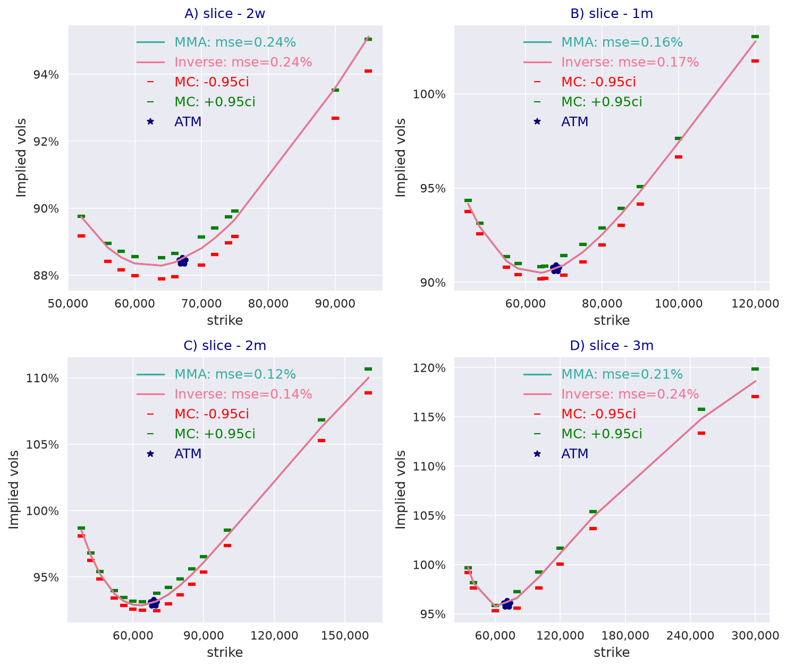

---
myst:
  html_meta:
    description: >-
      Case study: calibrating the log-normal stochastic volatility model with quadratic drift to
      Bitcoin options on Deribit from 2019 to 2023, positive volatility beta, and consistent
      valuation of inverse options under the MMA and inverse measures, with stochvolmodels code.
---

# Bitcoin options: MMA, inverse and QV valuation

*Author: [Artur Sepp](https://github.com/ArturSepp)*

Implemented in [stochvolmodels](https://github.com/ArturSepp/StochVolModels).
Software citation: [CITATION.cff](https://github.com/ArturSepp/StochVolModels/blob/main/CITATION.cff).

This case study reports how Sepp and Rakhmonov (2023, Section 6) calibrated the log-normal
stochastic volatility model with quadratic drift to Bitcoin options every week for four and a half
years, and how they compared valuation under the money-market-account (MMA) and inverse measures.
Their Deribit data cannot be distributed, so the paper's figures are reproduced under its
open-access licence and its numbers are quoted by section. A companion script applies the same
calibration configuration to the Bitcoin chain bundled with the package.

## Overview

Bitcoin options are a demanding test for a stochastic volatility model, for two reasons. Deribit
options are inverse options: premium and payoff are paid in bitcoin, so they are valued most
naturally under the inverse measure, with the spot price as numeraire. And the implied volatility
skew of Bitcoin changes sign: calls are bid in rallies and puts in sell-offs, so the correlation
between returns and volatility, carried by the volatility beta $\beta$, is sometimes positive. With a
linear drift, a positive $\beta$ breaks the martingale property; the quadratic drift restores it
when $\kappa_2 \ge \beta$ under the MMA measure and $\kappa_2 \ge 2 \beta$ under the inverse
measure (see the [conventions page](option_chains_and_conventions.md#measures-mma-and-inverse)).

The study asks three questions. Does a model with four free parameters fit the liquid part of the
Bitcoin smile week after week, across market regimes? Are valuations under the MMA and inverse
measures consistent? And what skew does the model imply for options on quadratic variance (QV)?

## Study design and data

- **Data.** Bitcoin options traded on Deribit, sampled every Friday at 10:00 UTC from April 2019 to
  October 2023. The expiries are one week, two weeks and one month, the most liquid ones; puts and
  calls with absolute deltas between 0.10 and 0.50 are included (Section 6.2).
- **Fixed mean reversion.** $\kappa_1 = 2.21$ and $\kappa_2 = 2.18$, estimated beforehand by
  fitting the model autocorrelation of log volatility to the empirical autocorrelation, and kept
  fixed over the whole period (Section 6.2).
- **Fitted parameters.** Each week $\sigma_0$, $\theta$, $\beta$ and $\varepsilon$ are fitted under
  the constraint $\kappa_2 \ge 2 \beta$, which keeps valuation under the inverse measure
  consistent (Theorem 3.7).
- **Objective.** The vega-weighted sum of squared differences between model and mid-market implied
  volatilities, Eq. (6.3), minimised by sequential least squares programming (SLSQP). Model prices
  use the second-order affine expansion.
- **Companion data.** The chain bundled with the package, `get_btc_test_chain_data`, holds Bitcoin
  implied volatilities quoted on 21 October 2021: 49 quotes on four expiries of two weeks, one,
  two and three months. It is a single historical snapshot, not part of the paper's sample.

## Configuration

The companion script
[`examples/docs/app_bitcoin_options.py`](../examples/docs/app_bitcoin_options.py) expresses the
paper's configuration with the package's calibration keywords:

```python
# mean-reversion rates estimated in the paper from the autocorrelation of volatility, Section 6.2
KAPPA1, KAPPA2 = 2.21, 2.18
```

```python
def calibrate(option_chain: svm.OptionChain) -> svm.LogSvParams:
    """Fit sigma0, theta, beta and volvol with the configuration of Section 6.2 of the paper."""
    params0 = svm.LogSvParams(sigma0=0.8, theta=0.8, kappa1=KAPPA1, kappa2=KAPPA2,
                              beta=0.5, volvol=2.0)
    return svm.LogSVPricer().calibrate_model_params_to_chain(
        option_chain=option_chain,
        params0=params0,
        model_calibration_type=svm.LogsvModelCalibrationType.PARAMS4,
        constraints_type=svm.ConstraintsType.INVERSE_MARTINGALE,
        is_vega_weighted=True,
    )
```

| Choice in Section 6.2 | Package setting |
|---|---|
| Fix $\kappa_1$ and $\kappa_2$; fit $\sigma_0$, $\theta$, $\beta$ and $\varepsilon$ | `LogsvModelCalibrationType.PARAMS4`, with the fixed rates in `params0` |
| $\kappa_2 \ge 2 \beta$ | `ConstraintsType.INVERSE_MARTINGALE` |
| Vega weights of Eq. (6.3) | `is_vega_weighted=True` |
| SLSQP | the optimiser of `LogSVPricer.calibrate_model_params_to_chain` |
| Second-order affine expansion | the default expansion order of the LogSV pricer |

The calibration of the bundled chain takes a few minutes. The script records its result, and the
other cases start from it:

```python
# the result of calibrate() on the bundled chain, asserted by the CALIBRATE case
FITTED = svm.LogSvParams(sigma0=0.8626, theta=1.0418, kappa1=KAPPA1, kappa2=KAPPA2,
                         beta=0.1296, volvol=1.6286)
```

## Results

### Weekly fits from 2019 to 2023

The paper reports that the model's average error was within the average bid-ask spread most of the
time, including the volatile year 2020, and below one volatility point most of the time in 2022
and 2023 (Section 6.2). Over the whole sample, the legend of its Fig. 7 gives an average error of
1.59 volatility points against an average bid-ask spread of 2.30. The fitted level of volatility
fell from about 80% in 2021 and 2022 to about 40% at the end of the sample, while $\beta$ and
$\varepsilon$ stayed range-bound. The volatility beta alternated between positive and negative
values with market sentiment.

[](images/ijtaf_fig7_btc_calibrations.png)

*Reproduced from Sepp and Rakhmonov (2023), Fig. 7, under
[CC BY 4.0](https://creativecommons.org/licenses/by/4.0/); cropped, with the sub-captions removed.
Weekly calibrations to Deribit Bitcoin options, April 2019 to October 2023. Top left: the average
model error ("MSE", a root-mean-square difference) and the average bid-ask spread of implied
volatilities. Top right: the volatility beta $\beta$. Bottom left: the initial volatility
$\sigma_0$ and the mean volatility $\theta$. Bottom right: the volatility-of-volatility
$\varepsilon$. In the published figure the sub-captions of the two upper-right and lower-left
panels are interchanged; the description here follows the plotted series.*

### One day in detail

On 20 June 2023 the fitted parameters were, Eq. (6.4),

$$
\hat{\sigma}_0 = 0.41, \quad \hat{\theta} = 0.38, \quad \hat{\beta} = 0.50, \quad \hat{\varepsilon} = 3.06, \quad \hat{\kappa}_1 = 2.21, \quad \hat{\kappa}_2 = 2.18 .
$$

The implied volatility skew was positive, so $\beta$ was positive, and the constraint held:
$2 \beta = 1.00$ against $\kappa_2 = 2.18$. The paper reports that the model captures the
skew across the three liquid expiries with four parameters, with an error of about 0.5 volatility
points for the longer expiries, within the bid-ask spread (Section 6.2).

[](images/ijtaf_fig8_btc_fit.png)

*Reproduced from Sepp and Rakhmonov (2023), Fig. 8, under
[CC BY 4.0](https://creativecommons.org/licenses/by/4.0/); cropped, with the caption omitted.
Model implied volatilities (line) against bid and ask quotes for the one-week (a), two-week (b)
and one-month (c) expiries, with the parameters of Eq. (6.4). The published caption dates the fit
20 June 2023; the panels are labelled with expiries of 14, 21 and 28 July 2023.*

### Valuation under the MMA and inverse measures

With the parameters of Eq. (6.4), the paper values vanilla options under the MMA measure and
inverse options under the inverse measure, and compares both with a Monte Carlo simulation of
400,000 paths. The two transform valuations differ by amounts of order $10^{-4}$, the accuracy of
the ordinary differential equation solver and the Fourier inversion (Section 6.3). The same holds
for call options on QV. Their implied volatility skew slopes upwards, as observed in market data on
options on QV and on the VIX index, whereas the Heston model produces downward-sloping skews for
these options (Section 6.3).

### The same configuration on the bundled chain

The companion script applies the configuration to the chain of 21 October 2021. The fit gives
$\sigma_0 = 0.863$, $\theta = 1.04$, $\beta = 0.130$ and $\varepsilon = 1.63$. The volatility
beta is positive, as the paper finds in bullish periods, and the constraint holds with a margin:
$\kappa_2 - 2 \beta = 1.92$.

```python
def fit_quality(option_chain: svm.OptionChain, params: svm.LogSvParams = FITTED) -> dict:
    """Per slice: root-mean-square error of model against mid volatilities, and bid-ask spread."""
    pricer = svm.LogSVPricer()
    vol_scaler = pricer.set_vol_scaler(option_chain=option_chain)
    model_vols = pricer.compute_model_ivols_for_chain(option_chain=option_chain, params=params,
                                                      vol_scaler=vol_scaler)
    quality = {}
    for slice_id, model, bid, ask in zip(option_chain.ids, model_vols,
                                         option_chain.bid_ivs, option_chain.ask_ivs):
        mid = 0.5 * (bid + ask)
        quality[slice_id] = {"rmse": np.sqrt(np.mean((model - mid) ** 2)),
                             "spread": np.mean(ask - bid)}
    return quality
```

| Expiry | Root-mean-square error | Average bid-ask spread |
|---|---|---|
| Two weeks | 2.04% | 2.11% |
| One month | 1.00% | 1.73% |
| Two months | 0.83% | 1.47% |
| Three months | 1.24% | 1.12% |

The error is inside the average spread for the first three expiries and slightly above it for the
three-month expiry, the longest. The paper notes that a term structure of the mean volatility
$\theta$ improves the fit around the money (Section 6.2); the package supports one through
`LogSvParams.vol_backbone`.

[](images/btc_case_fit.png)

*Historical snapshot: the Bitcoin chain of 21 October 2021 bundled with the package. Model implied
volatilities (line) with the parameters `FITTED`, against bid and ask quotes. The legend's "mse" is
the root-mean-square difference to mid volatility. Drawn by `LogSVPricer.plot_model_ivols_vs_bid_ask`.*

```python
def compare_measures(option_chain: svm.OptionChain, params: svm.LogSvParams = FITTED,
                     nb_path: int = 50000, seed: int = 3) -> dict:
    """Prices under the MMA and inverse measures, and seeded Monte Carlo prices with errors."""
    pricer = svm.LogSVPricer()
    vol_scaler = pricer.set_vol_scaler(option_chain=option_chain)
    mma = pricer.price_chain(option_chain=option_chain, params=params, vol_scaler=vol_scaler)
    inverse = pricer.price_chain(option_chain=option_chain, params=params,
                                 is_spot_measure=False, vol_scaler=vol_scaler)
    set_seed(seed)
    mc, mc_se = pricer.model_mc_price_chain(option_chain=option_chain, params=params,
                                            nb_path=nb_path, nb_steps=360)
    return {"mma": mma, "inverse": inverse, "mc": mc, "mc_se": mc_se}
```

Across the 49 quotes, the MMA and inverse valuations differ by less than $10^{-4}$ of the forward
in price and less than $4 \times 10^{-4}$ in implied volatility. The Monte Carlo prices, from 50,000
paths with daily steps, lie within two standard errors of the MMA prices at every strike.

[](images/btc_case_measures.png)

*Historical snapshot: the Bitcoin chain of 21 October 2021. Implied volatilities under the MMA
measure and the inverse measure, which overlap, against the 95% confidence bounds of a Monte Carlo
simulation with 400,000 paths, daily steps and seed 7. The legend's "mse" is the root-mean-square
difference to the Monte Carlo implied volatility. Drawn by
`LogSVPricer.plot_comp_mma_inverse_options_with_mc`.*

## What the study does and does not show

The study shows that, with the mean-reversion rates fixed, four parameters fit the liquid
short-dated Bitcoin smile across four and a half years of changing regimes, including periods of
positive volatility beta, and that the quadratic drift keeps both valuation measures consistent
while $\beta$ is positive.

It does not show:

- **Hedging or out-of-sample performance.** The weekly fits are in-sample; the paper reports no
  hedging or forecasting test.
- **A comparison with other models.** The fit quality is measured against the bid-ask spread, not
  against another model fitted to the same data.
- **Point-in-time parameters.** The mean-reversion rates were estimated once and kept fixed over the
  whole period; the paper notes that in practice they would be re-estimated regularly.
- **A market test of arbitrage.** The agreement of the MMA and inverse valuations is a check of
  numerical consistency within the model, not of quoted prices.
- **The paper's numbers on the companion chain.** The bundled chain is a different date and covers
  longer expiries. The companion script demonstrates the mechanism, not the paper's results.

## Reproduce

Run the companion script from a checkout:

```console
python examples/docs/app_bitcoin_options.py
```

The `CALIBRATE` case repeats the calibration and asserts that it reproduces `FITTED`; it is listed
in `SLOW_CASES` and runs in the slow test lane. The other cases take seconds.

The paper's figures come from
[`papers/logsv_model_with_quadratic_drift/article_figures.py`](https://github.com/ArturSepp/StochVolModels/blob/main/papers/logsv_model_with_quadratic_drift/article_figures.py).
Fig. 7 reads a local file of weekly calibration results, and Figs. 8 and 9 load a Deribit chain
from local Tardis data through the `research` extra; neither input is distributed. The paper
directories and their prerequisites are described in
[research papers and replication](reproducing_the_papers.md). The exhibits on this page are regenerated by
`python -m scripts.docs_analytics.run --all`, as recorded in the
[analytics gallery](analytics_gallery.md).

## See also

- [Option chains, notation and conventions](option_chains_and_conventions.md)
- [Steady-state distribution, moments and expected quadratic variance](volatility_distribution_and_moments.md)
- [Calibration](calibration.md)
- [Analytic versus Monte Carlo validation](analytic_vs_monte_carlo.md)

## References

- Sepp, A. and Rakhmonov, P. (2023). Log-normal stochastic volatility model with quadratic drift.
  *International Journal of Theoretical and Applied Finance* 26(8), 2450003.
  [DOI 10.1142/S0219024924500031](https://doi.org/10.1142/S0219024924500031). Open access under
  [CC BY 4.0](https://creativecommons.org/licenses/by/4.0/).
- [stochvolmodels software citation](https://github.com/ArturSepp/StochVolModels/blob/main/CITATION.cff).
