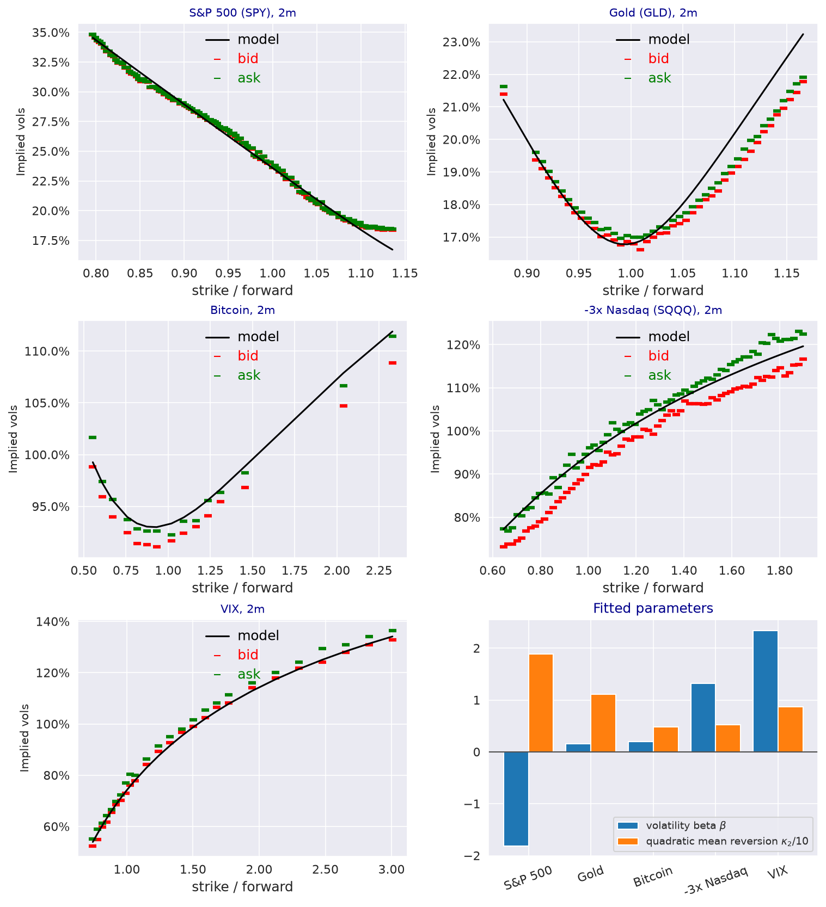

---
myst:
  html_meta:
    description: >-
      Case study: the log-normal stochastic volatility model with quadratic drift on dated option
      chains of the S&P 500 ETF, gold, Bitcoin, a -3x Nasdaq ETF and VIX bundled with
      stochvolmodels; negative and positive volatility beta, fit quality, and the martingale
      conditions of the positive-beta fits.
---

# One model for equity, VIX, gold and leveraged-ETF skews

*Author: [Artur Sepp](https://github.com/ArturSepp)*

Implemented in [stochvolmodels](https://github.com/ArturSepp/StochVolModels).
Software citation: [CITATION.cff](https://github.com/ArturSepp/StochVolModels/blob/main/CITATION.cff).

Equity-index options price a skew in which puts are dearer than calls; options on the VIX index and
on leveraged-short exchange-traded funds price the opposite. This case study evaluates one
parameterisation of the log-normal stochastic volatility (SV) model with quadratic drift on option
chains of five underlyings bundled with the package, using the parameters recorded in the module
`papers/logsv_model_with_quadratic_drift/calibrations.py`. It is an illustration of the package on
dated historical snapshots, not the replication of a published result: the published article
calibrates the model to Bitcoin options only (see the
[Bitcoin case study](app_bitcoin_options.md)).

## Overview

Sepp and Rakhmonov (2023, Section 1.4) note that the return-volatility correlation is positive
permanently for the VIX index and for short and leveraged-short ETFs, and in some regimes for
commodities, currencies and cryptocurrencies. In the log-normal SV model the sign of that
correlation is the sign of the volatility beta $\beta$. With a linear drift a positive $\beta$
makes the discounted price a strict local martingale; the quadratic drift restores the martingale
property under the money-market-account (MMA) measure when $\kappa_2 \ge \beta$, and under the
inverse measure when $\kappa_2 \ge 2 \beta$ (Theorem 3.7; see
[martingale conditions](martingale_conditions_and_skews.md)).

The study asks two questions. Does the same model, fitted to each chain separately, take a negative
$\beta$ for the equity index and a positive one where the skew is reversed? And do the positive-beta
fits satisfy the martingale conditions?

## Study design and data

Each chain is a single dated snapshot of bid and ask implied volatilities; the package records the
date of each snapshot, not the venue or the filter applied to the quotes.

| Underlying | Chain | Snapshot | Maturities | Options |
|---|---|---|---|---|
| S&P 500 ETF (SPY) | `get_spy_test_chain_data` | 15 July 2022 | 2w, 1m, 2m, 6m | 427 |
| Gold ETF (GLD) | `get_gld_test_chain_data` | 15 July 2022 | 1m, 2m, 5m, 12m | 154 |
| Bitcoin | `get_btc_test_chain_data` | 21 October 2021 | 2w, 1m, 2m, 3m | 49 |
| -3x Nasdaq ETF (SQQQ) | `get_sqqq_test_chain_data` | 15 July 2022 | 2w, 1m, 2m, 6m | 232 |
| VIX | `get_vix_test_chain_data` | 15 July 2022 | 2w, 1m, 2m, 6m | 92 |

The skew of each maturity is measured by `OptionChain.get_chain_skews(delta=0.25)`: the 25-delta
put volatility minus the 25-delta call volatility, divided by the at-the-money volatility. It is
positive when puts are dearer than calls.

## Configuration

The module fits five parameters with `LogsvModelCalibrationType.PARAMS5`, which sets
$\kappa_2 = \kappa_1 / \theta$, by minimising squared implied-volatility errors weighted by vegas
normalised within each maturity. Its constraints differ by asset: `MMA_MARTINGALE_MOMENT4`
($\kappa_2 \ge \beta$ and the fourth-moment inequality
$\kappa_1 + \kappa_2 \theta \ge 1.5 \vartheta^2$, with $\vartheta^2 = \beta^2 + \varepsilon^2$) for SPY, SQQQ and
VIX, `INVERSE_MARTINGALE` for Bitcoin, whose options are inverse options, and no constraint for
gold. The recorded parameters are:

| Underlying | $\sigma_0$ | $\theta$ | $\kappa_1$ | $\kappa_2$ | $\beta$ | $\varepsilon$ |
|---|---|---|---|---|---|---|
| SPY | 0.2270 | 0.2616 | 4.9325 | 18.8550 | -1.8123 | 0.9832 |
| GLD | 0.1505 | 0.1994 | 2.2062 | 11.0630 | 0.1547 | 2.8011 |
| Bitcoin | 0.8327 | 1.0139 | 4.8609 | 4.7940 | 0.1988 | 2.3694 |
| SQQQ | 0.9114 | 0.9390 | 4.9544 | 5.2762 | 1.3215 | 0.9964 |
| VIX | 0.9767 | 0.5641 | 4.9067 | 8.6985 | 2.3425 | 1.0163 |

The companion script
[`examples/docs/app_positive_and_negative_skews.py`](../examples/docs/app_positive_and_negative_skews.py)
asserts every number quoted below. The fit is measured against the mid of bid and ask, and against
the spread itself:

```python
def fit_quality(asset: str) -> dict:
    """Per slice: RMSE of model against mid implied vols and share of quotes inside bid-ask."""
    chain = CHAINS[asset]()
    pricer = svm.LogSVPricer()
    model_vols = pricer.compute_model_ivols_for_chain(
        option_chain=chain, params=FITTED[asset],
        vol_scaler=pricer.set_vol_scaler(option_chain=chain))
    out = {}
    for slice_id, model, bid, ask in zip(chain.ids, model_vols, chain.bid_ivs, chain.ask_ivs):
        mid = 0.5 * (bid + ask)
        out[slice_id] = {"rmse": np.sqrt(np.nanmean(np.square(model - mid))),
                         "inside": np.mean((model >= bid) & (model <= ask))}
    return out
```

and the parameters against the conditions of Theorem 3.7 and the fourth-moment inequality:

```python
def admissibility(params: svm.LogSvParams) -> dict:
    """Theorem 3.7 conditions and the fourth-moment inequality of the calibration constraints."""
    vartheta2 = params.beta ** 2 + params.volvol ** 2
    return {"mma": params.kappa2 >= params.beta, "inverse": params.kappa2 >= 2.0 * params.beta,
            "fourth_moment": params.kappa1 + params.kappa2 * params.theta >= 1.5 * vartheta2}
```

## Results

**Skews of both signs.** The SPY skew is 0.25 or more at every maturity: puts are dearer. The
Bitcoin, SQQQ and VIX skews are negative at every maturity; the VIX skew is -0.351 at two weeks
and -0.461 at one month. The gold skew changes sign along the term structure, from
0.039 at one month to -0.152 at twelve months.

**The sign of beta follows the skew.** The fitted $\beta$ is negative for SPY (-1.81) and positive
for Bitcoin (0.20), SQQQ (1.32) and VIX (2.34): opposite in sign to the skew measure in each case.
For gold, whose skew changes sign, the fit takes a small $\beta$ of 0.15 and carries the smile by
the residual vol-of-vol, $\varepsilon = 2.80$.

**Fit quality.** The root-mean-square error against mid implied volatilities ranges over the
maturities from 0.47 to 1.04 volatility points for SPY, 0.72 to 0.96 for gold, 0.97 to 1.32 for
Bitcoin, 1.76 to 3.43 for SQQQ and 1.58 to 4.82 for VIX. The SPY spreads are narrower than these
errors, so fewer than 9% of SPY model volatilities fall inside bid and ask at any maturity; for
SQQQ, whose spreads are wide, at least 79% do.

**Admissibility.** Every recorded fit satisfies $\kappa_2 \ge 2 \beta$ and therefore
$\kappa_2 \ge \beta$: the price is a martingale under the MMA measure and its inverse under the
inverse measure, including for VIX, where $\kappa_2 = 8.70$ against $2 \beta = 4.685$. The
fourth-moment inequality holds for every asset except gold, which the module fits without
constraints.

**The recorded VIX fit is not the optimum of its configuration.** Repeating the module's VIX
calibration, from its starting point and under its constraints, returns $\beta = 2.80$ and
$\varepsilon = 0.34$ instead of 2.34 and 1.02, with a weighted error of 0.0017 against 0.0032 at the
recorded parameters; the fourth-moment inequality binds at the refit. Both points have a positive
$\beta$ and satisfy both martingale conditions, so the conclusions above do not depend on which is
used.

[](images/cross_asset_calibrations.png)

*Bundled snapshots of 15 July 2022 (SPY, GLD, SQQQ, VIX) and 21 October 2021 (Bitcoin). Model
implied volatilities of the recorded parameters against bid and ask at the two-month maturity,
against strike over forward, and (bottom right) the fitted $\beta$ and $\kappa_2 / 10$ of each
underlying.*

## What the study does and does not show

- **It shows** that one model, with a quadratic drift and five fitted parameters, describes dated
  chains whose skews have opposite signs, that $\beta$ takes the sign the skew requires, and that the
  positive-beta fits satisfy the martingale conditions of Theorem 3.7.
- **It does not show** that the parameters are stable over time: each underlying is one snapshot.
  The [Bitcoin case study](app_bitcoin_options.md) reports weekly calibrations over four and a half
  years for one underlying.
- **Identification.** $\beta$ and $\varepsilon$ both shape the smile, and the VIX refit shows that
  different pairs fit the same chain; the sign of $\beta$ is the robust result, not its value.
- **It is not a paper replication.** The published article does not report these five fits; the
  parameters are those recorded with the package.

## Reproduce

Run the companion script from a checkout:

```console
python examples/docs/app_positive_and_negative_skews.py
```

The `REFIT_VIX` case repeats the module's VIX calibration, about eight minutes; it is listed in
`SLOW_CASES` and runs in the slow test lane. The other cases take seconds. The module's
`calibrate_logsv_model` runs the calibration of each underlying with the configuration above.

## See also

- [Martingale conditions, measures and positive skews](martingale_conditions_and_skews.md)
- [Calibration to implied volatilities](calibration.md)
- [Bitcoin options: MMA, inverse and QV valuation](app_bitcoin_options.md)
- [Log-normal stochastic volatility model with quadratic drift](logsv_model.md)

## References

- Sepp, A. and Rakhmonov, P. (2023). Log-normal stochastic volatility model with quadratic drift.
  *International Journal of Theoretical and Applied Finance* 26(8), 2450003.
  [DOI 10.1142/S0219024924500031](https://doi.org/10.1142/S0219024924500031).
- [stochvolmodels software citation](https://github.com/ArturSepp/StochVolModels/blob/main/CITATION.cff).
