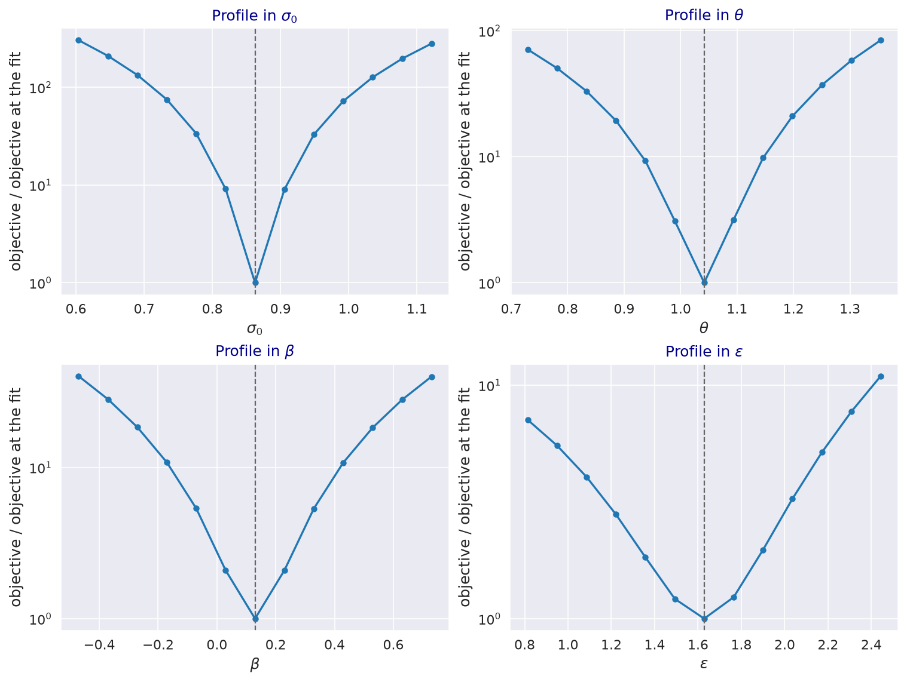
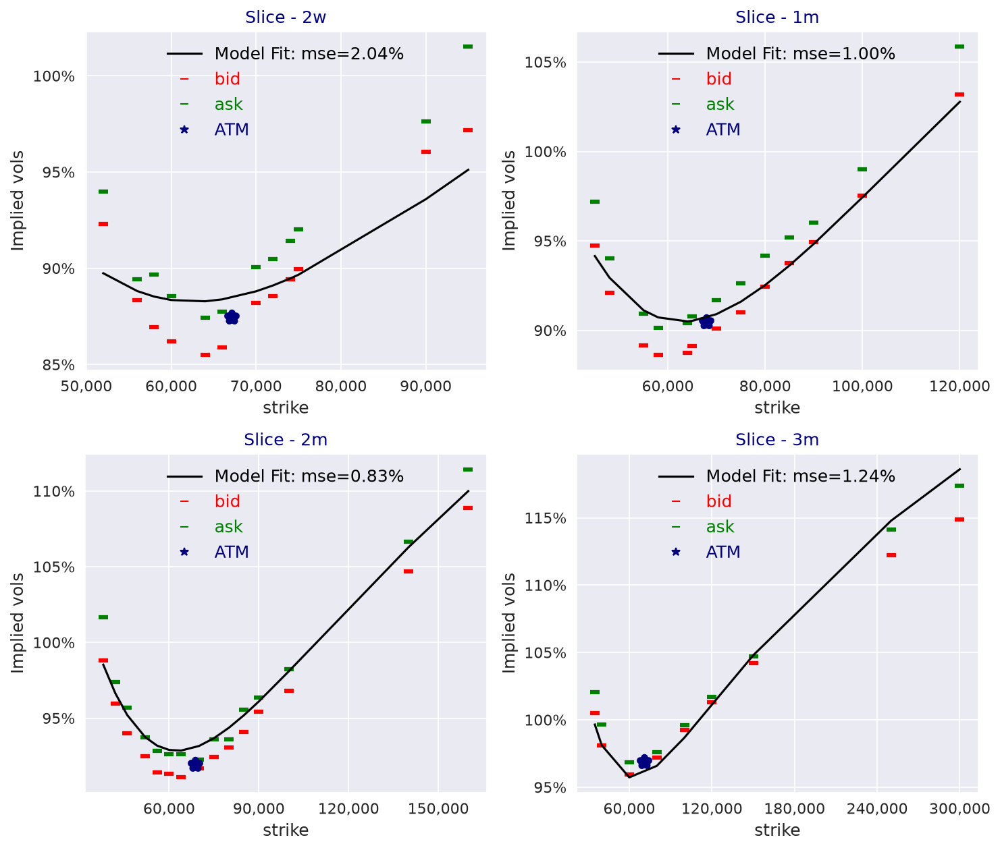

---
myst:
  html_meta:
    description: >-
      Calibrating the log-normal stochastic volatility model to option implied volatilities with
      stochvolmodels: the vega-weighted objective, the parameter sets, the martingale constraints,
      the analytic and Monte Carlo engines, the variance-swap backbone, and a worked calibration to
      the bundled Bitcoin chain with its objective profiles and a refit from a distant start.
---

# Calibration to implied volatilities

*Author: [Artur Sepp](https://github.com/ArturSepp) / First recorded: [2026-08-16](https://github.com/ArturSepp/StochVolModels/commit/e9e01403a6ba36aad7708049028c64438a606234)*

Implemented in [stochvolmodels](https://github.com/ArturSepp/StochVolModels).
Software citation: [CITATION.cff](https://github.com/ArturSepp/StochVolModels/blob/main/CITATION.cff).

Calibration finds the model parameters whose implied volatilities are closest to the market's.
Sepp and Rakhmonov (2023, Section 6.2) calibrate the log-normal stochastic volatility (SV) model
weekly to Bitcoin options by minimising a vega-weighted squared error of implied volatilities, with
the mean-reversion rates fixed beforehand and a martingale constraint. This article describes the
objective, the choice of free parameters, the constraints and engines of
`LogSVPricer.calibrate_model_params_to_chain`, and shows on the bundled Bitcoin chain how well the
objective identifies each parameter and that a distant start finds the same optimum.

## Overview

A calibration has four ingredients: the market data (an option chain with bid and ask implied
volatilities), an objective, the free parameters with their bounds and constraints, and the engine
that computes model implied volatilities inside the objective. The mean-reversion rates $\kappa_1$
and $\kappa_2$ trade off against the vol-of-vol and the volatility beta: different combinations
produce similar smiles. The paper therefore estimates $\kappa_1$ and $\kappa_2$ from the
autocorrelation of volatility and fits the four remaining parameters to options.

## Inputs, notation, and assumptions

| Keyword of `calibrate_model_params_to_chain` | Meaning | Default |
|---|---|---|
| `option_chain` | Chain with forwards, discount factors, strikes, option codes and bid and ask implied volatilities | |
| `params0` | Starting point; under `PARAMS4` its `kappa1` and `kappa2` are held fixed | |
| `params_min`, `params_max` | Box bounds of the free parameters | $\sigma_0, \theta \in [0.1, 1.5]$, $\kappa_1, \kappa_2 \in [0.25, 10]$, $\beta \in [-3, 3]$, $\varepsilon \in [0.2, 3]$ |
| `is_vega_weighted` | Weight squared errors by Black-Scholes vega | `True` |
| `is_unit_ttm_vega` | Compute the vegas at unit maturity | `False` |
| `model_calibration_type` | Free parameters, `LogsvModelCalibrationType` | `PARAMS5` |
| `constraints_type` | Martingale constraints, `ConstraintsType` | `UNCONSTRAINT` |
| `calibration_engine` | `CalibrationEngine.ANALYTIC`, `MC` or `ROUGH_MC` | `ANALYTIC` |
| `nb_path`, `nb_steps`, `seed` | Monte Carlo engines only: paths, steps per year, seed of the fixed random numbers | 100,000; 360; 10 |

Implied volatilities are Black-Scholes volatilities in decimals; the chain's conventions are on the
[conventions page](option_chains_and_conventions.md#option-chains).

## Methodology

### The objective

The objective is the weighted mean squared error of Eq. (6.3),

$$
\mathrm{WMSE} = \sum_n w_n \left( \sigma_n^{model} - \sigma_n^{mid} \right)^2 ,
$$

over all options $n$ of the chain, with $\sigma^{mid}$ the mid of the bid and ask implied
volatilities. The paper sets $w_n$ to the Black-Scholes vega of the option. The package normalises
the vegas to sum to one within each maturity, so every maturity carries the same total weight and,
within a maturity, options near the money count most. With `is_unit_ttm_vega=True` the vegas are
computed as if the maturity were one year, which spreads the weight further into the wings; after
the normalisation it does not change the weight of a maturity.

### Free parameters

| `LogsvModelCalibrationType` | Fitted | Held |
|---|---|---|
| `PARAMS4` | $\sigma_0$, $\theta$, $\beta$, $\varepsilon$ | $\kappa_1$, $\kappa_2$ from `params0`, as in Section 6.2 |
| `PARAMS5` | $\sigma_0$, $\theta$, $\kappa_1$, $\beta$, $\varepsilon$ | $\kappa_2 = \kappa_1 / \theta$ |
| `PARAMS6` | Declared for all six parameters | Not implemented: raises `NotImplementedError` |
| `PARAMS_WITH_VARSWAP_FIT` | $\beta$, $\varepsilon$ | $\sigma_0$, $\theta$, $\kappa_1$, $\kappa_2$ from `params0`, with a variance-swap backbone |

### Constraints and optimiser

`ConstraintsType` adds the martingale conditions of Theorem 3.7 as inequality constraints:
$\kappa_2 \ge \beta$ for the money-market-account measure, $\kappa_2 \ge 2 \beta$ for the inverse
measure, and optionally $\kappa_1 + \kappa_2 \theta \ge 1.5 \vartheta^2$ for a finite fourth moment
of volatility (see [martingale conditions](martingale_conditions_and_skews.md#constraints-in-calibration)).
The package minimises with sequential least-squares programming (SLSQP) under the box bounds and
these constraints, with a function tolerance of $10^{-8}$. It raises `CalibrationError` when the
optimiser fails, returns non-finite values or a vector of the wrong length, or leaves the bounds.

### Engines

The analytic engine prices the chain by the [Fourier transform](european_option_pricing.md) of
the [affine expansion](affine_expansion.md), on a grid fixed from the chain's first at-the-money
volatility so that it does not move as $\sigma_0$ changes. The Monte Carlo engine draws its random
numbers once, with `get_randoms_for_chain_valuation` and the given `seed`, and reuses them at every
evaluation, so the objective is a smooth function of the parameters
([Monte Carlo schemes](monte_carlo_simulation.md)). `ROUGH_MC` does the same for the experimental
rough extension.

### The variance-swap backbone

`PARAMS_WITH_VARSWAP_FIT` scales $\theta$ by a factor $\eta_i$ for each maturity $T_i$, chosen so
that the model reproduces the variance-swap strikes replicated from the chain: $\eta_i$ is the ratio
of the market's expected quadratic variance between $T_{i-1}$ and $T_i$ to the model's. The code
replaces a non-positive ratio by one and takes the square root of the ratio for maturities below
0.06 years. The factors are stored in `LogSvParams.vol_backbone` and enter the transform and the
simulation. The device is outside the paper.

## Worked example

Every block below is an excerpt of [`examples/docs/calibration.py`](../examples/docs/calibration.py),
which asserts every number quoted here. The chain is the bundled Bitcoin chain of 21 October 2021
(four maturities, 49 options), and `FITTED` is the result of the [Bitcoin case
study](app_bitcoin_options.md): `PARAMS4` with $\kappa_1 = 2.21$ and $\kappa_2 = 2.18$ from the paper,
under `INVERSE_MARTINGALE`.

```python
def weighted_error(params: svm.LogSvParams, chain: svm.OptionChain,
                   is_unit_ttm_vega: bool = False) -> float:
    """Objective of Eq. (6.3): squared implied-vol errors weighted by vegas normalised per slice."""
    pricer = svm.LogSVPricer()
    vegas = chain.get_chain_vegas(is_unit_ttm_vega=is_unit_ttm_vega)
    weights = [vega / np.sum(vega) for vega in vegas]
    model_vols = pricer.compute_model_ivols_for_chain(
        option_chain=chain, params=params, vol_scaler=pricer.set_vol_scaler(option_chain=chain))
    return sum(np.nansum(w * np.square(model - mid))
               for w, model, mid in zip(weights, model_vols, chain.get_mid_vols()))
```

At the fit the objective is $5.03 \times 10^{-4}$, and $7.27 \times 10^{-4}$ with unit-maturity
vegas. Moving one parameter at a time, the others held at the fit, shows how sharply the objective
identifies each: changing $\sigma_0$ by 10% multiplies it by about 33, $\theta$ by about 9.5, the
vol-of-vol $\varepsilon$ by about 1.3, and moving $\beta$ by 0.1 about doubles it. The level
parameters are pinned by the at-the-money volatilities; the smile parameters by the wings, which
carry little vega weight.

[](images/calibration_objective_profiles.png)

*Historical snapshot of 21 October 2021, bundled with the package. The objective of Eq. (6.3),
relative to its value at the fit, as one parameter moves and the others stay at the fit. Each profile
has its minimum at the fitted value, marked by the dashed line.*

The fit satisfies all three constraints with room: $\kappa_2 - \beta = 2.050$,
$\kappa_2 - 2 \beta = 1.921$ and $\kappa_1 + \kappa_2 \theta - 1.5 \vartheta^2 = 0.477$, so on this
chain the constraints do not bind and every constraint type gives the same fit. The script's slow case
starts far from the fit, under the weaker money-market-account constraint:

```python
def refit(chain: svm.OptionChain) -> svm.LogSvParams:
    """Fit sigma0, theta, beta and volvol from a distant start under the MMA martingale."""
    params0 = svm.LogSvParams(sigma0=1.2, theta=0.6, kappa1=2.21, kappa2=2.18, beta=-0.5,
                              volvol=1.0)
    return svm.LogSVPricer().calibrate_model_params_to_chain(
        option_chain=chain, params0=params0,
        model_calibration_type=svm.LogsvModelCalibrationType.PARAMS4,
        constraints_type=svm.ConstraintsType.MMA_MARTINGALE,
        calibration_engine=svm.CalibrationEngine.ANALYTIC, is_vega_weighted=True)
```

It returns the same $\sigma_0$, $\theta$, $\beta$ and $\varepsilon$ as the case study to $10^{-3}$.
The fit against the bid and ask quotes is the case study's exhibit:

[](images/btc_case_fit.png)

*Historical snapshot of 21 October 2021: the fitted model against bid and ask implied
volatilities, drawn by `LogSVPricer.plot_model_ivols_vs_bid_ask`; the exhibit of the Bitcoin case
study. The legend's "mse" is a root-mean-square error.*

For the variance-swap backbone, the strikes replicated from the chain, floored at the at-the-money
volatility, are 88.2%, 90.9%, 94.6% and 96.9% for the four maturities, and the factors that make the
fitted model reproduce them are 0.981, 0.928, 0.938 and 0.869.

## Implementation in stochvolmodels

| Name | Role |
|---|---|
| `LogSVPricer.calibrate_model_params_to_chain` | The calibration, with the keywords of the table above |
| `LogsvModelCalibrationType`, `ConstraintsType`, `CalibrationEngine` | Free parameters, constraints and engine; stable exports |
| `CalibrationError` | Raised for a failed or invalid optimisation; a stable export |
| `LogSvParams` field `vol_backbone`, with `set_vol_backbone` and `get_vol_backbone_eta` | Backbone factors by maturity, used by the transform and the simulation |
| `OptionChain.get_slice_varswap_strikes`, `get_chain_vegas` | Replicated variance-swap strikes and the vegas of the weights |

The backbone fit is `fit_model_vol_backbone_to_varswaps` in `stochvolmodels.pricers.logsv.vol_moments_ode`,
an internal function. Each objective evaluation prices the whole chain, so an analytic calibration of
the bundled chain takes a few minutes; the Monte Carlo engines are slower. Record the chain, the
starting point, the bounds, the constraint, the engine and, for Monte Carlo, the seed. Run the
example from a checkout with `python examples/docs/calibration.py`.

## Interpretation and limitations

- **A local optimiser.** SLSQP finds a local minimum; restart from other points, as the refit does,
  when the result matters.
- **Identification.** The smile parameters are weakly identified relative to the level parameters,
  and the mean-reversion rates are not fitted by `PARAMS4`; fix them from time-series information as
  the paper does.
- **Bid and ask are not in the objective.** The mid is fitted; compare the residuals with the
  bid-ask spread afterwards, as the case study does.
- **Short maturities at low volatility.** The transform's accuracy limit for small
  $\sigma_0 \sqrt{\tau}$ (see [Fourier pricing](european_option_pricing.md#interpretation-and-limitations))
  carries into the objective.

## See also

- [Bitcoin options: MMA, inverse and QV valuation](app_bitcoin_options.md)
- [Martingale conditions, measures and positive skews](martingale_conditions_and_skews.md)
- [Monte Carlo simulation schemes](monte_carlo_simulation.md)
- [Approximate log-normal SV smile fitter](logsv_smile_fitter.md)

## References

- Sepp, A. and Rakhmonov, P. (2023). Log-normal stochastic volatility model with quadratic drift.
  *International Journal of Theoretical and Applied Finance* 26(8), 2450003.
  [DOI 10.1142/S0219024924500031](https://doi.org/10.1142/S0219024924500031).
- [stochvolmodels software citation](https://github.com/ArturSepp/StochVolModels/blob/main/CITATION.cff).
