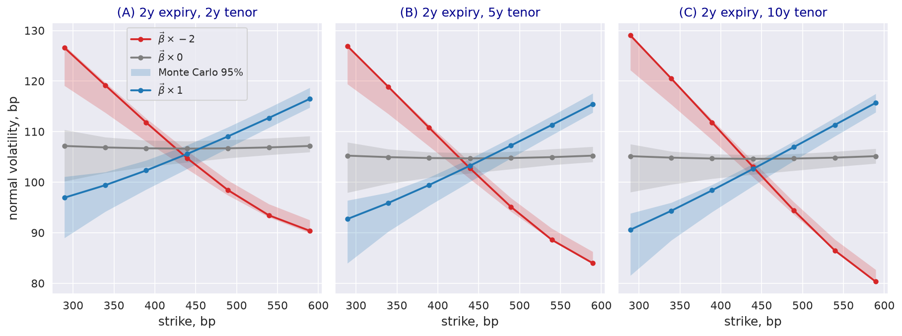

---
myst:
  html_meta:
    description: >-
      The factor Heath-Jarrow-Morton model with a log-normal stochastic volatility driver in
      stochvolmodels: Nelson-Siegel factors, the auxiliary factor, swap rates under the annuity
      measure, drift freezing, the first-order affine expansion of the swap-rate MGF, swaption
      smiles as the volatility beta varies, and a Monte Carlo check. Experimental tier.
---

# Stochastic volatility for factor HJM rates

*Author: [Artur Sepp](https://github.com/ArturSepp)*

Implemented in [stochvolmodels](https://github.com/ArturSepp/StochVolModels).
Software citation: [CITATION.cff](https://github.com/ArturSepp/StochVolModels/blob/main/CITATION.cff).

Sepp and Rakhmonov (2025) add a stochastic volatility (SV) driver to the factor Heath-Jarrow-Morton
(FHJM) framework of Lyashenko and Goncharov (2022): a small number of yield-curve factors, such as the
level, slope and curvature of Nelson and Siegel (1987), share one volatility process that is
correlated with them. The correlation produces skews in swaption and SOFR option volatilities, and
an affine expansion of the moment generating function (MGF) prices both in closed form up to a
Fourier integral. This article explains the model and the approximations behind the pricer, and
shows how the volatility beta shapes swaption smiles.

```{note}
`stochvolmodels.pricers.factor_hjm` is an experimental research surface: it is reached by deep
imports, may change between minor releases, and is outside the stable API (see
[stability tiers](option_chains_and_conventions.md#stability-tiers)).
```

## Overview

The yield curve moves through $d$ factors $X_t$ that are Gaussian given the volatility path, and an
auxiliary, locally deterministic factor $Y_t$ keeps the curve free of arbitrage. One scalar driver
$\sigma_t$ scales the volatility of all factors, so the volatility is unspanned: bond prices do not
depend on it. A swaption is an option on a swap rate, which is a martingale under the annuity
measure, but its dynamics depend on the whole curve. Freezing the curve factors at their expected
paths makes the swap rate a one-dimensional diffusion driven by $\sigma_t$, whose MGF the affine
expansion gives. A Monte Carlo simulation of the full dynamics, without the freezing, checks the
result.

## Inputs, notation, and assumptions

| Paper | Code, `MultiFactRateLogSvParams` | Meaning |
|---|---|---|
| $\lambda$ | `basis=NelsonSiegel(meanrev, key_terms)` | Mean reversion of the Nelson-Siegel basis; `key_terms` are the benchmark tenors, here 2y, 5y and 10y |
| $\vec{a}(t)$ | `A` | Normal volatilities of the benchmark yields, one row per expiry |
| $R$ | `R` | Correlation of the benchmark yields, fixed in time |
| $\mathbf{C}(t)$ | `C`, computed | Factor volatility matrix, from $\vec{a}$, $R$ and the basis (Eq. (130)) |
| $\sigma_0$, $\theta$, $\kappa_1$, $\kappa_2$ | `sigma0`, `theta`, `kappa1`, `kappa2` | Initial and mean level of the driver (both 1), linear and quadratic mean reversion |
| $\vec{\beta}(t)$ | `beta`, a `TermStructure` of vectors | Volatility betas: loadings of $d\sigma_t$ on the factor shocks |
| $\beta_0(t)$ | `volvol`, a `TermStructure` | Residual volatility of volatility |

Parameters are piecewise constant between expiries. Rates and normal volatilities are absolute;
the page quotes them in basis points (bp). The worked example uses the base scenario of Table 2 of
the article: $\vec{\beta} = (0.2, 0.2, 0.2)$, $\beta_0 = 0.2$, $\vec{a} = (0.01, 0.01, 0.01)$,
$\kappa_1 = 0.25$, $\kappa_2 = 0.5$, $\lambda = 0.55$, and the historical correlation of the
article. The initial curve of the module is a flat zero curve at 4.3%, continuously compounded.

## Methodology

### Factors, auxiliary factor and forward curve

The instantaneous forward rate of tenor $\tau$ is (Eq. (2))

$$
f_t(\tau) = B(\tau) X_t + \tilde{B}(\tau) Y_t + \hat{f}_t(\tau) ,
$$

with an exponential-polynomial basis $B(\tau) = B_0 e^{\mathbf{D} \tau}$ (Eq. (3)) and the initial
curve $\hat{f}_t$. Under the risk-neutral measure the factors follow (Eq. (9))

$$
dX_t = \mathbf{D} X_t dt + \sigma_t \mathbf{C} dW^{(0)}_t , \qquad dY_t = \tilde{\mathbf{D}} Y_t dt + \sigma_t^2 \tilde{\Omega}_t dt ,
$$

where $\tilde{\Omega}_t$ solves $\tilde{B}(\tau) \tilde{\Omega}_t = B(\tau) \mathbf{C} \mathbf{C}^\top \left( \int_0^\tau B(u) du \right)^\top$,
the no-arbitrage condition of the FHJM framework. The log-normal driver has the quadratic drift of
the [log-normal SV model](logsv_model.md) (Eq. (12)):

$$
d\sigma_t = (\kappa_1 + \kappa_2 \sigma_t)(\theta - \sigma_t) dt + \sigma_t \left( \vec{\beta}(t)^\top dW^{(0)}_t + \beta_0(t) dw^{(1)}_t \right) ,
$$

with $\kappa_1 \ge 0$, $\kappa_2 \ge 0$ and $\theta > 0$ (Eq. (13)). Bond prices are exponential-affine
in $X_t$ and $Y_t$ and do not involve $\sigma_t$ (Eq. (15)).

The Nelson-Siegel basis is $B(\tau) = (1, e^{-\lambda \tau}, \tau e^{-\lambda \tau})$ (Eq. (21)), with
level, slope and curvature factors; its auxiliary basis has eight functions (Section 2.3). The
volatility matrix is parametrised by the volatilities and correlation of the benchmark yields
(Appendix 1, Eq. (130)); the module sets $\mathbf{C} = \mathbf{B}^{-1} \mathrm{diag}(\vec{a}) \mathbf{L}$,
where the rows of $\mathbf{B}$ map the factors to the benchmark yields and $\mathbf{L} \mathbf{L}^\top = R$.

### Swap rates under the annuity measure

Under the annuity measure the swap rate $S(t)$ is driftless, $dS = \sigma_t \nabla_X S^\top \mathbf{C} dW^{A}_t$,
but the change of measure adds a drift to the factors and to the driver: the quadratic mean
reversion becomes $\kappa_2 - \vec{\beta}(t)^\top \mathbf{C}^\top L_X(t)$, where
$L_X = \nabla_X \ln A$ is the gradient of the log-annuity (Section 3.1). The driver stays
well-behaved only if (Eq. (33))

$$
\kappa_2 > \vec{\beta}(t)^\top \mathbf{C}^\top L_X(t) ,
$$

the counterpart of the [martingale conditions](martingale_conditions_and_skews.md) of the
single-asset model.

### Drift freezing

$\nabla_X S$ and $L_X$ depend on the factors. Replacing the factors by their expected paths under
the annuity measure (Eq. (37)), computed from ordinary differential equations, makes the swap rate
$s_t$ a one-factor diffusion, $ds_t = \sigma_t a(t)^\top dW^{A}_t$, with a deterministic volatility
loading $a(t) = \mathbf{C}^\top \nabla_X S$ and an effective beta
$\beta_2(t) = \vec{\beta}(t)^\top \mathbf{C}^\top L_X$ that enters the drift of $\sigma_t$
(Eqs. (39) and (40)). This is the approximation of the pricer; the Monte Carlo simulation does not
make it.

### MGF, affine expansion and Fourier inversion

For the frozen dynamics, the MGF of $s_T$ is approximated by the exponential-affine leading term of
the first-order expansion (Theorem 6.1, Eq. (108)), with coefficients from a quadratic ODE system in
the driver, as in the [affine expansion](affine_expansion.md) of the single-asset model; the MGF of
the swap rate is Eq. (116). Payer and receiver swaptions are the annuity times a Fourier integral of
the MGF along $\Phi = -1/2 + ip$ (Section 4.1), evaluated with a double-exponential quadrature
(Section 7.2). Options on 3M SOFR futures use the same construction for a log-shifted futures rate
under a forward measure (Section 4.2).

### Monte Carlo

The article simulates the full dynamics under the risk-neutral measure, with a backward Euler step
for $\ln \sigma_t$ and exact matrix exponentials for $X_t$ and $Y_t$ (Eq. (124)), and values
swaptions with the money-market numeraire.

## Worked example

Every block below is an excerpt of
[`examples/docs/factor_hjm_stochastic_volatility.py`](../examples/docs/factor_hjm_stochastic_volatility.py),
which asserts every number quoted here. The parameters are the base scenario of Table 2, with the
volatility betas scaled:

```python
def model_params(beta_scale: float = 1.0) -> MultiFactRateLogSvParams:
    """Base scenario of RDR Table 2, with the volatility betas multiplied by beta_scale."""
    times = np.array([0.0, 1.0, 2.0, 3.0, 5.0])  # piecewise-constant parameters up to 5y
    return MultiFactRateLogSvParams(
        sigma0=1.0, theta=1.0, kappa1=0.25, kappa2=0.5,
        beta=TermStructure.create_multi_fact_from_vec(times, beta_scale * np.full(3, 0.2)),
        volvol=TermStructure.create_from_scalar(times, 0.2),
        A=np.array([0.01, 0.01, 0.01]),  # normal volatilities of the 2y, 5y and 10y yields
        R=CORRELATION, basis=NelsonSiegel(meanrev=0.55, key_terms=TENORS),
        ccy="USD", vol_interpolation="BY_YIELD")
```

The factor volatilities it builds reproduce the covariance of the benchmark yields,
$\mathbf{B} \mathbf{C} \mathbf{C}^\top \mathbf{B}^\top = \mathrm{diag}(\vec{a}) R \mathrm{diag}(\vec{a})$,
to $10^{-14}$. The forward swap rate of every tenor is $e^{0.043} - 1$, or 4.3938%. Swaptions with
a 2y expiry are priced on seven strikes from 150 bp below to 150 bp above the forward:

```python
def expansion_smiles(params: MultiFactRateLogSvParams, expiry: float = EXPIRY) -> list:
    """Normal implied volatilities of payer swaptions by the first-order affine expansion."""
    ttms = np.array([expiry])
    strikes = strike_grid(params, expiry)
    _, vols = logsv_chain_de_pricer(
        params=params, t_grid=generate_ttms_grid(ttms), ttms=ttms,
        forwards=[np.array([f]) for f in forward_swap_rates(params, expiry)],
        strikes_ttms=[[k] for k in strikes], optiontypes_ttms=[np.repeat("C", strikes[0].size)],
        expansion_order=ExpansionOrder.FIRST)
    return [np.asarray(vol[0]) for vol in vols]
```

**The volatility beta sets the skew.** Without a beta the smile is symmetric around the forward.
With the base betas, volatility rises with rates: for the 2y tenor from 96.94 bp at the lowest
strike through 105.58 bp at the money to 116.48 bp at the highest. With the betas multiplied by
$-2$ the skew reverses, from 126.62 bp through 104.77 bp to 90.40 bp.

**Condition (33) holds with a wide margin.** The effective quadratic mean reversion
$\kappa_2 - \beta_2(t)$ stays above 0.4 for every tenor as the betas are scaled from $-4$ to $4$; at
$-4$ its minimum is 0.4704, 0.4551 and 0.4288 for the 2y, 5y and 10y tenors, against $\kappa_2 = 0.5$.

**Monte Carlo check.** The simulation values the same swaptions without drift freezing:

```python
def monte_carlo_smiles(params: MultiFactRateLogSvParams, expiry: float = EXPIRY,
                       nb_path: int = 20000) -> tuple:
    """Monte Carlo normal volatilities with their 95% bounds, simulated without drift freezing."""
    strikes = strike_grid(params, expiry)
    _, mid, up, down = calc_mc_vols(
        basis_type="NELSON-SIEGEL", params=params, ttm=expiry, tenors=TENORS,
        forwards=[np.array([f]) for f in forward_swap_rates(params, expiry)],
        strikes_ttms=[[k] for k in strikes], optiontypes=np.repeat("C", strikes[0].size),
        is_annuity_measure=False, nb_path=nb_path)
    return [np.asarray(v) for v in mid], [np.asarray(v) for v in up], [np.asarray(v) for v in down]
```

With 20,000 paths, all 21 expansion volatilities of the base scenario lie inside the 95% intervals,
the largest distance to the simulated value being 2.58 bp. With the betas multiplied by $-2$, 18 of
21 do: the expansion lies up to 3.75 bp above the simulation at the lowest strikes, where the
reversed skew is steepest.

[](images/fhjm_swaption_skews.png)

*Synthetic teaching exhibit. Normal volatilities of 2y-expiry payer swaptions from the first-order
expansion (lines) for the base scenario of RDR Table 2 with the volatility betas multiplied by
$-2$, 0 and 1, and Monte Carlo 95% intervals from 20,000 paths (shaded).*

## Implementation in stochvolmodels

| Name | Role |
|---|---|
| `rate_factor_basis.NelsonSiegel` | Basis, auxiliary basis, generator matrices and bond reconstruction; `swap_rate`, `annuity` |
| `rate_logsv_params.MultiFactRateLogSvParams` | Parameters; builds $\mathbf{C}$ and $\tilde{\Omega}$; `transform_QA_params` gives the frozen coefficients under the annuity measure, `check_QA_kappa2` tests Eq. (33) |
| `rate_logsv_params.TermStructure` | Piecewise-constant parameters on an expiry grid |
| `rate_logsv_pricer.logsv_chain_de_pricer` | Swaption and SOFR option volatilities by the affine expansion and double-exponential quadrature |
| `factor_hjm_pricer.calc_mc_vols` | Monte Carlo swaption volatilities with 95% bounds |
| `rate_logsv_pricer.calc_futures_rate` | SOFR futures rate with the convexity adjustment |

All names are under `stochvolmodels.pricers.factor_hjm`; `generate_ttms_grid` and
`get_default_swap_term_structure` are in `stochvolmodels.utils.rate_core`. Run the example from a
checkout with `python examples/docs/factor_hjm_stochastic_volatility.py`.

The module differs from the article in ways that matter for use:

- **Simulation scheme.** `calc_mc_vols` simulates with explicit Euler steps for $X_t$, $Y_t$ and
  $\ln \sigma_t$, 360 a year, not the scheme of Eq. (124). It draws all increments before
  stepping, four normal numbers per path and step for three factors, so 50,000 paths over five
  years need 2.9 GB. It reseeds NumPy's global generator with 16 whatever its `seed` argument, so
  repeated calls return the same paths.
- **Initial curve.** The `"USD"` curve is flat, so forward swap rates are equal across tenors.
- **Compatibility.** Until the fixes recorded in the
  [changelog](https://github.com/ArturSepp/StochVolModels/blob/main/CHANGELOG.md), the chain pricer
  and the Monte Carlo inverter failed with NumPy 2.5 and vanilla-option-pricers 2.1.

## Interpretation and limitations

- **Drift freezing.** The pricer freezes the curve factors at their expected paths. The article
  finds the first-order expansion less accurate out of the money when the betas are large or the
  vol-of-vol high (Section 7.6); the check above shows the same direction, and the
  [swaptions case study](app_swaptions_and_sofr_options.md) measures it with 200,000 paths.
- **First order.** Swaptions are priced at first order; the second-order expansion of Appendix 5 is
  available through `expansion_order` and is used for SOFR options in the case study.
- **One driver.** All factors share one volatility, so the model cannot move the volatilities of
  short and long tenors independently beyond what $\vec{a}(t)$ and the betas allow.
- **Experimental.** The module's unit tests cover its MGF functions and the compatibility fixes;
  the pricing paths are exercised in full by the scripts of this page and the case study.

## See also

- [USD swaptions and SOFR futures options](app_swaptions_and_sofr_options.md)
- [Log-normal stochastic volatility model with quadratic drift](logsv_model.md)
- [The moment generating function and its affine expansion](affine_expansion.md)
- [Martingale conditions, measures and positive skews](martingale_conditions_and_skews.md)

## References

- Lyashenko, A. and Goncharov, Y. (2022). Bridging P-Q modeling divide with factor HJM modeling
  framework. SSRN working paper.
  [DOI 10.2139/ssrn.3995533](https://doi.org/10.2139/ssrn.3995533).
- Nelson, C. R. and Siegel, A. F. (1987). Parsimonious modeling of yield curves. *Journal of
  Business* 60(4), 473-489. [DOI 10.1086/296409](https://doi.org/10.1086/296409).
- Sepp, A. and Rakhmonov, P. (2025). Stochastic volatility for factor Heath-Jarrow-Morton
  framework. *Review of Derivatives Research* 28, article 12.
  [DOI 10.1007/s11147-025-09217-4](https://doi.org/10.1007/s11147-025-09217-4).
- [stochvolmodels software citation](https://github.com/ArturSepp/StochVolModels/blob/main/CITATION.cff).
