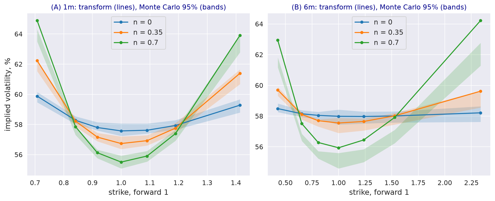

---
myst:
  html_meta:
    description: >-
      A jump-diffusion with positive and negative jumps whose intensities are self- and
      cross-exciting Hawkes processes, in stochvolmodels: dynamics, the stationarity condition, the
      affine moment generating function, option pricing, simulation and calibration, and the smiles
      that clustering produces at the same average jump intensity.
---

# Jump-diffusion with clustered jumps

*Author: [Artur Sepp](https://github.com/ArturSepp)*

Implemented in [stochvolmodels](https://github.com/ArturSepp/StochVolModels).
Software citation: [CITATION.cff](https://github.com/ArturSepp/StochVolModels/blob/main/CITATION.cff).

Large price moves cluster: a jump makes further jumps more likely for a while. Liu, Packham and
Sepp (2025) model the returns of Bitcoin with a diffusion and two jump processes, one of positive
and one of negative jumps, whose intensities are Hawkes (1971) processes excited by past jumps of
either sign. The model is affine, so its moment generating function (MGF) solves ordinary
differential equations and options are priced by Fourier inversion. This article explains the model
as implemented in the package, and what clustering does to the smile when the average jump
intensity is held fixed.

```{note}
`HawkesJDParams` and `HawkesJDPricer` are advanced exports: importable from the package root, outside
the stable API (see [stability tiers](option_chains_and_conventions.md#stability-tiers)). The paper
is a working paper.
```

## Overview

With constant intensities the model is a jump-diffusion with double-sided shifted exponential
jumps. Clustering adds memory: each jump raises the intensities, which then decay back to their
mean. For the same average number of jumps, clustered jumps arrive in bursts, which fattens the
tails of returns over horizons longer than the bursts, and self- and cross-excitation of positive
and negative jumps make the skew vary over time and change sign (Liu, Packham and Sepp, 2025,
abstract). The package prices the model from its MGF, simulates it, and calibrates it to option
chains.

## Inputs, notation, and assumptions

| Symbol | `HawkesJDParams` | Meaning |
|---|---|---|
| $\sigma$ | `sigma` | Volatility of the diffusion |
| $\nu^\pm$, $\eta^\pm$ | `shift_p`, `mean_p`; `shift_m`, `mean_m` | Threshold and mean of the exponential part of positive and negative jumps, in log-return units |
| $\lambda^\pm_0$ | `lambda_p`, `lambda_m` | Initial intensities, jumps per year |
| $\theta^\pm$, $\kappa^\pm$ | `theta_p`, `kappa_p`; `theta_m`, `kappa_m` | Mean-reversion levels and rates of the intensities |
| $\beta_{11}, \beta_{12}, \beta_{21}, \beta_{22}$ | `beta1_p`, `beta2_p`, `beta1_m`, `beta2_m` | Excitation of the positive (first index 1) and negative (2) intensity by positive (second index 1) and negative (2) jumps, per unit of jump size |
| $\gamma$ | `risk_premia_gamma` | Exponent of the package's risk kernel, off by default |

All parameters are annualised. The defaults of `HawkesJDParams` describe Bitcoin at a daily
frequency, according to its docstring; the examples start from them. Rates are zero.

## Methodology

### Dynamics

The log-return and the intensities follow (Liu, Packham and Sepp, 2025, Section 2.1)

$$
dX_t = -\left( \frac{1}{2} \sigma^2 + c^+ \lambda^+_t + c^- \lambda^-_t \right) dt + \sigma dW_t + J^+ dN^+_t + J^- dN^-_t ,
$$

$$
d\lambda^+_t = \kappa^+ (\theta^+ - \lambda^+_t) dt + \beta_{11} J^+ dN^+_t + \beta_{12} J^- dN^-_t , \qquad d\lambda^-_t = \kappa^- (\theta^- - \lambda^-_t) dt + \beta_{21} J^+ dN^+_t + \beta_{22} J^- dN^-_t ,
$$

where $N^\pm$ count positive and negative jumps with intensities $\lambda^\pm$, the jump sizes are
$J^+ = \nu^+ + E^+$ and $J^- = \nu^- - E^-$ with exponential $E^\pm$ of means $\eta^+$ and $|\eta^-|$,
and $c^\pm = E[e^{J^\pm}] - 1$ compensates the jumps so that $e^{X_t}$ is a martingale. Negative
jumps are negative, so a negative $\beta_{12}$ or $\beta_{22}$ raises an intensity.

### Stationarity

The intensities stay stationary if each rate of mean reversion exceeds the expected excitation per
jump, $\kappa^+ - \beta_{11} E[J^+] - \beta_{12} E[J^-] > 0$ and the same for the negative intensity
(Section 2.1, Eq. (3)); `jump1_cond` and `jump2_cond` return the two sides. With self-excitation
only, $n = \beta_{11} E[J^+] / \kappa^+$ is the expected number of jumps each jump triggers, the
branching ratio, and the mean intensity is $\theta / (1 - n)$.

### MGF and option prices

The MGF of the log-return is exponential-affine in the intensities,
$E[e^{-\Phi X_T}] = \exp\left( A_0(T) + A_1(T) \lambda^+_0 + A_2(T) \lambda^-_0 \right)$, with
$A_1$ and $A_2$ solving Riccati equations that contain the Laplace transforms of the jump sizes
(Section 2.2, Proposition 1). The package solves them numerically for every point of the transform
grid and prices options by Fourier inversion, as in
[Fourier pricing](european_option_pricing.md). With constant intensities the MGF is in closed form.

### Simulation and calibration

`model_mc_price_chain` takes 1,800 Euler steps a year, allows at most one jump of each sign per
step, and draws from NumPy's global generator, which `numpy.random.seed` seeds. It stores all its
random numbers before stepping, so large runs are done in batches.
`calibrate_model_params_to_chain` fits eight parameters, with each intensity excited equally by
jumps of either sign, and constrains the sum of the two stationarity conditions to be non-negative.

## Worked example

Every block below is an excerpt of
[`examples/docs/hawkes_jump_diffusion.py`](../examples/docs/hawkes_jump_diffusion.py), which asserts
every number quoted here. Clustering is set by the branching ratio, with the mean intensity held
at its default:

```python
def clustered(n: float, base: svm.HawkesJDParams = BASE) -> svm.HawkesJDParams:
    """Self-excitation with branching ratio n for both jump signs, no cross-excitation.

    Each jump raises its own intensity by n kappa / E[J] per unit of jump size, so it triggers n
    further jumps on average; theta = lambda0 (1 - n) keeps the mean intensity at lambda0.
    """
    mean_jump_p, mean_jump_m = base.shift_p + base.mean_p, base.shift_m + base.mean_m
    return replace(base, beta1_p=n * base.kappa_p / mean_jump_p, beta2_p=0.0,
                   beta1_m=0.0, beta2_m=n * base.kappa_m / mean_jump_m,
                   theta_p=base.lambda_p * (1.0 - n), theta_m=base.lambda_m * (1.0 - n))
```

For $n = 0.7$ the excitation is $\beta_{11} = 173.37$ and $\beta_{22} = -225.56$, and the
stationarity conditions are 6.687 and 8.70, down from 22.29 and 29.0 without clustering. For every
setting a call struck at zero is worth the forward, and without clustering the package's prices
equal those of the closed-form MGF to $10^{-6}$.

**Clustering reshapes the smile.** Strikes are two standard deviations either side of the forward
at 60% volatility. Without clustering the at-the-money volatility is 57.57% at one month and 57.99%
at six months; with $n = 0.35$ it is 56.74% and 57.55%, and with $n = 0.7$ 55.51% and 55.94%. The
wings rise: at six months the lowest and highest strikes have 58.49% and 58.21% without clustering,
59.70% and 59.62% with $n = 0.35$, and 62.94% and 64.22% with $n = 0.7$. Without clustering the
six-month smile is nearly flat, less than 0.6 points from end to end; with $n = 0.7$ it spans more
than 8 points.

**Monte Carlo check.** The simulation is run in batches:

```python
def monte_carlo(params: svm.HawkesJDParams, nb_batch: int = 20, nb_path: int = 10000,
                seed: int = 2026) -> tuple:
    """Monte Carlo prices and standard errors pooled over batches that fit in memory.

    The simulator draws from NumPy's global generator, which is seeded once here.
    """
    np.random.seed(seed)
    batches = []
    for _ in range(nb_batch):
        batches.append(svm.HawkesJDPricer().model_mc_price_chain(option_chain=chain(),
                                                                 params=params, nb_path=nb_path))
    prices = [np.mean([p[i] for p, _ in batches], axis=0) for i in range(len(TTMS))]
    errors = [np.sqrt(np.sum([s[i] ** 2 for _, s in batches], axis=0)) / nb_batch
              for i in range(len(TTMS))]
    return prices, errors
```

With 200,000 paths, the analytic prices lie within two standard errors of the simulated ones at
every strike without clustering and with $n = 0.35$. With $n = 0.7$ the simulation is lower at six
months by more than three standard errors at every strike, by 0.81 to 2.17 volatility points.

[](images/hawkes_smiles.png)

*Synthetic teaching exhibit. Implied volatilities at one month (A) and six months (B) for branching
ratios 0, 0.35 and 0.7 at the default mean intensities, from the affine MGF (lines), with Monte Carlo
95% intervals from 200,000 paths, seed 2026 (shaded).*

## Implementation in stochvolmodels

| Name | Role |
|---|---|
| `HawkesJDParams` | Parameters of the table above; `jump1_cond` and `jump2_cond` are the stationarity conditions |
| `HawkesJDPricer.price_chain`, `compute_model_ivols_for_chain` | Prices and implied volatilities from the MGF |
| `HawkesJDPricer.model_mc_price_chain`, `simulate_terminal_values` | Euler simulation, 1,800 steps a year |
| `HawkesJDPricer.calibrate_model_params_to_chain` | Fit of eight parameters to an option chain |
| `HawkesJDPricer.calibrate_risk_premia_gamma_to_chain` | Fit of $\sigma$ and $\gamma$ with the other parameters fixed |

`HawkesJDPricer` shares the pricer interface of the package, including `price_slice` and
`compute_chain_prices_with_vols`. Run the example from a checkout with
`python examples/docs/hawkes_jump_diffusion.py`; its Monte Carlo case takes about a minute and runs
in the slow test lane.

## Interpretation and limitations

- **Strong clustering and the simulation.** The simulator's time step is fixed, and it allows one
  jump of each sign per step; with strong clustering its prices separate from the transform's at
  longer maturities. Treat the transform as the reference only where the two agree, as above for
  $n$ up to 0.35.
- **Risk premia.** The paper introduces separate premia for positive and negative jumps (Section
  2.3); the package implements one exponential kernel $e^{\gamma X_T}$, which prices correctly only
  on strikes normalised by the forward.
- **Measures.** The pricer values options under the money-market-account measure; its
  inverse-measure option is not reliable.
- **Cost.** The Riccati equations are solved point by point on the transform grid, so a chain takes
  under a second to price after compilation, and a calibration minutes.

## See also

- [Fourier pricing of European options](european_option_pricing.md)
- [Bitcoin options: MMA, inverse and QV valuation](app_bitcoin_options.md)
- [The Heston model as a benchmark](heston_model.md)

## References

- Hawkes, A. G. (1971). Spectra of some self-exciting and mutually exciting point processes.
  *Biometrika* 58(1), 83-90. [DOI 10.1093/biomet/58.1.83](https://doi.org/10.1093/biomet/58.1.83).
- Liu, F., Packham, N. and Sepp, A. (2025). Jump risk premia in the presence of clustered jumps.
  arXiv 2510.21297, first posted on SSRN (4735365) in 2024.
  [DOI 10.48550/arXiv.2510.21297](https://doi.org/10.48550/arXiv.2510.21297).
- [stochvolmodels software citation](https://github.com/ArturSepp/StochVolModels/blob/main/CITATION.cff).
