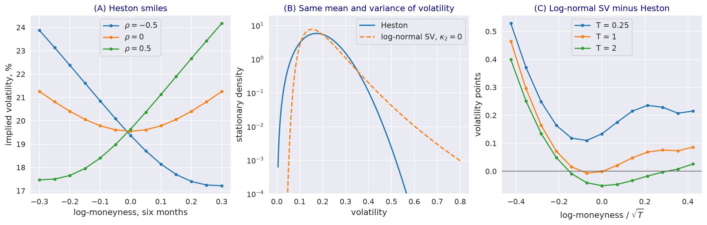

---
myst:
  html_meta:
    description: >-
      The Heston stochastic volatility model in stochvolmodels as a benchmark: square-root variance
      dynamics, the closed-form moment generating function, the Feller condition and the stationary
      gamma law, calibration and simulation, and a comparison with the log-normal SV model in
      volatility distribution, smiles and fit to the bundled Bitcoin chain.
---

# The Heston model as a benchmark

*Author: [Artur Sepp](https://github.com/ArturSepp)*

Implemented in [stochvolmodels](https://github.com/ArturSepp/StochVolModels).
Software citation: [CITATION.cff](https://github.com/ArturSepp/StochVolModels/blob/main/CITATION.cff).

The Heston (1993) model drives the variance of returns by a square-root process correlated with
the price. Its moment generating function (MGF) is known in closed form, which makes it the
standard benchmark for stochastic volatility (SV) models. The package prices, simulates and
calibrates it through the same interfaces as the
[log-normal SV model](logsv_model.md), so the two can be compared on the same chains. This article
explains the Heston model as implemented, and where it differs from the log-normal SV model in the
distribution of volatility, in smiles and in fits.

## Overview

The variance mean-reverts and its volatility is proportional to its square root, so the process is
affine: the MGF of the log-price and of the quadratic variance (QV) is exponential-affine in the
initial variance, with coefficients in closed form. The correlation $\rho$ of the price and variance
shocks sets the skew of the smile, and the vol-of-variance $\vartheta$ its curvature. Sepp and
Rakhmonov (2023, Section 1.1) cite evidence from VIX, S&P 500 implied and realized volatilities that
favours log-normal volatility dynamics over the square-root ones (Christoffersen, Jacobs and
Mimouni, 2010); the comparison below shows where the two differ in the package.

## Inputs, notation, and assumptions

| Paper | `HestonParams` | Meaning |
|---|---|---|
| $V_0$ | `v0` | Initial variance, in annualised variance units (0.04 is 20% volatility) |
| $\theta$ | `theta` | Long-run variance |
| $\kappa$ | `kappa` | Mean-reversion rate of the variance |
| $\rho$ | `rho` | Correlation of the price and variance shocks |
| $\vartheta$ | `volvol` | Volatility of the variance |

`theta` is a variance here and a volatility in `LogSvParams` (see the
[notation](option_chains_and_conventions.md#notation-paper-and-code)). Rates are zero and prices are
of options on the forward. The examples use $V_0 = \theta = 0.04$, $\kappa = 4$ and
$\vartheta = 0.4$.

## Methodology

### Dynamics

Under the pricing measure the log-price $X_t$ and the variance $V_t$ follow

$$
dX_t = -\frac{1}{2} V_t dt + \sqrt{V_t} dW^{(0)}_t , \qquad dV_t = \kappa (\theta - V_t) dt + \vartheta \sqrt{V_t} dW^{(1)}_t ,
$$

with $d \langle W^{(0)}, W^{(1)} \rangle_t = \rho dt$. By Itô's lemma the volatility
$\sigma_t = \sqrt{V_t}$ has diffusion coefficient $\vartheta / 2$: its volatility relative to its
level, $\vartheta / (2 \sigma_t)$, falls as volatility rises. In the log-normal SV model the relative
vol-of-vol is a constant, which is the source of the differences below.

### Closed-form MGF

With the transform variables $\Phi$ of the log-price and $\Psi$ of the QV, in the convention of the
[affine expansion](affine_expansion.md), the MGF is $\exp\left( A(\tau) + B(\tau) V_0 \right)$ with

$$
b_1 = \kappa + \rho \vartheta \Phi , \quad b_0 = \frac{1}{2} \Phi (\Phi + 1) - \Psi , \quad \zeta = \sqrt{b_1^2 - 2 b_0 \vartheta^2} , \quad \psi_\pm = \mp b_1 + \zeta , \quad c_\pm = \frac{\psi_\pm}{2 \zeta} ,
$$

$$
B(\tau) = \frac{\psi_- c_+ e^{-\zeta \tau} - \psi_+ c_-}{\vartheta^2 \left( c_+ e^{-\zeta \tau} + c_- \right)} , \qquad A(\tau) = -\frac{\kappa \theta}{\vartheta^2} \left( \psi_+ \tau + 2 \ln \left( c_+ e^{-\zeta \tau} + c_- \right) \right) .
$$

Options are priced by Fourier inversion of this MGF, as in
[Fourier pricing](european_option_pricing.md); for a chain the coefficients are carried from one
maturity to the next.

### Feller condition and stationary law

The variance stays away from zero if $2 \kappa \theta \ge \vartheta^2$, the Feller condition. Its
stationary law is gamma, with shape $2 \kappa \theta / \vartheta^2$ and scale
$\vartheta^2 / (2 \kappa)$; the Feller condition is a shape of at least one. At a shape of exactly
one the law is exponential, with its mode at zero variance.

### Calibration and simulation

`HestonPricer.calibrate_model_params_to_chain` fits all five parameters by sequential least squares
to implied volatilities weighted by vegas normalised within each maturity, with bounds and the
Feller condition as an inequality constraint. `model_mc_price_chain` simulates 360 Euler steps a
year and floors the variance at $10^{-4}$ after each step (see
[Monte Carlo simulation](monte_carlo_simulation.md#the-heston-scheme)).

## Worked example

Every block below is an excerpt of
[`examples/docs/heston_model.py`](../examples/docs/heston_model.py), which asserts every number
quoted here. Smiles are computed from the closed-form MGF:

```python
def heston_smile(params: svm.HestonParams, ttm: float = 0.5) -> np.ndarray:
    """Implied volatilities of the Heston model from its closed-form MGF."""
    return svm.HestonPricer().compute_model_ivols_for_chain(option_chain=smile_chain(ttm),
                                                            params=params)[0]
```

**The correlation sets the skew.** At six months, with strikes from 30% below to 30% above the
forward in log terms, the smile is symmetric in log-moneyness without correlation, 19.55% at the
money and 21.26% at both ends. With $\rho = -0.5$ it falls from 23.88% through 19.37% to 17.22%;
with $\rho = 0.5$ it rises. A simulation of 400,000 paths prices the $\rho = -0.5$ slice within one
standard error of the closed form at every strike.

**Stationary volatility.** The example satisfies the Feller condition with a shape of 2. Its
stationary volatility has mean 0.1880 and standard deviation 0.0682:

```python
def stationary_volatility(params: svm.HestonParams):
    """Stationary law of the variance, a gamma distribution, and the mean and sd of volatility."""
    shape = 2.0 * params.kappa * params.theta / params.volvol ** 2
    scale = params.volvol ** 2 / (2.0 * params.kappa)
    mean = np.sqrt(scale) * special.gamma(shape + 0.5) / special.gamma(shape)
    return stats.gamma(a=shape, scale=scale), mean, np.sqrt(params.theta - mean ** 2)
```

A log-normal SV model with the same initial volatility and correlation, the same relative
vol-of-vol at 20% volatility, and the same stationary mean and variance of volatility has, with
$\kappa_2 = 0$, an inverse gamma stationary law (Sepp and Rakhmonov, 2023, Eq. (3.38)):

```python
def matched_logsv(heston: svm.HestonParams, vartheta: float = 1.0) -> svm.LogSvParams:
    """Log-normal SV parameters with the same initial volatility, correlation and stationary mean
    and variance of volatility; with kappa2 = 0 its stationary law is inverse gamma.

    vartheta = 1 equals the Heston vol-of-vol of volatility, volvol / (2 sigma), at sigma = 0.2.
    """
    _, mean, sd = stationary_volatility(heston)
    shape = 2.0 + mean ** 2 / sd ** 2  # inverse gamma: variance = mean^2 / (shape - 2)
    beta = heston.rho * vartheta
    return svm.LogSvParams(sigma0=np.sqrt(heston.v0), theta=mean,
                           kappa1=(shape - 1.0) * vartheta ** 2 / 2.0, kappa2=0.0, beta=beta,
                           volvol=np.sqrt(vartheta ** 2 - beta ** 2))
```

With the first two moments equal, the tails differ: volatility exceeds 40% with probability 0.30%
under Heston and 1.29% under the log-normal SV model, and exceeds 50% with probability 0.005% and
0.31%; the 99.9% quantiles are 0.43 and 0.59.

**Smiles at matched dynamics.** The two models give the same at-the-money volatility, within 0.06
points at one and two years. The low-strike wing is higher under the log-normal SV model, by 0.47
points at one year and 0.40 at two, the heavier right tail of volatility passing to low strikes
through the negative correlation.

**A fit to the bundled Bitcoin chain.** Calibrated to the Bitcoin chain of 21 October 2021, with all
five parameters free, the Heston model fits with root-mean-square errors of 1.10, 0.65, 0.80 and
0.78 volatility points for the four maturities, against 2.04, 1.00, 0.83 and 1.24 for the log-normal
SV fit of the [Bitcoin case study](app_bitcoin_options.md), which fixes $\kappa_1$ and $\kappa_2$ at
the paper's estimates. The fit sets $\rho = 0.09$ and $\vartheta = 4.09$, and the Feller condition
binds: the stationary variance is exponential, and volatility falls below 20% with probability 3.5%
in the long run.

[](images/heston_vs_logsv.png)

*Synthetic teaching exhibit. (A) Heston smiles at six months for $\rho = -0.5$, 0 and 0.5; (B)
stationary densities of volatility under Heston and the matched log-normal SV model, on a log
scale; (C) log-normal SV minus Heston implied volatility at three maturities, at matched dynamics.*

## Implementation in stochvolmodels

| Name | Role |
|---|---|
| `HestonParams` | Fields `v0`, `theta`, `kappa`, `rho`, `volvol`, as in the table above |
| `HestonPricer.price_chain`, `compute_model_ivols_for_chain` | Prices and implied volatilities from the closed-form MGF |
| `HestonPricer.model_mc_price_chain`, `simulate_terminal_values` | Euler simulation, 360 steps a year; the numba generator is seeded by `stochvolmodels.utils.funcs.set_seed` |
| `HestonPricer.calibrate_model_params_to_chain` | Fit of all five parameters with the Feller constraint |
| `BTC_HESTON_PARAMS` | Preset used as a starting point for Bitcoin chains (compatibility tier) |

`HestonPricer` also provides `price_vanilla`, `price_slice` and `compute_chain_prices_with_vols` from
the shared pricer interface. Run the example from a checkout with
`python examples/docs/heston_model.py`.

## Interpretation and limitations

- **A fit is not the test.** On one date the Heston model fitted the Bitcoin chain more closely than
  the constrained log-normal SV fit, but only with a binding Feller condition and a stationary law
  that puts mass near zero volatility. The argument of Sepp and Rakhmonov for log-normal dynamics
  concerns the behaviour of volatility over time, not a single smile.
- **Tails of volatility.** Square-root dynamics give a light right tail of volatility; when the
  distribution of volatility, or options on it, matter, the two models differ even at equal
  moments.
- **Constant parameters.** The package's Heston model has no term structure of parameters; each
  chain is fitted with one set.
- **Simulation.** The variance is floored at $10^{-4}$ rather than truncated at zero; with the Feller
  condition failing, the floor is reached often and biases the simulation. The number of steps is not
  a parameter.
- **Calibration interface.** The docstring of `calibrate_model_params_to_chain` says that `v0` is
  inferred from the at-the-money volatility; the code fits it with the other four parameters.

## See also

- [Log-normal stochastic volatility model with quadratic drift](logsv_model.md)
- [Steady-state distribution, moments and expected QV](volatility_distribution_and_moments.md)
- [Fourier pricing of European options](european_option_pricing.md)
- [Calibration to implied volatilities](calibration.md)

## References

- Christoffersen, P., Jacobs, K. and Mimouni, K. (2010). Models for S&P 500 dynamics: evidence from
  realized volatility, daily returns and options prices. *The Review of Financial Studies* 23(9),
  3141-3189.
- Heston, S. L. (1993). A closed-form solution for options with stochastic volatility with
  applications to bond and currency options. *The Review of Financial Studies* 6(2), 327-343.
  [DOI 10.1093/rfs/6.2.327](https://doi.org/10.1093/rfs/6.2.327).
- Sepp, A. and Rakhmonov, P. (2023). Log-normal stochastic volatility model with quadratic drift.
  *International Journal of Theoretical and Applied Finance* 26(8), 2450003.
  [DOI 10.1142/S0219024924500031](https://doi.org/10.1142/S0219024924500031).
- [stochvolmodels software citation](https://github.com/ArturSepp/StochVolModels/blob/main/CITATION.cff).
