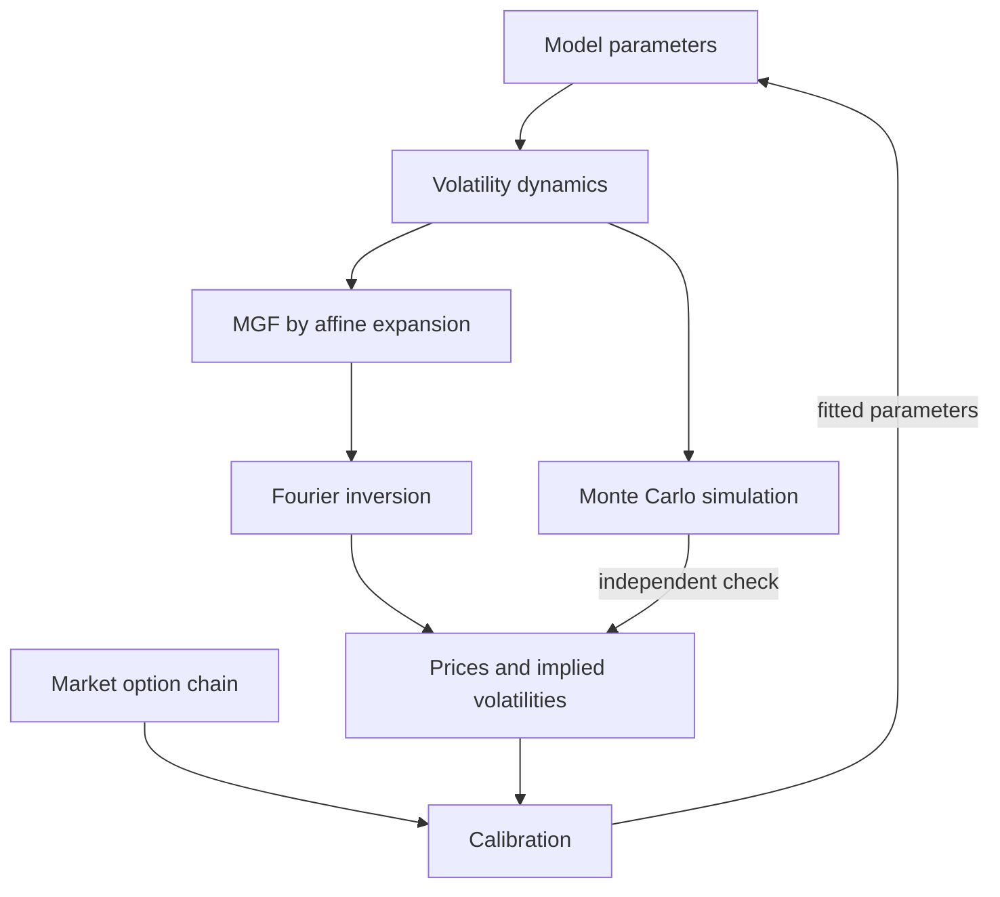

---
myst:
  html_meta:
    description: >-
      stochvolmodels documentation: Fourier-transform pricing, Monte Carlo validation and
      calibration of European options under the log-normal stochastic volatility model with
      quadratic drift and the Heston model in Python, with methods, conventions and runnable
      examples.
---

# stochvolmodels

*Author: [Artur Sepp](https://github.com/ArturSepp) / First recorded: [2026-08-16](https://github.com/ArturSepp/StochVolModels/commit/e9e01403a6ba36aad7708049028c64438a606234)*

[stochvolmodels](https://github.com/ArturSepp/StochVolModels) is a Python library for pricing
European options under stochastic volatility. It prices vanilla, inverse and quadratic-variance
options by Fourier inversion of a closed-form moment generating function, checks the analytic
prices against a Monte Carlo simulation of the same dynamics, and calibrates the models to option
chains. It is the reference implementation of the log-normal stochastic volatility model with
quadratic drift, with the Heston model as benchmark. Its core depends on no sibling package other
than [vanilla-option-pricers](https://github.com/ArturSepp/VanillaOptionPricers).

Software citation: [CITATION.cff](https://github.com/ArturSepp/StochVolModels/blob/main/CITATION.cff).

## Start here

1. [Install stochvolmodels and price a first option](getting_started.md). The core installation
   command is `python -m pip install stochvolmodels`, and the first example runs offline.
2. Keep the [notation and conventions](option_chains_and_conventions.md) at hand: the paper
   symbols mapped to code, units, option types, the MMA and inverse measures, the option-chain
   layout, Monte Carlo seeds and the stability tiers are defined there once for every page.
3. Browse the [analytics gallery](analytics_gallery.md) for every figure with its question, data
   and producer, or the [examples and recipes](examples.md) for every runnable script, its data
   requirements and the page it supports.

## The model in one picture

Under the money-market-account measure, the log-normal stochastic volatility model of Sepp and
Rakhmonov (2023, Eq. (3.12)) drives the spot price $S_t$ with a volatility $\sigma_t$ that mean
reverts with a quadratic drift:

$$
dS_t = r(t) S_t dt + \sigma_t S_t dW^{(0)}_t ,
$$

$$
d\sigma_t = (\kappa_1 + \kappa_2 \sigma_t)(\theta - \sigma_t) dt + \beta \sigma_t dW^{(0)}_t + \varepsilon \sigma_t dW^{(1)}_t .
$$

The volatility beta $\beta$ sets the sign of the return-volatility correlation, and the quadratic
term $\kappa_2$ permits a positive $\beta$ without losing the martingale property, provided
$\kappa_2 \ge \beta$. Options are priced by
inverting the moment generating function (MGF) of the log price, which an affine expansion gives
in closed form up to a system of ordinary differential equations.



In words: parameters define the volatility dynamics; the affine expansion turns the dynamics into
an MGF; Fourier inversion turns the MGF into prices and implied volatilities; a Monte Carlo
simulation of the same dynamics checks those prices independently; and calibration fits the
parameters to the implied volatilities of a market chain.

| Step of the diagram | Pages |
|---|---|
| Model parameters and dynamics | [Log-normal SV model](logsv_model.md), [steady state and moments](volatility_distribution_and_moments.md), [martingale conditions](martingale_conditions_and_skews.md), [Heston model](heston_model.md), [notation](option_chains_and_conventions.md#notation-paper-and-code) |
| MGF and Fourier inversion | [Affine expansion](affine_expansion.md), [Fourier pricing](european_option_pricing.md), [inverse options](inverse_options.md), [QV options](quadratic_variance_options.md), [numerical accuracy](numerical_accuracy_and_performance.md) |
| Monte Carlo check | [Monte Carlo schemes](monte_carlo_simulation.md), [analytic versus Monte Carlo validation](analytic_vs_monte_carlo.md) |
| Market chain and calibration | [Option chains](option_chains_and_conventions.md#option-chains), [calibration](calibration.md), [smile fitter](logsv_smile_fitter.md) |
| Other models on the same pipeline | [Clustered jumps](hawkes_jump_diffusion.md), [mixture and Student-t smiles](terminal_distribution_models.md), [factor HJM rates](factor_hjm_stochastic_volatility.md) |
| Applications | [Bitcoin options](app_bitcoin_options.md), [skews of both signs](app_positive_and_negative_skews.md), [swaptions and SOFR options](app_swaptions_and_sofr_options.md), [impermanent loss](app_impermanent_loss_hedging.md), [robust SV models](app_robust_volatility_models.md) |

## The log-normal SV model

- [Log-normal stochastic volatility model with quadratic drift](logsv_model.md): the dynamics
  under the physical and risk-neutral measures, the invariance of the quadratic drift, the
  volatility beta and the model's parameters and pricer.
- [Steady-state distribution, moments and expected quadratic variance](volatility_distribution_and_moments.md):
  the generalised inverse Gaussian law of volatility, how the quadratic drift damps its tail and the
  kurtosis of returns, the truncated moment system and the variance-swap strike.
- [Martingale conditions, measures and positive skews](martingale_conditions_and_skews.md): the
  money-market-account and inverse measures, why a positive volatility beta needs the quadratic
  drift, a Monte Carlo test and the calibration constraints.

## Transform pricing

- [The moment generating function and its affine expansion](affine_expansion.md): the valuation
  PDE, the first- and second-order coefficient systems, the properties they keep exactly, and
  densities against Monte Carlo.
- [Fourier pricing of European options](european_option_pricing.md): the capped-payoff formula,
  the integration grid and its accuracy against Black-Scholes, implied volatilities, and the
  Black-Scholes and Bachelier analytics.
- [Inverse options and the inverse measure](inverse_options.md): options settled in the
  underlying coin, their valuation under the inverse measure, equivalence with vanilla options and
  the net delta.
- [Expected quadratic variance, variance swaps and QV options](quadratic_variance_options.md): the
  variance-swap strike, its replication by options, and calls on quadratic variance under both
  measures.

## Simulation and validation

- [Monte Carlo simulation schemes](monte_carlo_simulation.md): the log-volatility scheme of the
  paper and the explicit scheme of the package, strong and weak convergence, sampling error,
  fixed random numbers and the experimental rough extension.
- [Analytic versus Monte Carlo validation](analytic_vs_monte_carlo.md): what agreement between
  the transform price and the simulated price establishes, and where on the Bitcoin chain the two
  separate.

## Calibration

- [Calibration to implied volatilities](calibration.md): the vega-weighted objective, free
  parameters, martingale constraints and engines, with objective profiles and a refit on the
  Bitcoin chain.
- [Approximate log-normal SV smile fitter](logsv_smile_fitter.md): a three-parameter smile
  for one maturity, what its parameters mean, and its density and delta helpers.

## Other models

- [The Heston model as a benchmark](heston_model.md): the square-root variance model and its
  closed-form MGF, the Feller condition, and how it differs from the log-normal SV model in the
  distribution of volatility, in smiles and in a fit.
- [Jump-diffusion with clustered jumps](hawkes_jump_diffusion.md): positive and negative jumps whose intensities are
  self- and cross-exciting Hawkes processes, priced from an affine MGF (advanced).
- [Gaussian-mixture and Student-t smiles](terminal_distribution_models.md): terminal laws of one maturity, a mixture of normal
  log-returns and a Student-t simple return, with closed-form prices and no dynamics.
- [Stochastic volatility for factor HJM rates](factor_hjm_stochastic_volatility.md): Nelson-Siegel
  yield-curve factors with one log-normal volatility driver, swaption smiles by drift freezing and
  the affine expansion, checked by simulation (experimental).

## Applications

Case studies report the evidence of the research papers, or apply the package to bundled data, in
context: the study design, the configuration, the exhibits, and what the study does and does not
show.

- [Bitcoin options: MMA, inverse and QV valuation](app_bitcoin_options.md): weekly calibrations to
  Deribit options from 2019 to 2023 with a volatility beta that changes sign, and consistent
  valuation of inverse options (IJTAF paper, Section 6).
- [One model for equity, VIX, gold and leveraged-ETF skews](app_positive_and_negative_skews.md):
  dated chains of five underlyings with skews of both signs, the sign of the fitted volatility
  beta, and the martingale conditions of the positive-beta fits.
- [USD swaptions and SOFR futures options](app_swaptions_and_sofr_options.md): the factor HJM
  model on USD swaptions and 3M SOFR options, with RDR Figures 5 to 9 regenerated and the accuracy
  of the expansion measured against simulation (RDR paper, Section 7).
- [Hedging impermanent loss with the LogSV MGF](app_impermanent_loss_hedging.md): the static
  replication of a concentrated-liquidity position by European options, valued with the
  log-normal SV transform and checked by simulation.
- [What makes a stochastic volatility model robust](app_robust_volatility_models.md): what the log-normal SV
  parameters recorded for VIX, MOVE, OVX and Bitcoin imply for the persistence and stationary
  distribution of volatility, with the robustness argument of the working paper.

## Implementation and reference

- [Software design](software_design.md): the module layers, the pricer interface, the
  analytic and Monte Carlo paths, the numba boundary, stability tiers and dependencies.
- [Numerical accuracy and performance](numerical_accuracy_and_performance.md): accuracy controls,
  compilation and performance expectations.
- [Testing and coverage](testing_and_coverage.md): the test lanes, coverage scopes, the
  documentation gates and the numerical verification map.
- [Choosing a Python derivatives library](package_comparison.md): a dated comparison with other
  open-source packages.
- [Research papers and replication](reproducing_the_papers.md): the citation ledger, the page each
  paper supports, the published figures on this site, replication commands and known issues.
- [API reference](api.md): the public names, grouped by the page that explains them, and the
  parameter maps.
- [Documentation standard](documentation_standard.md): page forms, citations, executable
  examples and exhibit provenance.

## Research papers

The methods are published in two papers whose article PDF and LaTeX source are in the
repository, under
[`papers/`](https://github.com/ArturSepp/StochVolModels/tree/main/papers):

- Sepp, A. and Rakhmonov, P. (2023). Log-normal stochastic volatility model with quadratic drift.
  *International Journal of Theoretical and Applied Finance* 26(8), 2450003.
  [DOI 10.1142/S0219024924500031](https://doi.org/10.1142/S0219024924500031).
- Sepp, A. and Rakhmonov, P. (2025). Stochastic volatility for factor Heath-Jarrow-Morton
  framework. *Review of Derivatives Research* 28, article 12.
  [DOI 10.1007/s11147-025-09217-4](https://doi.org/10.1007/s11147-025-09217-4).

Further working papers that use the package are listed in
[research papers and replication](reproducing_the_papers.md).

## Project resources

- [PyPI package](https://pypi.org/project/stochvolmodels/) and
  [source repository](https://github.com/ArturSepp/StochVolModels).
- [Issue tracker](https://github.com/ArturSepp/StochVolModels/issues) and
  [contributing and support](contributing.md).
- [Changelog](https://github.com/ArturSepp/StochVolModels/blob/main/CHANGELOG.md) and
  [JOSS paper draft](https://github.com/ArturSepp/StochVolModels/blob/main/paper.md).
- [License](https://github.com/ArturSepp/StochVolModels/blob/main/LICENSE.txt): MIT.

<!-- The sidebar mirrors the grouped links above. Keep each document in one toctree. -->

```{toctree}
:hidden:
:maxdepth: 1
:caption: Start here

Installation and first result <getting_started>
option_chains_and_conventions
analytics_gallery
examples
```

```{toctree}
:hidden:
:maxdepth: 1
:caption: The log-normal SV model

logsv_model
volatility_distribution_and_moments
martingale_conditions_and_skews
```

```{toctree}
:hidden:
:maxdepth: 1
:caption: Transform pricing

affine_expansion
european_option_pricing
inverse_options
quadratic_variance_options
```

```{toctree}
:hidden:
:maxdepth: 1
:caption: Simulation and validation

monte_carlo_simulation
analytic_vs_monte_carlo
```

```{toctree}
:hidden:
:maxdepth: 1
:caption: Calibration

calibration
logsv_smile_fitter
```

```{toctree}
:hidden:
:maxdepth: 1
:caption: Other models

heston_model
hawkes_jump_diffusion
terminal_distribution_models
factor_hjm_stochastic_volatility
```

```{toctree}
:hidden:
:maxdepth: 1
:caption: Applications

app_bitcoin_options
app_positive_and_negative_skews
app_swaptions_and_sofr_options
app_impermanent_loss_hedging
app_robust_volatility_models
```

```{toctree}
:hidden:
:maxdepth: 1
:caption: Implementation and reference

software_design
numerical_accuracy_and_performance
testing_and_coverage
package_comparison
reproducing_the_papers
api
documentation_standard
contributing
```
