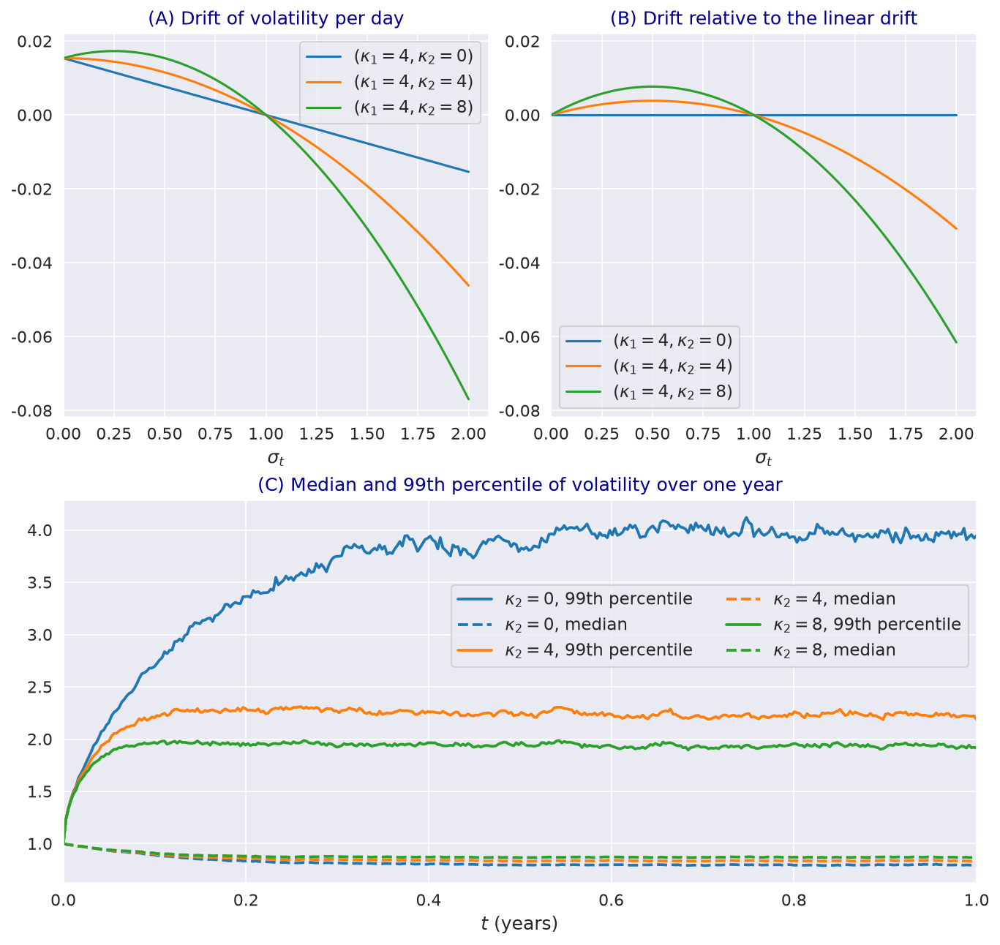

---
myst:
  html_meta:
    description: >-
      The log-normal stochastic volatility model with quadratic drift (Karasinski-Sepp) in
      stochvolmodels: dynamics under the physical and risk-neutral measures, invariance of the
      quadratic drift, volatility beta, regularity, and the LogSvParams and LogSVPricer interface.
---

# Log-normal stochastic volatility model with quadratic drift

*Author: [Artur Sepp](https://github.com/ArturSepp) / First recorded: [2026-08-16](https://github.com/ArturSepp/StochVolModels/commit/e9e01403a6ba36aad7708049028c64438a606234)*

Implemented in [stochvolmodels](https://github.com/ArturSepp/StochVolModels).
Software citation: [CITATION.cff](https://github.com/ArturSepp/StochVolModels/blob/main/CITATION.cff).

The log-normal stochastic volatility (SV) model with quadratic drift, which the package calls the
Karasinski-Sepp model, lets the volatility of an asset follow a mean-reverting log-normal
diffusion that is correlated with the asset through a volatility beta. The mean reversion has a
quadratic term. It pulls high volatility back faster than a linear drift, it keeps the model's
form when the physical measure is changed to the risk-neutral one, and it keeps valuation
consistent when the volatility beta is positive. This article presents the dynamics following Sepp
and Rakhmonov (2023, Section 3) and the package's parameters and pricer.

## Overview

Volatility is close to log-normal in index, option-implied and realised data, and log-normal
volatility models fit these data better than the square-root and 3/2 models (Christoffersen,
Jacobs and Mimouni, 2010). The model of Karasinski and Sepp (2012) makes volatility log-normal and
correlates its changes with returns through a volatility beta $\beta$. Sepp and Rakhmonov (2023)
add a quadratic term to its drift, following Lewis (2018) and Carr and Willems (2019). The result
has four properties that the rest of the documentation builds on:

1. **Either sign of skew.** The volatility beta can be negative, as for equity indices, or positive:
   permanently for the VIX index and short or leveraged-short exchange-traded funds, and at times for
   some commodities, currencies and cryptocurrencies (Section 1.4 of the paper).
2. **Invariance.** The quadratic form of the drift is the same under the physical measure and the
   risk-neutral measure.
3. **Martingale property.** Valuation under the money-market-account (MMA) measure is consistent
   when $\kappa_2 \ge \beta$, and under the inverse measure when $\kappa_2 \ge 2 \beta$; see
   [martingale conditions](martingale_conditions_and_skews.md).
4. **Tractability.** The moments of volatility and the moment generating function (MGF) have
   closed-form approximations, so options are priced by Fourier inversion and checked by Monte
   Carlo simulation; see [the steady state and moments](volatility_distribution_and_moments.md) and
   [Fourier pricing of European options](european_option_pricing.md).

## Inputs, notation, and assumptions

| Symbol | Field of `LogSvParams` | Meaning | Convention |
|---|---|---|---|
| $\sigma_0$ | `sigma0` | Initial volatility | Annualised decimal |
| $\theta$ | `theta` | Mean volatility | $\theta > 0$ |
| $\kappa_1$ | `kappa1` | Linear mean-reversion rate | Per year, $\kappa_1 \ge 0$ |
| $\kappa_2$ | `kappa2` | Quadratic mean-reversion rate | Per year and unit of volatility, $\kappa_2 \ge 0$ |
| $\beta$ | `beta` | Volatility beta, the loading of volatility on the price shock | Any sign |
| $\varepsilon$ | `volvol` | Volatility of residual volatility | $\varepsilon > 0$ |
| $\vartheta^2$ | derived, `vartheta2` | Total vol-of-vol, $\beta^2 + \varepsilon^2$ | Per year |
| $\bar{\lambda}_0$, $\bar{\lambda}_1$ | not in the package | Equity and volatility risk premia per unit of volatility | Physical measure only |

The rate $r(t)$ is deterministic. The parameters satisfy Assumption 3.1 of the paper:
$\kappa_1 \ge 0$, $\kappa_2 \ge 0$ and $\theta > 0$. Prices are computed under the MMA measure unless
the inverse measure is requested. The other conventions, including units and the mapping of
symbols to code, are on the [conventions page](option_chains_and_conventions.md).

## Methodology

### Dynamics under the physical measure

Under the physical measure $\mathbb{P}$ the price $S_t$ and its volatility $\sigma_t$ follow,
Eq. (3.1),

$$
dS_t = \mu_t S_t dt + \sigma_t S_t dW^{(0)}_t ,
$$

$$
d\sigma_t = (\kappa_1 + \kappa_2 \sigma_t)(\theta - \sigma_t) dt + \beta \sigma_t dW^{(0)}_t + \varepsilon \sigma_t dW^{(1)}_t ,
$$

where $W^{(0)}$ and $W^{(1)}$ are independent Brownian motions. The relative change of volatility
loads $\beta$ on the price shock and $\varepsilon$ on an independent shock, so the correlation
between returns and relative volatility changes is $\beta / \vartheta$. The speed of mean reversion,
$\kappa_1 + \kappa_2 \sigma_t$, grows with the level of volatility.

### Change of measure and invariance of the quadratic drift

The market prices of risk of the two shocks are $\lambda_0(t)$, fixed by the drift of the price,
$\lambda_0(t) = (\mu_t - r_t) / \sigma_t$ (Eq. (3.4)), and $\lambda_1(t)$. With risk premia
proportional to volatility, $\lambda_i(t) = \bar{\lambda}_i \sigma_t$ (Eq. (3.6)), the drift of
volatility under the MMA measure $\mathbb{Q}$ becomes, Eq. (3.7),

$$
\kappa_1 \theta - (\kappa_1 - \kappa_2 \theta) \sigma - \left( \kappa_2 + \beta \bar{\lambda}_0 + \varepsilon \bar{\lambda}_1 \right) \sigma^2 .
$$

It is again a quadratic drift, $(\hat{\kappa}_1 + \hat{\kappa}_2 \sigma)(\hat{\theta} - \sigma)$, with the
parameters of Eqs. (3.8) and (3.9):

$$
\hat{\kappa}_2 = \kappa_2 + \beta \bar{\lambda}_0 + \varepsilon \bar{\lambda}_1 ,
$$

$$
\hat{\kappa}_1 = \frac{1}{2} \left( \kappa_1 - \kappa_2 \theta + D \right), \quad \hat{\theta} = \frac{-(\kappa_1 - \kappa_2 \theta) + D}{2 \hat{\kappa}_2}, \quad D = \sqrt{(\kappa_1 - \kappa_2 \theta)^2 + 4 \theta \kappa_1 \hat{\kappa}_2} .
$$

By Theorem 3.1 of the paper, the two measures are equivalent if and only if
$\kappa_2 \ge \max\left( -\beta \bar{\lambda}_0 - \varepsilon \bar{\lambda}_1, 0 \right)$. A model with a
linear drift, $\kappa_2 = 0$, does not share this invariance: the change of measure creates a
quadratic term that the linear model does not have. The rest of the documentation works under
$\mathbb{Q}$ and drops the hats.

### Dynamics under the money-market-account measure

Under $\mathbb{Q}$ the price, its volatility and the quadratic variance $I_t$ follow, Eq. (3.12),

$$
dS_t = r(t) S_t dt + \sigma_t S_t dW^{(0)}_t, \quad dI_t = \sigma_t^2 dt ,
$$

$$
d\sigma_t = (\kappa_1 + \kappa_2 \sigma_t)(\theta - \sigma_t) dt + \beta \sigma_t dW^{(0)}_t + \varepsilon \sigma_t dW^{(1)}_t ,
$$

with total vol-of-vol $\vartheta^2 = \beta^2 + \varepsilon^2$, Eq. (3.13). The drift of volatility is,
Eq. (3.14),

$$
\mu(\sigma) = (\kappa_1 + \kappa_2 \sigma)(\theta - \sigma) = \kappa_1 \theta - (\kappa_1 - \kappa_2 \theta) \sigma - \kappa_2 \sigma^2 .
$$

The quadratic rate adds $\kappa_2 \sigma (\theta - \sigma)$ to the linear drift: a push upwards below
the mean and a pull downwards above it that grows with the square of volatility.

### Regularity

Under Assumption 3.1, volatility never reaches zero and never explodes (Theorem 3.2 of the paper),
and its stochastic differential equation has a unique strong solution (Theorem 3.3). The drift grows
faster than linearly, so the standard Lipschitz conditions do not apply; the proof uses the result
of Gyöngy and Krylov (1980) for monotone coefficients.

## Worked example

Every block below is an excerpt of
[`examples/docs/logsv_model.py`](../examples/docs/logsv_model.py), which asserts every number quoted
here. The first two examples use the parameters of the paper's drift figure: $\kappa_1 = 4$,
$\theta = 1$, $\vartheta = 1.75$ and $\kappa_2$ equal to 0, 4 or 8.

```python
def drift(sigma: np.ndarray, params: svm.LogSvParams) -> tuple:
    """The volatility drift of Eq. (3.14) in its factored and expanded forms."""
    factored = (params.kappa1 + params.kappa2 * sigma) * (params.theta - sigma)
    expanded = (params.kappa1 * params.theta
                - (params.kappa1 - params.kappa2 * params.theta) * sigma
                - params.kappa2 * sigma ** 2)
    return factored, expanded
```

At twice the mean, $\sigma = 2$, the drift is -4, -12 and -20 per year for $\kappa_2$ equal to 0, 4
and 8: the quadratic rate triples or quintuples the pull towards the mean. At half the mean it is 2,
3 and 4, a much smaller change. The script also checks the simulator against Eq. (3.14): the average
change of volatility over a tenth of a day, from $\sigma_0$ equal to 0.5, 1 and 2, matches the drift
within three standard errors for $\kappa_2 = 0$ and $\kappa_2 = 8$.

The effect on the tail of volatility is large. The script simulates one year of daily volatility
paths with the same random increments for the three rates:

```python
def volatility_paths(kappa2: float, ttm: float = 1.0, nb_path: int = 20000,
                     seed: int = 7) -> tuple:
    """Daily volatility paths; the same seed gives the same increments for every kappa2."""
    nb_steps, dt, _ = set_time_grid(ttm=ttm, nb_steps_per_year=360)
    brownians = np.sqrt(dt) * np.random.default_rng(seed).standard_normal((nb_steps, nb_path))
    return svm.LogSVPricer().simulate_vol_paths(params=drift_params(kappa2), ttm=ttm,
                                                nb_path=nb_path, nb_steps=360, brownians=brownians)
```

| $\kappa_2$ | Median of $\sigma_1$ | 99th percentile of $\sigma_1$ | 99th percentile of the maximum over the year |
|---|---|---|---|
| 0 | 0.793 | 3.94 | 8.58 |
| 4 | 0.834 | 2.19 | 3.78 |
| 8 | 0.868 | 1.91 | 3.03 |

The median moves little, while the 99th percentile of volatility at one year falls from 3.94 to
1.91 and that of its running maximum from 8.58 to 3.03.

[](images/logsv_drift_and_paths.png)

*Synthetic teaching exhibit. (A) The drift of Eq. (3.14) per day (the annual drift divided by 260)
and (B) its difference to the linear drift, for $\kappa_1 = 4$, $\theta = 1$ and $\kappa_2 = 0, 4, 8$,
drawn by the paper module `vol_drift.py`. (C) The median (dashed) and 99th percentile (solid) of
volatility over one year from 20,000 daily paths with $\vartheta = 1.75$, the same increments for
each rate, seed 7.*

The measure change of Eq. (3.9) is a few lines. With physical parameters $\kappa_1 = 2$,
$\kappa_2 = 1$, $\theta = 0.5$, $\beta = -0.5$ and $\varepsilon = 1$, and risk premia
$\bar{\lambda}_0 = 0.5$ and $\bar{\lambda}_1 = -0.3$:

```python
def risk_neutral_parameters(kappa1: float, kappa2: float, theta: float, beta: float,
                            volvol: float, lambda0: float, lambda1: float) -> tuple:
    """Rates and mean under the MMA measure, Eq. (3.9), for the risk premia of Eq. (3.6)."""
    kappa2_q = kappa2 + beta * lambda0 + volvol * lambda1
    root = np.sqrt((kappa1 - kappa2 * theta) ** 2 + 4.0 * theta * kappa1 * kappa2_q)
    theta_q = (-(kappa1 - kappa2 * theta) + root) / (2.0 * kappa2_q)
    kappa1_q = 0.5 * ((kappa1 - kappa2 * theta) + root)
    return kappa1_q, kappa2_q, theta_q
```

The risk-neutral parameters are $\hat{\kappa}_1 = 1.756$, $\hat{\kappa}_2 = 0.45$ and
$\hat{\theta} = 0.569$. The script checks, on a grid of volatilities, that
$(\hat{\kappa}_1 + \hat{\kappa}_2 \sigma)(\hat{\theta} - \sigma)$ equals the drift of Eq. (3.7), and
that $\hat{\kappa}_2 \ge 0$ as Theorem 3.1 requires.

Finally, a three-month slice with a negative volatility beta:

```python
def first_slice() -> tuple:
    """Price a three-month slice with a negative volatility beta and read its implied vols."""
    params = svm.LogSvParams(sigma0=0.2, theta=0.25, kappa1=4.0, kappa2=4.0, beta=-1.0,
                             volvol=1.0)
    strikes = np.array([0.8, 0.9, 1.0, 1.1, 1.2])
    optiontypes = np.array(["P", "P", "C", "C", "C"])
    prices, ivols = svm.LogSVPricer().price_slice(params=params, ttm=0.25, forward=1.0,
                                                  strikes=strikes, optiontypes=optiontypes)
    return params, strikes, optiontypes, prices, ivols
```

The implied volatilities fall from 0.295 at strike 0.8 through 0.219 at the money to 0.174 at
strike 1.2, the downward-sloping smile of a negative volatility beta. A Monte Carlo valuation with
50,000 paths and daily steps agrees with every price within three standard errors.

## Implementation in stochvolmodels

| Name | Role |
|---|---|
| `LogSvParams` | The parameters of Eq. (3.12); a stable export. `kappa2=None` sets $\kappa_2 = \kappa_1 / \theta$. The properties `vartheta2`, `kappa` and `theta2` give $\vartheta^2$, $\kappa_1 + \kappa_2 \theta$ and $\theta^2$. |
| `LogSVPricer` | The pricer; a stable export. `price_vanilla`, `price_slice` and `price_chain` value options by Fourier inversion, under the MMA measure or, with `is_spot_measure=False`, the inverse measure. `model_mc_price_chain` values the same chain by Monte Carlo; `calibrate_model_params_to_chain` fits parameters to implied volatilities. |
| `LogSVPricer.simulate_vol_paths`, `LogSVPricer.simulate_terminal_values` | Volatility paths, and terminal log returns, volatilities and quadratic variances |

`LogSvParams` does not check the martingale conditions: calibration imposes them through
`ConstraintsType`, as described in [martingale conditions](martingale_conditions_and_skews.md). Its
other fields serve other pages: `vol_backbone`, a term structure of the mean volatility, is
described under [calibration](calibration.md); `H`, `weights` and `nodes` configure the experimental
rough extension. The package works under the MMA measure and does not implement the physical
parameterisation of Eq. (3.9); the canonical script does. Run it from a checkout with
`python examples/docs/logsv_model.py`.

## Interpretation and limitations

- **Volatility beta and correlation.** $\beta$ is a loading, not a correlation: the correlation of
  returns with relative volatility changes is $\beta / \vartheta$, and the same correlation can come
  from different pairs of $\beta$ and $\varepsilon$.
- **Mean reversion is hard to identify from one chain.** The rates $\kappa_1$ and $\kappa_2$, the
  volatility beta and the vol-of-vol can produce similar smiles. The paper therefore fixes the rates
  from the autocorrelation of volatility before calibrating the other parameters; see the
  [Bitcoin case study](app_bitcoin_options.md).
- **Martingale conditions.** A parameter set with $\kappa_2 < \beta$ is not a consistent model under
  the MMA measure, and one with $\kappa_2 < 2 \beta$ is not under the inverse measure. The pricer
  still returns numbers for such parameters.
- **Measure change.** The invariance of the quadratic drift assumes risk premia proportional to
  volatility, Eq. (3.6).
- **Scope.** The package values European options on the price and on its quadratic variance. It
  does not value American or path-dependent options; the rough extension is experimental.

## See also

- [Option chains, notation and conventions](option_chains_and_conventions.md)
- [Steady-state distribution, moments and expected quadratic variance](volatility_distribution_and_moments.md)
- [Martingale conditions, measures and positive skews](martingale_conditions_and_skews.md)
- [Fourier pricing of European options](european_option_pricing.md)
- [Calibration](calibration.md)

## References

- Carr, P. and Willems, S. (2019). A lognormal type stochastic volatility model with quadratic
  drift. arXiv:1908.07417.
- Christoffersen, P., Jacobs, K. and Mimouni, K. (2010). Models for S&P 500 dynamics: evidence from
  realized volatility, daily returns and options prices. *The Review of Financial Studies* 23(9),
  3141-3189.
- Gyöngy, I. and Krylov, N. V. (1980). On stochastic equations with respect to semimartingales I.
  *Stochastics* 4(1), 1-21.
- Karasinski, P. and Sepp, A. (2012). Beta stochastic volatility model. *Risk*, October 2012.
- Lewis, A. L. (2018). Exact solutions for a GBM-type stochastic volatility model having a
  stationary distribution. arXiv:1809.08635.
- Sepp, A. and Rakhmonov, P. (2023). Log-normal stochastic volatility model with quadratic drift.
  *International Journal of Theoretical and Applied Finance* 26(8), 2450003.
  [DOI 10.1142/S0219024924500031](https://doi.org/10.1142/S0219024924500031).
- [stochvolmodels software citation](https://github.com/ArturSepp/StochVolModels/blob/main/CITATION.cff).
