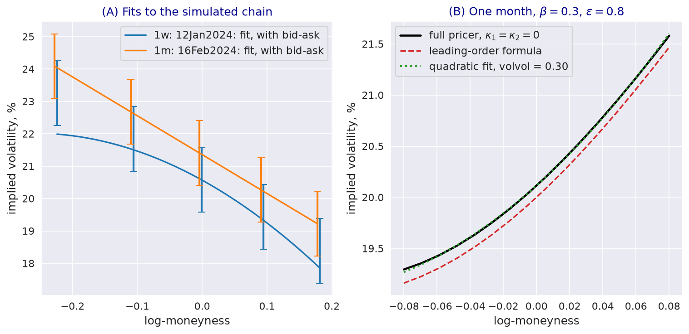

---
myst:
  html_meta:
    description: >-
      The approximate log-normal stochastic volatility smile of stochvolmodels.fitters: the
      leading-order formula without mean reversion, the quadratic form used for fitting, what its
      parameters mean, fits to a simulated chain, the implied density and delta-space helpers.
---

# Approximate log-normal SV smile fitter

*Author: [Artur Sepp](https://github.com/ArturSepp)*

Implemented in [stochvolmodels](https://github.com/ArturSepp/StochVolModels).
Software citation: [CITATION.cff](https://github.com/ArturSepp/StochVolModels/blob/main/CITATION.cff).

`stochvolmodels.fitters` fits a three-parameter smile, $(\sigma_0, \beta, \varepsilon)$, to the
implied volatilities of one maturity without pricing a single option, and derives from it a density
and strikes for given deltas. The smile comes from the leading-order expansion of implied volatility in the
log-normal stochastic volatility (SV) model without mean reversion. This article states the formula,
shows how close it is to the full model, explains that the fitting form's vol-of-vol is on a
different scale from the model's, and documents the helpers. The fitter has no publication in the
package's papers; it is documented here as an implementation.

## Overview

Over short horizons mean reversion has little effect on a smile, and the log-normal SV model behaves
like a model with $d\sigma_t = \beta \sigma_t dW^{(0)}_t + \varepsilon \sigma_t dW^{(1)}_t$. Its
implied volatility at leading order in maturity depends only on log-moneyness, through a closed-form
function. A cheap three-parameter fit of that shape gives a smooth interpolation of a slice, a
starting point for the full calibration, or a density for risk and scenario work.

## Inputs, notation, and assumptions

| Symbol | Meaning | Code |
|---|---|---|
| $k$ | Log-moneyness $\ln(K / F)$ | `log_strikes` |
| $y$ | $-k / \sigma_0$ | |
| $\sigma_0$, $\beta$, $\varepsilon$ | At-the-money volatility, volatility beta, residual vol-of-vol | `sigma0`, `beta`, `volvol` |
| $\vartheta$ | $\sqrt{\beta^2 + \varepsilon^2}$ | |

Inputs are the log-moneyness and the mid implied volatilities of one maturity, in decimals; the
maturity enters only the fitting weights and the density.

## Methodology

### The leading-order smile

Without mean reversion, the implied volatility at leading order is

$$
\sigma_{imp}(k) = \sigma_0 \frac{y}{x(y)} , \qquad x(y) = \frac{1}{\vartheta} \ln\left( \frac{\vartheta J(y) + \vartheta^2 y - \beta}{\vartheta - \beta} \right) , \qquad J(y) = \sqrt{1 + \vartheta^2 y^2 - 2 \beta y} ,
$$

the log-normal SABR smile with volatility of volatility $\vartheta$ and correlation
$\beta / \vartheta$. For small $y$,

$$
\sigma_{imp}(k) = \sigma_0 \left( 1 - \frac{\beta}{2} y + \frac{2 \varepsilon^2 - \beta^2}{12} y^2 + O(y^3) \right) .
$$

A positive $\beta$ tilts the smile up to the right, and $\varepsilon$ adds curvature.

### The fitting form

`calc_logsv_ivols` uses by default the quadratic form

$$
\sigma_{fit}(k) = \sigma_0 \left( 1 - \frac{\beta}{2} y + (2 \varepsilon^2 - \beta^2) y^2 \right) ,
$$

whose curvature coefficient lacks the factor $1/12$ of the expansion. Fitted to a model smile, it
reproduces the shape and recovers $\sigma_0$ and roughly $\beta$, but its $\varepsilon$ is a curvature
parameter on another scale: $2 \varepsilon_{fit}^2 - \beta_{fit}^2 \approx (2 \varepsilon^2 - \beta^2) / 12$.
Do not pass fitted `volvol` values to `LogSvParams`.

`fit_logsv_ivols` fits the form by `scipy.optimize.curve_fit`, starting from the interpolated
at-the-money volatility with $\beta = 0$ and $\varepsilon = 0.1$, with bounds
$\sigma_0 \in [0.01, \max \sigma^{mid}]$, $\beta \in [-15, 5]$ and $\varepsilon \in [0.01, 30]$,
and with weights proportional to the Black-Scholes vega of each point.

### Density and deltas

The risk-neutral density of the log-price follows from the second derivative of call prices in the
strike, written through the smile and its first two derivatives in $k$; `calc_logsv_pdf` evaluates
it on a grid and can normalise it to probabilities. `infer_strikes_from_deltas` finds, for each Black
forward delta, the strike at which the smile's implied volatility gives that delta, by bracketing on a
grid and Brent's method.

## Worked example

Every block below is an excerpt of
[`examples/docs/logsv_smile_fitter.py`](../examples/docs/logsv_smile_fitter.py), which asserts
every number quoted here.

```python
def fit_slice(chain: svm.OptionChain, idx: int) -> dict:
    """Fit the approximate smile to one slice's mid volatilities, in log-moneyness."""
    log_strikes = np.log(chain.strikes_ttms[idx] / chain.forwards[idx])
    mid_vols = 0.5 * (chain.bid_ivs[idx] + chain.ask_ivs[idx])
    params = fitters.fit_logsv_ivols(log_strikes=log_strikes, mid_vols=mid_vols,
                                     ttm=chain.ttms[idx])
    fitted = fitters.calc_logsv_ivols(log_strikes, **params)
    return {"params": params, "fitted": fitted, "mid": mid_vols,
            "inside": (fitted >= chain.bid_ivs[idx]) & (fitted <= chain.ask_ivs[idx])}
```

The packaged simulated chain, `get_oca_simulated_chain_data`, has five strikes from 80 to 120 on a
forward of about 100 at one week and one month. The one-week fit has $\sigma_0 = 0.2057$,
$\beta = -0.2219$ and $\varepsilon = 0.0534$, with a root-mean-square error of 0.63 volatility points
and four of the five mids inside the bid-ask interval; the one-month slice lies on the fitting form,
with an error below $10^{-6}$.

To compare the formulas with the full model, the script prices smiles with `LogSVPricer` at
$\kappa_1 = \kappa_2 = 0$, $\sigma_0 = \theta = 0.2$ and $\varepsilon = 0.8$, over log-moneyness
within 0.08:

```python
def leading_order_smile(log_strikes: np.ndarray, sigma0: float, beta: float,
                        volvol: float) -> np.ndarray:
    """sigma0 y / x(y): the leading-order smile without mean reversion, y = -log_strike / sigma0."""
    ivols, _, _ = fitters.calc_logsv_ivols_partials(log_strikes, sigma0, beta, volvol,
                                                    is_analytic=True)
    return ivols
```

At one month the leading-order smile is within 0.15 volatility points of the full pricer for
$\beta = \pm 0.3$; it lies slightly below it at every strike, because it omits the correction
proportional to maturity. At one week the transform pricer itself is inaccurate at 20% volatility (see
[Fourier pricing](european_option_pricing.md#interpretation-and-limitations)), so the script compares
with a simulation of 400,000 paths instead: the leading-order smile lies inside the 95% Monte Carlo
interval at every strike. Fitted to the one-month model smiles, the quadratic form is within 0.05
volatility points of them, with $\beta_{fit} \approx 0.96 \beta$ and $\varepsilon_{fit} = 0.30$ for a
model $\varepsilon$ of 0.8.

[](images/smile_fitter_fit.png)

*Synthetic teaching exhibit. (A) Quadratic fits to the two slices of the packaged simulated chain,
with the bid-ask interval of each quote; (B) the one-month smile of the full pricer with
$\kappa_1 = \kappa_2 = 0$, $\sigma_0 = 0.2$, $\beta = 0.3$ and $\varepsilon = 0.8$, the leading-order
formula with the same parameters, and the quadratic fit with its own vol-of-vol.*

The density of the one-month smile with $\sigma_0 = 0.2$, $\beta = 0.3$ and $\varepsilon = 0.3$ is
non-negative and normalises to one, and its 25-delta call and put strikes on a forward of 100 are
104.30 and 96.42: at those strikes the Black deltas with the smile's volatilities are 0.25 and
-0.25 to $10^{-8}$.

## Implementation in stochvolmodels

| Name | Role |
|---|---|
| `fitters.fit_logsv_ivols` | Fit the quadratic form to one slice |
| `fitters.calc_logsv_ivols` | The quadratic form, or with `is_quadratic=False` the full formula divided by $\sigma_0$ |
| `fitters.calc_logsv_ivols_partials` | The smile and its first two derivatives in $k$; with `is_analytic=True` the leading-order formula |
| `fitters.calc_logsv_atm_fit` | At-the-money estimates; the fitter uses only its volatility as a starting point |
| `fitters.calc_logsv_pdf`, `calc_logsv_pdf_core` | Density on a log-moneyness grid, optionally normalised |
| `fitters.infer_strikes_from_deltas`, `get_vols_delta_space`, `get_pdf_delta_space` | Strikes, smile and density on a delta grid |
| `fitters.generate_grid_option_prices_from_slice` | Fit a slice and price puts and calls on a strike grid |

The module is reached by `from stochvolmodels import fitters`, outside `stochvolmodels.__all__`;
its names are listed with the provisional surfaces of the [API reference](api.md). The branch
`is_quadratic=False` of `calc_logsv_ivols` returns $y / x(y)$ without the factor $\sigma_0$; use
`calc_logsv_ivols_partials` with `is_analytic=True` for the leading-order smile. Run the example
from a checkout with `python examples/docs/logsv_smile_fitter.py`.

## Interpretation and limitations

- **Short maturities, one slice.** The formula has no mean reversion and no term structure; fit each
  maturity separately.
- **Not the model's parameters.** The fitted `volvol` measures curvature on the scale of the
  quadratic form; convert through the relation above, or calibrate the full model, before using it
  in `LogSvParams`.
- **Wings.** The quadratic form grows without bound in $y$; far from the money it is an
  extrapolation, and the density derived from it can lose accuracy there.

## See also

- [Calibration to implied volatilities](calibration.md)
- [Log-normal stochastic volatility model with quadratic drift](logsv_model.md)
- [Fourier pricing of European options](european_option_pricing.md)

## References

- [stochvolmodels software citation](https://github.com/ArturSepp/StochVolModels/blob/main/CITATION.cff).
