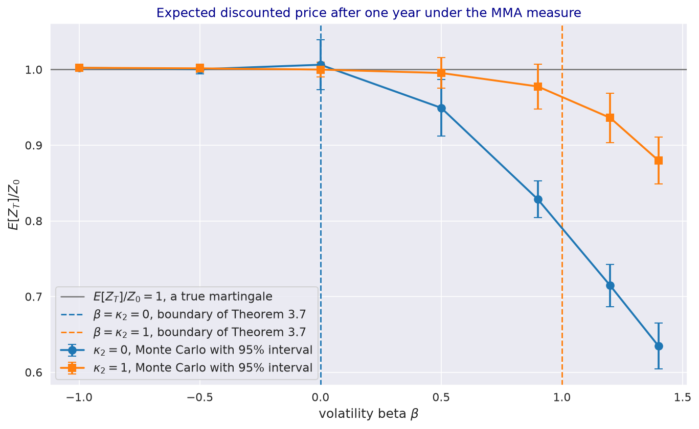
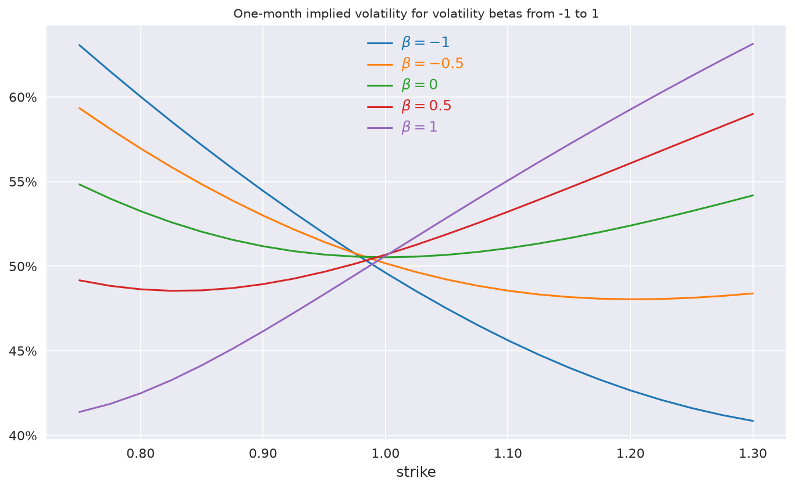

---
myst:
  html_meta:
    description: >-
      Martingale conditions of the log-normal stochastic volatility model with quadratic drift:
      valuation under the money-market-account and inverse measures, why a positive volatility
      beta needs the quadratic drift, a Monte Carlo test, positive and negative skews, and the
      calibration constraints of stochvolmodels.
---

# Martingale conditions, measures and positive skews

*Author: [Artur Sepp](https://github.com/ArturSepp)*

Implemented in [stochvolmodels](https://github.com/ArturSepp/StochVolModels).
Software citation: [CITATION.cff](https://github.com/ArturSepp/StochVolModels/blob/main/CITATION.cff).

A stochastic volatility model is a consistent pricing model only if the discounted price is a true
martingale under the valuation measure. For the log-normal stochastic volatility (SV) model with
quadratic drift, this holds under the money-market-account (MMA) measure if and only if the
quadratic mean-reversion rate is at least the volatility beta, $\kappa_2 \ge \beta$, and the
inverse price is a martingale under the inverse measure if and only if $\kappa_2 \ge 2 \beta$
(Sepp and Rakhmonov, 2023, Theorem 3.7). This article explains the two measures, the conditions,
what they mean for assets whose volatility rises with their price, and how calibration imposes them.

## Overview

Equity indices usually show a negative correlation between returns and volatility, and a
downward-sloping implied volatility skew. The VIX index and short or leveraged-short
exchange-traded funds show a positive correlation permanently, and some commodities, currencies
and cryptocurrencies at times (Section 1.4 of the paper). In the log-normal SV model the sign of the
correlation is the sign of the volatility beta $\beta$, which also sets the direction of the skew.

With a linear drift, a positive $\beta$ breaks the model: the discounted price becomes a strict local
martingale, whose expectation falls below today's price, so the model's forward is inconsistent
with the market's. The quadratic drift restores the martingale property when it is strong enough.
The conditions matter in practice for three tasks: fitting positive skews, valuing inverse options,
which are paid in the underlying and valued under the inverse measure, and choosing the constraints
of calibration.

## Inputs, notation, and assumptions

| Symbol | Meaning | Convention |
|---|---|---|
| $Z_t$ | Discounted price $e^{-\int_0^t r(s) ds} S_t$, Eq. (3.15) | Zero drift under the MMA measure |
| $R_t$ | Its inverse, $1 / Z_t$ | Numeraire-relative value of cash |
| $\mathbb{Q}$ | MMA measure, with the money-market account as numeraire | `is_spot_measure=True`, the default |
| $\tilde{\mathbb{Q}}$ | Inverse measure, with the spot price as numeraire | `is_spot_measure=False` |
| $\Lambda_t$ | Density of $\tilde{\mathbb{Q}}$ with respect to $\mathbb{Q}$, $Z_t / Z_0$ | Eq. (3.27) |
| $\beta$, $\varepsilon$, $\vartheta$ | Volatility beta, residual vol-of-vol, total vol-of-vol | `beta`, `volvol`; $\vartheta^2 = \beta^2 + \varepsilon^2$ |
| $\kappa_1$, $\kappa_2$ | Linear and quadratic mean-reversion rates | `kappa1`, `kappa2` |

The dynamics are those of Eq. (3.12), described in the
[model article](logsv_model.md), under Assumption 3.1 of the paper: $\kappa_1 \ge 0$,
$\kappa_2 \ge 0$ and $\theta > 0$. Units and conventions are on the
[conventions page](option_chains_and_conventions.md).

## Methodology

### Two valuation measures

A vanilla call pays $\max(S_T - K, 0)$ in cash, Eq. (2.1). An inverse call pays the same amount
converted into the underlying, $\max(S_T - K, 0) / S_T$, Eq. (2.2). With the money-market account
$M$ as numeraire, the value of a payoff $u(S_T)$ is, Eq. (2.3),

$$
U(t, S) = M(t) E\left[ \frac{u(S_T)}{M(T)} \right] ,
$$

and with the spot price as numeraire it is, Eq. (2.4),

$$
\tilde{U}(t, S) = S_t \tilde{E}\left[ \frac{u(S_T)}{S_T} \right] .
$$

When both $\mathbb{Q}$ and $\tilde{\mathbb{Q}}$ are equivalent martingale measures the two values
are equal (Theorem 2.1), and the value of an inverse option in cash equals that of the vanilla
option.

### Dynamics under the inverse measure

Changing the numeraire from the money-market account to the price shifts the price shock by
$\sigma_t dt$. Volatility loads $\beta$ on that shock, so its drift gains $\beta \sigma_t^2$:
under $\tilde{\mathbb{Q}}$, Eq. (3.26),

$$
d\sigma_t = \left( \kappa_1 \theta - (\kappa_1 - \kappa_2 \theta) \sigma_t - (\kappa_2 - \beta) \sigma_t^2 \right) dt + \beta \sigma_t d\tilde{W}^{(0)}_t + \varepsilon \sigma_t d\tilde{W}^{(1)}_t ,
$$

with density $\Lambda_t = Z_t / Z_0$, Eq. (3.27). The quadratic coefficient becomes $\kappa_2 - \beta$.
If it is negative, the drift pushes large volatility further up and volatility explodes under
$\tilde{\mathbb{Q}}$.

### The martingale conditions

The discounted price $Z_t$ is a true martingale under $\mathbb{Q}$ if and only if volatility does not
explode under the measure that $Z_t$ defines as numeraire (Sin, 1998; Lewis, 2000). Applied to the
drift above, this gives Theorems 3.6 and 3.7 of the paper:

| Statement | Condition |
|---|---|
| $Z_t$ is a martingale under $\mathbb{Q}$, and $\mathbb{Q}$ and $\tilde{\mathbb{Q}}$ are equivalent | $\kappa_2 \ge \beta$ |
| $R_t$ is a martingale under $\tilde{\mathbb{Q}}$, so valuation under the inverse measure is consistent | $\kappa_2 \ge 2 \beta$ |
| With a linear drift, $\kappa_2 = 0$, either property | $\beta \le 0$ (Corollary 3.1) |

The conditions compare $\kappa_2$ with $\beta$ only: they concern the drift at large volatility,
where the $\sigma^2$ terms dominate, and they do not depend on $\kappa_1$, $\theta$ or the vol-of-vol.
A negative $\beta$ satisfies both with any $\kappa_2 \ge 0$. A positive $\beta$ needs a quadratic
drift of at least $\beta$ for the MMA measure, and of at least $2 \beta$ for the inverse measure.

### Skews and the sign of the volatility beta

When $\beta > 0$, volatility tends to rise when the price rises, so out-of-the-money calls are
worth more than in a model with independent volatility, and the implied volatility skew slopes
upwards. When $\beta < 0$, the skew slopes downwards, as for equity indices. The residual
vol-of-vol $\varepsilon$ adds curvature in both wings.

### Constraints in calibration

`ConstraintsType` selects the inequalities that `LogSVPricer.calibrate_model_params_to_chain` imposes:

| Member | Inequality |
|---|---|
| `UNCONSTRAINT` | None |
| `MMA_MARTINGALE` | $\kappa_2 \ge \beta$ |
| `INVERSE_MARTINGALE` | $\kappa_2 \ge 2 \beta$ |
| `MMA_MARTINGALE_MOMENT4` | $\kappa_2 \ge \beta$ and $\kappa_1 + \kappa_2 \theta \ge 1.5 \vartheta^2$ |
| `INVERSE_MARTINGALE_MOMENT4` | $\kappa_2 \ge 2 \beta$ and $\kappa_1 + \kappa_2 \theta \ge 1.5 \vartheta^2$ |

The fourth-moment inequality is the diagonal condition of the moment system for the fourth moment
of volatility (see [moments](volatility_distribution_and_moments.md#moments-at-a-finite-horizon)).

## Worked example

Every block below is an excerpt of
[`examples/docs/martingale_conditions_and_skews.py`](../examples/docs/martingale_conditions_and_skews.py),
which asserts every number quoted here.

```python
def admissibility(params: svm.LogSvParams) -> dict:
    """Valuation measures that Theorem 3.7 admits, and the fourth-moment calibration condition."""
    kappa = params.kappa1 + params.kappa2 * params.theta
    vartheta2 = params.beta ** 2 + params.volvol ** 2
    return {"mma": params.kappa2 >= params.beta,
            "inverse": params.kappa2 >= 2.0 * params.beta,
            "fourth_moment": kappa >= 1.5 * vartheta2}
```

With $\kappa_2 = 1$, $\beta = 0.4$, $\kappa_1 = 2$, $\theta = 1$ and $\vartheta = 1.5$, both measures
are admissible, but the fourth-moment inequality fails: $\kappa_1 + \kappa_2 \theta = 3$ against
$1.5 \vartheta^2 = 3.375$. With $\beta = 0.8$ the inverse measure is no longer admissible, and with a
linear drift any positive $\beta$ fails both conditions.

Monte Carlo simulation cannot prove that a process is a martingale, but it can show a failure: the
simulated mean of $Z_T / Z_0$ falls below one when the condition is violated.

```python
def test_params(kappa2: float, beta: float, vartheta: float = 1.5) -> svm.LogSvParams:
    """kappa1 = 2 and theta = sigma0 = 1; the total vol-of-vol is split between beta and volvol."""
    return svm.LogSvParams(sigma0=1.0, theta=1.0, kappa1=2.0, kappa2=kappa2, beta=beta,
                           volvol=np.sqrt(vartheta ** 2 - beta ** 2))


def expected_price_ratio(params: svm.LogSvParams, ttm: float = 1.0, nb_path: int = 100000,
                         seed: int = 5) -> tuple:
    """Monte Carlo estimate of E[Z_T] / Z_0 under the MMA measure, with its standard error."""
    set_seed(seed)
    log_returns, _, _ = svm.LogSVPricer().simulate_terminal_values(params=params, ttm=ttm,
                                                                   nb_path=nb_path)
    ratio = np.exp(log_returns)
    return np.mean(ratio), np.std(ratio) / np.sqrt(nb_path)
```

Well inside the region, with $\kappa_2 = 1$ and $\beta$ equal to -0.5 or 0, the estimate is within
three standard errors of one. Well outside it, the estimate is 0.804 for $\kappa_2 = 0$ and
$\beta = 0.9$, and 0.831 for $\kappa_2 = 1$ and $\beta = 1.4$, more than ten standard errors below one.

[](images/martingale_test.png)

*Synthetic teaching exhibit. Monte Carlo estimates of $E[Z_1] / Z_0$ under the MMA measure, with
95% intervals, against $\beta$, for a linear drift ($\kappa_2 = 0$) and a quadratic drift
($\kappa_2 = 1$); $\kappa_1 = 2$, $\theta = \sigma_0 = 1$, $\vartheta = 1.5$, 200,000 paths per
point, seed 5. The dashed lines mark the boundary $\beta = \kappa_2$ of Theorem 3.7. Beyond the
boundary the estimates fall well below one. Close to it, inside the region, they fall slightly
below one: the distribution of $Z_T$ has a heavy right tail there, the sample mean converges slowly,
and the sample standard error understates the uncertainty.*

The direction of the skew follows the sign of $\beta$. The script prices one-month smiles with a
volatility of 50% and the total vol-of-vol held at 1.5:

```python
def smile_params(beta: float) -> svm.LogSvParams:
    """Volatility 50%, kappa2 = 2.5 and a total vol-of-vol of 1.5 split between beta and volvol."""
    return svm.LogSvParams(sigma0=0.5, theta=0.5, kappa1=2.0, kappa2=2.5, beta=beta,
                           volvol=np.sqrt(1.5 ** 2 - beta ** 2))
```

The difference between the implied volatilities at strikes 1.2 and 0.8 is -0.174 for $\beta = -1$
and 0.168 for $\beta = 1$. With $\kappa_2 = 2.5$, every smile in the figure satisfies both martingale
conditions, including $\beta = 1$.

[](images/smiles_in_beta.png)

*Synthetic teaching exhibit. One-month implied volatilities for $\beta$ from -1 to 1, with
$\sigma_0 = \theta = 0.5$, $\kappa_1 = 2$, $\kappa_2 = 2.5$ and $\vartheta = 1.5$. Drawn by
`LogSVPricer.plot_model_slices_in_params`.*

## Implementation in stochvolmodels

| Name | Role |
|---|---|
| `ConstraintsType` | The calibration constraints above; a stable export, passed as `constraints_type` to `LogSVPricer.calibrate_model_params_to_chain` |
| `LogSVPricer.price_chain`, `price_slice`, `price_vanilla` | Value under the MMA measure, or under the inverse measure with `is_spot_measure=False` |
| `LogSVPricer.simulate_terminal_values` | Terminal log returns, volatilities and quadratic variances under either measure |

`LogSvParams` does not check the conditions, and the pricers return numbers for parameters that
violate them. Impose the conditions in calibration, or check a parameter set as the `admissibility`
function above does. Run the example from a checkout with
`python examples/docs/martingale_conditions_and_skews.py`.

## Interpretation and limitations

- **Monte Carlo is a one-sided test.** A clear deficit shows that the martingale property fails; an
  estimate close to one does not prove that it holds. Near the boundary the estimates converge
  slowly, as the figure shows.
- **Consequences of a violation.** With $\kappa_2 < \beta$, the model's expected price is below the
  forward, so option values from the model are inconsistent with the market forward.
- **Inverse options need the stronger condition.** Bitcoin options on Deribit are inverse options,
  so the [Bitcoin case study](app_bitcoin_options.md) calibrates under `INVERSE_MARTINGALE`.
- **The fourth-moment inequality** keeps the diagonal of the moment system stable for the fourth
  moment of volatility. It is a sufficient condition within the truncated system, not a statement
  about every moment.

## See also

- [Log-normal stochastic volatility model with quadratic drift](logsv_model.md)
- [Option chains, notation and conventions](option_chains_and_conventions.md#measures-mma-and-inverse)
- [Calibration](calibration.md)
- [Bitcoin options: MMA, inverse and QV valuation](app_bitcoin_options.md)

## References

- Lewis, A. L. (2000). *Option Valuation under Stochastic Volatility*. Finance Press.
- Sepp, A. and Rakhmonov, P. (2023). Log-normal stochastic volatility model with quadratic drift.
  *International Journal of Theoretical and Applied Finance* 26(8), 2450003.
  [DOI 10.1142/S0219024924500031](https://doi.org/10.1142/S0219024924500031).
- Sin, C. A. (1998). Complications with stochastic volatility models. *Advances in Applied
  Probability* 30(1), 256-268.
- [stochvolmodels software citation](https://github.com/ArturSepp/StochVolModels/blob/main/CITATION.cff).
