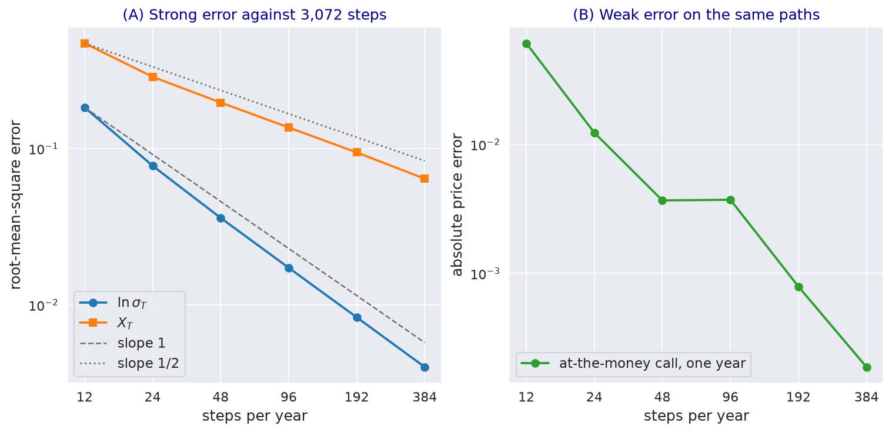

---
myst:
  html_meta:
    description: >-
      Monte Carlo simulation of the log-normal stochastic volatility model in stochvolmodels: the
      log-volatility scheme of the paper and the explicit scheme the package uses, strong and weak
      convergence measured on nested grids, sampling error, seeds and fixed random numbers, the
      Heston scheme and the experimental rough extension.
---

# Monte Carlo simulation schemes

*Author: [Artur Sepp](https://github.com/ArturSepp)*

Implemented in [stochvolmodels](https://github.com/ArturSepp/StochVolModels).
Software citation: [CITATION.cff](https://github.com/ArturSepp/StochVolModels/blob/main/CITATION.cff).

Monte Carlo simulation is the package's second route to option values: it checks the transform
prices, values payoffs the transforms do not cover, and drives the Monte Carlo calibration engines.
Sepp and Rakhmonov (2023, Section 3.8) simulate the log of volatility, whose diffusion coefficient
is constant, with a drift-implicit Euler scheme of strong order one. This article states that
scheme, documents the explicit scheme the package implements, measures its convergence and its
sampling error, and explains seeds, fixed random numbers and the simulators of the other models.

## Overview

Volatility in the log-normal stochastic volatility (SV) model has a proportional diffusion, so its
logarithm $L_t = \ln \sigma_t$ has a constant one: the Lamperti transform moves the nonlinearity
into the drift. Simulating $L_t$ keeps volatility positive without boundary handling, which affine
variance models need. The log-price and the quadratic variance (QV) are then accumulated along the
volatility path.

Two errors matter: the sampling error, which falls with the square root of the number of paths, and
the discretisation error, which falls with the time step. The package reports the first as a
standard error; the second must be checked by refining the grid, as this article does.

## Inputs, notation, and assumptions

| Symbol | Meaning | Code |
|---|---|---|
| $L_t$ | Log-volatility $\ln \sigma_t$ | |
| $\zeta(L)$ | Drift of $L_t$ | `log_vol_drift` below |
| $\Delta$ | Time step | `1 / nb_steps` years when `nb_steps` is given per year |
| $N$ | Number of paths | `nb_path` |
| $W^{(0)}$, $W^{(1)}$ | Independent Brownian motions of the price and of the residual volatility | `W0`, `W1` |
| $H$ | Hurst exponent of the rough extension | `LogSvParams.H`, default 0.5 |

The model and its parameters are those of the [model article](logsv_model.md); seeds and the
meaning of `nb_steps` are on the [conventions page](option_chains_and_conventions.md#monte-carlo-conventions).

## Methodology

### The log-volatility process

By Itô's formula, under the money-market-account (MMA) measure, Eq. (3.55),

$$
d L_t = \zeta(L_t) dt + \vartheta d W^{(\ast)}_t , \qquad \zeta(L) = \left( -\kappa_1 + \kappa_2 \theta - \frac{1}{2} \vartheta^2 \right) + \kappa_1 \theta e^{-L} - \kappa_2 e^{L} ,
$$

where $\vartheta W^{(\ast)} = \beta W^{(0)} + \varepsilon W^{(1)}$. The drift pulls $L_t$ up through
$e^{-L}$ when volatility is low and down through $e^{L}$ when it is high; the second term is the
quadratic mean reversion.

### The scheme of the paper

The paper uses the backward (drift-implicit) Euler-Maruyama scheme, Eq. (3.56),

$$
\hat{L}_{t_{k+1}} = \hat{L}_{t_k} + \zeta(\hat{L}_{t_{k+1}}) \Delta + \vartheta (W^{(\ast)}_{t_{k+1}} - W^{(\ast)}_{t_k}) ,
$$

which has a unique solution at every step because $l - \zeta(l) \Delta$ is increasing, and is solved
by a few Newton iterations. Theorem 3.8 shows that it converges strongly with order one. The full
scheme, Eq. (3.59), adds the log-price and the QV with left-point increments:

$$
X_{t_{k+1}} = X_{t_k} - \frac{1}{2} \sigma_{t_k}^2 \Delta + \sigma_{t_k} (W^{(0)}_{t_{k+1}} - W^{(0)}_{t_k}) , \qquad I_{t_{k+1}} = I_{t_k} + \sigma_{t_k}^2 \Delta .
$$

### The scheme of the package

The package takes an explicit step for $L_t$, with the drift at the current state,

$$
\hat{L}_{t_{k+1}} = \hat{L}_{t_k} + \zeta(\hat{L}_{t_k}) \Delta + \beta (W^{(0)}_{t_{k+1}} - W^{(0)}_{t_k}) + \varepsilon (W^{(1)}_{t_{k+1}} - W^{(1)}_{t_k}) ,
$$

the left-point step for $X_t$ of Eq. (3.59), and the trapezoidal rule
$I_{t_{k+1}} = I_{t_k} + \frac{1}{2} (\sigma_{t_k}^2 + \sigma_{t_{k+1}}^2) \Delta$ for the QV. The
explicit step needs no Newton iteration. It is not covered by Theorem 3.8 and, because $\zeta$
grows exponentially, it can overflow when the step is large. Under the inverse measure the drift of
$X_t$ changes sign and $\kappa_2$ becomes $\kappa_2 - \beta$ in $\zeta$, per Eq. (3.26).

### Error of a Monte Carlo price

A price is the mean of $N$ discounted payoffs, and its standard error is the sample standard
deviation over $\sqrt{N}$; a 95% interval is the price plus or minus 1.96 standard errors. Before
taking the payoff, the package shifts the simulated terminal prices by a constant so that their mean
equals the forward: this removes the sampling error of the forward and makes put-call parity hold on
every path set. The discretisation error is separate and does not show in the standard error.

## Worked example

Every block below is an excerpt of
[`examples/docs/monte_carlo_simulation.py`](../examples/docs/monte_carlo_simulation.py), which
asserts every number quoted here. The parameters are `LOGSV_BTC_PARAMS`.

```python
def log_vol_drift(params: svm.LogSvParams, log_vol: np.ndarray) -> np.ndarray:
    """zeta(L) of Eq. (3.55), the drift of the log-volatility L = ln(sigma), MMA measure."""
    vartheta2 = params.beta ** 2 + params.volvol ** 2
    return ((-params.kappa1 + params.kappa2 * params.theta - 0.5 * vartheta2)
            + params.kappa1 * params.theta * np.exp(-log_vol) - params.kappa2 * np.exp(log_vol))
```

One step of the package's simulator equals the explicit step above to $10^{-14}$. With six steps per
year, some paths overflow. To measure convergence, the script simulates one year on nested grids of
12 to 384 steps driven by the same Brownian paths, obtained by summing the increments of a
3,072-step grid, and compares each grid with the finest:

```python
def nested_terminal_values(params: svm.LogSvParams = PARAMS, ttm: float = 1.0,
                           steps: tuple = (12, 24, 48, 96, 192, 384, 3072),
                           nb_path: int = 20000, seed: int = 3) -> dict:
    """Terminal values on nested grids driven by one Brownian path: fine increments are summed."""
    rng = np.random.default_rng(seed)
    z0 = rng.standard_normal((steps[-1], nb_path))
    z1 = rng.standard_normal((steps[-1], nb_path))
    values = {}
    for n in steps:
        m = steps[-1] // n
        coarse0 = z0.reshape(n, m, nb_path).sum(axis=1) / np.sqrt(m)
        coarse1 = z1.reshape(n, m, nb_path).sum(axis=1) / np.sqrt(m)
        values[n] = simulate(params, ttm, coarse0, coarse1)
    return values
```

The root-mean-square error of $\ln \sigma_T$ falls from 0.1835 with 12 steps to 0.0040 with 384, a
fitted slope of order 1.1 in the step count, so the explicit scheme converges with the order that
Theorem 3.8 proves for the implicit one on these parameters. The error of $X_T$ falls from 0.472 to
0.064, order 0.55: the left-point step for the log-price is of strong order one half. The price of
a one-year at-the-money call, computed on the same paths, differs from its 3,072-step value by more
than 0.05 with 12 steps and by less than 0.001 with 384.

[](images/mc_convergence.png)

*Synthetic teaching exhibit. (A) Root-mean-square error of $\ln \sigma_T$ and $X_T$ at one year
against the number of steps, relative to 3,072 steps on the same Brownian paths, with reference
slopes of one and one half; (B) error of the price of a one-year at-the-money call on the same
paths. `LOGSV_BTC_PARAMS`, 20,000 paths, seed 3.*

The sampling error of a three-month at-the-money call, with 360 steps per year, is 0.0053, 0.0022
and 0.0011 with 10,000, 40,000 and 160,000 paths: times $\sqrt{N}$ it is 0.53, 0.43 and 0.45, and
the scaled error settles as the sample grows, so each fourfold increase in paths about halves the
error.

For calibration the random numbers must stay fixed while the parameters move. The fixed-random
pricer takes them as arguments:

```python
def fixed_random_prices(params: svm.LogSvParams, chain: svm.OptionChain, nb_path: int = 50000,
                        seed: int = 10) -> tuple:
    """Chain prices with random numbers drawn once from a local generator, as calibration uses."""
    w0s, w1s, dts = svm.get_randoms_for_chain_valuation(ttms=chain.ttms, nb_path=nb_path,
                                                        nb_steps_per_year=360, seed=seed)
    return svm.logsv_mc_chain_pricer_fixed_randoms(
        ttms=chain.ttms, forwards=chain.forwards, discfactors=chain.discfactors,
        strikes_ttms=chain.strikes_ttms, optiontypes_ttms=chain.optiontypes_ttms,
        W0s=w0s, W1s=w1s, dts=dts, v0=params.sigma0, theta=params.theta, kappa1=params.kappa1,
        kappa2=params.kappa2, beta=params.beta, volvol=params.volvol,
        vol_backbone_etas=params.get_vol_backbone_etas(ttms=chain.ttms))
```

Two calls return identical prices, and on a three- and six-month chain they agree with the seeded
simulator `model_mc_price_chain` within three combined standard errors at every strike.

### The Heston scheme

`HestonPricer.model_mc_price_chain` simulates the variance with an Euler step, floors it at
$10^{-4}$ after each step, and accumulates the log-price and the QV with left-point increments, on
360 steps per year; it takes no `nb_steps` argument.

### The rough extension

With a Hurst exponent $H < 1/2$, `LogSvParams` approximates the fractional kernel by a sum of
exponentials, whose nodes and weights `approximate_kernel` sets for a horizon, and
`model_mc_price_chain` simulates the resulting multi-factor dynamics when called with
`use_rough_mc=True` and a `seed`. This extension is experimental and outside the paper; it has no
transform price. With $H = 1/2$ the kernel is a single node at $10^{-3}$ with weight one, and the
three-month prices of the rough simulator agree with those of the standard simulator within 0.01
standard errors when both use seed 7.

```python
def rough_params(hurst: float, params: svm.LogSvParams = PARAMS, ttm: float = 0.25):
    """Parameters with Hurst exponent H and the Markovian kernel approximation for horizon ttm."""
    rough = svm.LogSvParams(sigma0=params.sigma0, theta=params.theta, kappa1=params.kappa1,
                            kappa2=params.kappa2, beta=params.beta, volvol=params.volvol, H=hurst)
    rough.approximate_kernel(T=ttm)
    return rough
```

## Implementation in stochvolmodels

| Name | Role |
|---|---|
| `LogSVPricer.model_mc_price_chain` | Prices and standard errors of a chain; `nb_path`, `nb_steps` per year, `is_spot_measure`, `variable_type`; `use_rough_mc=True` with `seed` for the rough extension |
| `LogSVPricer.simulate_terminal_values` | Terminal $X_T$, $\sigma_T$ and $I_T$, 360 steps per year |
| `LogSVPricer.simulate_vol_paths` | Volatility paths; NumPy's generator, or given increments through `brownians` |
| `get_randoms_for_chain_valuation`, `logsv_mc_chain_pricer_fixed_randoms` | Random numbers drawn once from a local generator, and the chain pricer that reuses them |
| `get_randoms_for_rough_vol_chain_valuation`, `rough_logsv_mc_chain_pricer_fixed_randoms` | The same for the rough extension |
| `LogSvParams` fields `H`, `weights` and `nodes` | Hurst exponent, and the kernel approximation that `approximate_kernel` sets |

The four fixed-random functions are advanced exports (see
[stability tiers](option_chains_and_conventions.md#stability-tiers)); the rough simulator is
experimental. `LogSVPricer.model_mc_price_chain` reads `nb_steps` as steps per year; without it, it
takes $\lfloor 360 T \rfloor + 1$ for the longest maturity $T$, which is coarse for short chains
and too coarse for options on QV (see [QV options](quadratic_variance_options.md)). The numba
simulators are seeded by `stochvolmodels.utils.funcs.set_seed`. Run the example from a checkout with
`python examples/docs/monte_carlo_simulation.py`.

## Interpretation and limitations

- **Explicit, not implicit.** The package's scheme converged with order one here, but it is not
  covered by Theorem 3.8 and overflows for large steps; keep at least daily steps for parameters with
  a large quadratic mean reversion or vol-of-vol.
- **The standard error is not the whole error.** It measures sampling noise only; check the
  discretisation error by refining the grid on the same paths.
- **Heavy tails.** With a large vol-of-vol the payoff distribution has a heavy right tail, and the
  sample standard error converges slowly, as the martingale test in the
  [martingale article](martingale_conditions_and_skews.md) shows.
- **Rough extension.** The kernel approximation and its simulator are experimental and have no
  analytic benchmark in the package.

## See also

- [Analytic versus Monte Carlo validation](analytic_vs_monte_carlo.md)
- [Log-normal stochastic volatility model with quadratic drift](logsv_model.md)
- [Numerical accuracy and performance](numerical_accuracy_and_performance.md)
- [Option chains, notation and conventions](option_chains_and_conventions.md#monte-carlo-conventions)

## References

- Sepp, A. and Rakhmonov, P. (2023). Log-normal stochastic volatility model with quadratic drift.
  *International Journal of Theoretical and Applied Finance* 26(8), 2450003.
  [DOI 10.1142/S0219024924500031](https://doi.org/10.1142/S0219024924500031).
- [stochvolmodels software citation](https://github.com/ArturSepp/StochVolModels/blob/main/CITATION.cff).
