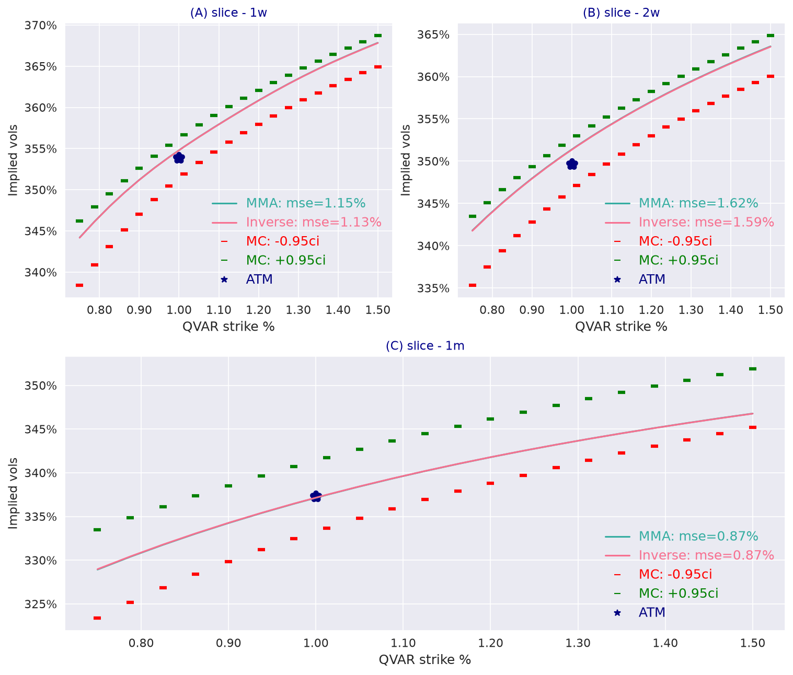

---
myst:
  html_meta:
    description: >-
      Expected quadratic variance, variance swaps and options on quadratic variance in the
      log-normal stochastic volatility model with quadratic drift: the variance-swap strike and its
      replication by options, calls on quadratic variance by Fourier inversion under the MMA and
      inverse measures, Monte Carlo checks, and stochvolmodels code.
---

# Expected quadratic variance, variance swaps and QV options

*Author: [Artur Sepp](https://github.com/ArturSepp)*

Implemented in [stochvolmodels](https://github.com/ArturSepp/StochVolModels).
Software citation: [CITATION.cff](https://github.com/ArturSepp/StochVolModels/blob/main/CITATION.cff).

The quadratic variance (QV) of the log-price, $I_T = \int_0^T \sigma_t^2 dt$, is the underlying of
variance swaps and of options on realised variance. In the log-normal stochastic volatility (SV)
model with quadratic drift, its expectation follows from the moment system of the volatility, and
its distribution from the moment generating function (MGF). This article connects the expected QV
to the variance-swap strike and its replication by vanilla options, and values calls on QV by
Fourier inversion under the money-market-account (MMA) and inverse measures, following Sepp and
Rakhmonov (2023, Sections 3.7 and 5.3).

## Overview

A variance swap pays the realised variance of returns over its life minus a fixed strike. For a
continuous price process without jumps, realised variance converges to the QV, and the fair strike
is the annualised expected QV. It can be computed from the model directly, or replicated from the
prices of out-of-the-money puts and calls on the same maturity: both must agree when the model is
consistent.

Options on QV pay a convex function of realised variance. Their value depends on the whole
distribution of $I_T$, which the MGF gives. In the log-normal SV model volatility has a heavy right
tail, and the implied volatilities of calls on QV rise with the strike, an upward-sloping skew.

## Inputs, notation, and assumptions

| Symbol | Meaning | Code and units |
|---|---|---|
| $I_T$ | Quadratic variance over $[0, T]$ | `VariableType.Q_VAR` |
| $\widehat{I}_T$ | Annualised expected QV, $E[I_T] / T$ | `compute_analytic_qvar`, annualised variance |
| $\sqrt{\widehat{I}_T}$ | Variance-swap strike quoted as a volatility | |
| $K$ | Strike of a call on QV, in annualised variance | `strikes` of a QV chain |
| $\Psi$ | Transform variable of $I_T$ | `psi_grid` |

Realised variance is continuously monitored and the price has no jumps; discrete sampling and jumps
add terms that this page does not cover. Measures and units are those of the
[conventions page](option_chains_and_conventions.md).

## Methodology

### Expected QV

The annualised expected QV follows from the first two integrated moments of the mean-adjusted
volatility, Eqs. (3.52) to (3.54), computed by the truncated moment system of order $k^\ast$; the
[moments article](volatility_distribution_and_moments.md#expected-quadratic-variance) derives it.
It is the model's fair variance-swap strike in variance units.

### Replication of the variance swap

Under the MMA measure the log-price satisfies $X_T = -\frac{1}{2} I_T + \int_0^T \sigma_t dW_t$, so
$E[I_T] = -2 E[\ln(S_T / F)]$ when the discounted price is a true martingale. The log contract is
replicated statically by out-of-the-money options, which gives the fair strike from undiscounted
put and call prices $O(K)$:

$$
\widehat{I}_T = \frac{2}{T} \int_0^\infty \frac{O(K)}{K^2} dK .
$$

The package applies this on a discrete strike grid with a correction for the first strike above the
forward, and returns the square root, the strike quoted as a volatility.

### Calls on QV

A call on QV pays $\frac{1}{T} \max(I_T - T K, 0)$, Eq. (5.19). Its transform is
$\widehat{u}(\Psi) = e^{\Psi T K} / \Psi^2$ for $\Re \Psi < 0$, Eq. (5.21), and its value is,
Proposition 5.3 and Eq. (5.20),

$$
U = \frac{D}{\pi T} \int_0^\infty \Re\left[ \widehat{u}(\Psi) E^{[m]}(\tau; \Phi = 0, \Psi; p = 1) \right] dy , \qquad \Psi = \Psi_R + i y ,
$$

with $E^{[m]}$ the [affine expansion](affine_expansion.md) of the MGF and $\Psi_R < 0$. The
package integrates along $\Psi_R = -\frac{1}{2}$ on 40,000 points of $y \in [0, 4000]$. By Theorem
4.3 the MGF of the QV exists on that line when $\kappa_2 > \vartheta$.

Under the inverse measure, the dollar value of the same payoff is $F$ times its coin value, as for
[inverse options](inverse_options.md), Eqs. (5.23) and (5.24). The package evaluates the
inverse-measure transform at $\Phi = 1$ with $p = -1$, which gives the dollar value directly, so
the two valuations can be compared.

Implied volatilities of calls on QV are Black volatilities with the expected QV as forward, as in the
paper's Fig. 10.

## Worked example

Every block below is an excerpt of
[`examples/docs/quadratic_variance_options.py`](../examples/docs/quadratic_variance_options.py),
which asserts every number quoted here.

With `LOGSV_BTC_PARAMS` ($\kappa_2 = 3.058$ above $\vartheta = 1.852$), the annualised expected QV is
0.7416, 0.7777 and 0.8470 at one week, two weeks and one month, variance-swap strikes of 86.12%,
88.19% and 92.03% in volatility. A simulation of 200,000 paths with 1,440 steps per year gives means
within one standard error of each. With daily steps the one-month estimate is 0.36% higher, a
discretisation error that finer steps remove.

```python
def replicated_variance_swap(params: svm.LogSvParams = PARAMS, ttm: float = 1.0 / 12.0) -> float:
    """Variance swap strike, as a volatility, replicated from a strip of model option prices."""
    deviation = params.sigma0 * np.sqrt(ttm)
    strikes = np.exp(np.linspace(-5.0 * deviation, 5.0 * deviation, 201))
    optiontypes = np.where(strikes >= 1.0, "C", "P")
    prices, _ = svm.LogSVPricer().price_slice(params=params, ttm=ttm, forward=1.0,
                                              strikes=strikes, optiontypes=optiontypes)
    puts = pd.Series(prices[optiontypes == "P"], index=strikes[optiontypes == "P"])
    calls = pd.Series(prices[optiontypes == "C"], index=strikes[optiontypes == "C"])
    return compute_var_swap_strike(puts=puts, calls=calls, forward=1.0, ttm=ttm)
```

Replicated from 201 model option prices within five standard deviations, the one-month strike is
92.030%, against 92.034% from the expected QV: the Fourier prices of vanilla options and the
moment system agree on the variance of the model.

The options on QV use the packaged QV chain, with the forward of each slice set to the expected QV
and the strikes from 75% to 150% of it:

```python
def qv_chain(params: svm.LogSvParams = PARAMS, ids: tuple = ("1w", "2w", "1m")) -> svm.OptionChain:
    """Packaged QV chain with forwards at the expected QV and strikes from 75% to 150% of it."""
    chain = svm.OptionChain.get_slices_as_chain(svm.get_qv_options_test_chain_data(), ids=list(ids))
    chain.forwards = np.array([svm.compute_analytic_qvar(params=params, ttm=ttm, n_terms=4)
                               for ttm in chain.ttms])
    chain.strikes_ttms = List(forward * strikes for forward, strikes
                              in zip(chain.forwards, chain.strikes_ttms))
    return chain


def qv_option_vols(chain: svm.OptionChain, params: svm.LogSvParams = PARAMS,
                   is_spot_measure: bool = True) -> list:
    """Black implied volatilities of QV calls, Eq. (5.20) under MMA or Eq. (5.24) under inverse."""
    _, ivols = svm.LogSVPricer().compute_chain_prices_with_vols(
        option_chain=chain, params=params, variable_type=svm.VariableType.Q_VAR,
        is_spot_measure=is_spot_measure)
    return ivols
```

At one month, the implied volatility of calls on QV rises from 176.9% at 75% of the expected QV to
182.5% at the money and 186.1% at 150%: an upward skew, the pattern of options on volatility when
volatility has a heavy right tail. The inverse measure gives the same implied volatilities to
$5 \times 10^{-4}$. A Monte Carlo valuation with 400,000 paths and 5,760 steps per year puts every
one of the 21 strikes inside its 95% interval, with 183.1% at the money. With the pricer's default
number of steps for a one-month chain, 31 per year, the Monte Carlo implied volatility at the money
is above 210%: the simulated QV then averages volatility over a few points only, which widens its
distribution.

The paper's Fig. 10 shows the same comparison for the parameters of Eq. (6.4), fitted to Bitcoin
options on one day in 2023, at one week, two weeks and one month:

[](images/qvar_option_smiles.png)

*IJTAF Fig. 10, regenerated with the package: Black implied volatilities of calls on QV under the
MMA and inverse measures for Eq. (6.4) ($\sigma_0 = 0.4083$, $\theta = 0.3789$, $\kappa_1 = 2.21$,
$\kappa_2 = 2.18$, $\beta = 0.501$, $\varepsilon = 3.0633$), against 95% Monte Carlo intervals from
400,000 paths with 5,760 steps per year, seed 13. The one-week smile rises from 344% at 75% of the
expected QV to 368% at 150%; the two valuations agree to $5 \times 10^{-4}$ and every strike of the
three slices lies inside its interval. The legend's "mse" is a root-mean-square difference to the
Monte Carlo implied volatility. Eq. (6.4) has $\vartheta = 3.10$ above $\kappa_2$, outside the
sufficient condition of Theorem 4.3, yet the transform values agree with simulation here. The
paper's code draws the Monte Carlo intervals with the pricer's default number of steps, which with
the current package are too few for options on QV.*

## Implementation in stochvolmodels

| Name | Role |
|---|---|
| `compute_analytic_qvar` | Annualised expected QV, owned by the [moments article](volatility_distribution_and_moments.md) |
| `LogSVPricer.price_chain`, `compute_chain_prices_with_vols` with `variable_type=VariableType.Q_VAR` | Calls on QV under either measure; strikes in annualised variance, call codes only |
| `get_qv_options_test_chain_data` | Packaged QV chain: six maturities from one week to one year, 21 relative strikes from 0.75 to 1.5 |
| `OptionChain.get_slice_varswap_strikes` | Variance-swap strikes replicated from a chain's mid implied volatilities, floored at the at-the-money volatility |
| `compute_var_swap_strike` | The replication itself, in `stochvolmodels.utils.var_swap_pricer`; returns a volatility |
| `LogSVPricer.model_mc_price_chain` with `variable_type=VariableType.Q_VAR` | Monte Carlo prices of calls on QV |

`get_qv_options_test_chain_data` is a compatibility export (see
[stability tiers](option_chains_and_conventions.md#stability-tiers)). The QV pricer returns at least
$10^{-10}$ and raises `ValueError` for put codes. Integrating 40,000 transform points takes about two
minutes per measure for a chain on a desktop computer. Pass `nb_steps` to `model_mc_price_chain`
for options on QV: it is read as steps per year, and without it the pricer takes
$\lfloor 360 T \rfloor + 1$ for the longest maturity $T$, one to three steps per slice for a
one-month chain. Run the example from a checkout with
`python examples/docs/quadratic_variance_options.py`.

## Interpretation and limitations

- **Continuous monitoring and no jumps.** Realised variance of daily returns differs from the QV by
  a sampling error, and jumps add to realised variance but not to this model's QV.
- **Existence.** The Fourier inversion along $\Re \Psi = -\frac{1}{2}$ is guaranteed by Theorem 4.3
  only when $\kappa_2 > \vartheta$; for parameters with a larger total vol-of-vol, compare with
  Monte Carlo.
- **Time steps.** Monte Carlo prices of options on QV are sensitive to the time step; with the
  pricer's default for short chains they are far too high.
- **Replication needs a wide strip.** The replication of the variance swap integrates over all
  strikes; a truncated market strip underestimates the strike, which is why
  `OptionChain.get_slice_varswap_strikes` floors it at the at-the-money volatility.

## See also

- [Steady-state distribution, moments and expected quadratic variance](volatility_distribution_and_moments.md)
- [The moment generating function and its affine expansion](affine_expansion.md)
- [Inverse options and the inverse measure](inverse_options.md)
- [Bitcoin options: MMA, inverse and QV valuation](app_bitcoin_options.md)

## References

- Sepp, A. (2008). Pricing options on realized variance in the Heston model with jumps in returns
  and volatility. *Journal of Computational Finance* 11(4), 33-70.
- Sepp, A. and Rakhmonov, P. (2023). Log-normal stochastic volatility model with quadratic drift.
  *International Journal of Theoretical and Applied Finance* 26(8), 2450003.
  [DOI 10.1142/S0219024924500031](https://doi.org/10.1142/S0219024924500031).
- [stochvolmodels software citation](https://github.com/ArturSepp/StochVolModels/blob/main/CITATION.cff).
