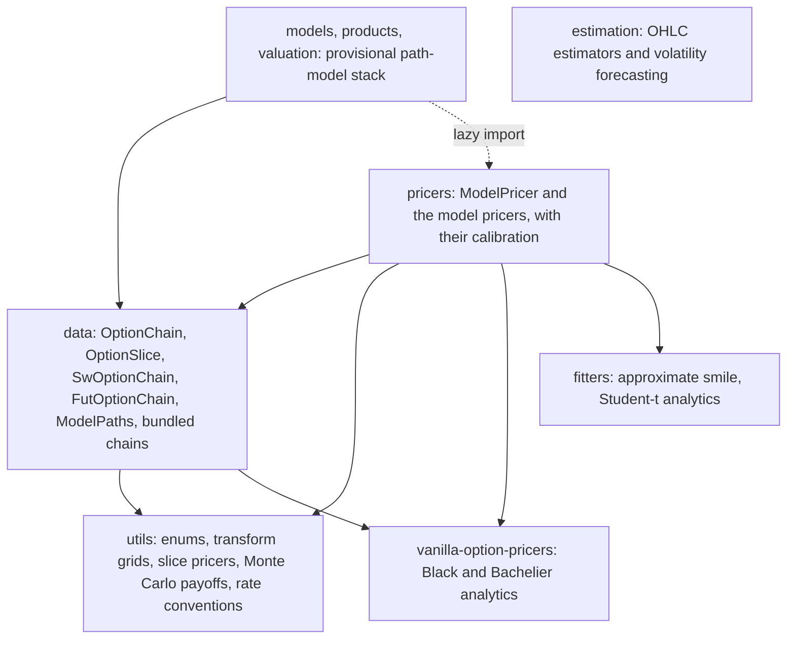

---
myst:
  html_meta:
    description: >-
      The software design of stochvolmodels: the module layers, the ModelPricer interface, the
      analytic transform and Monte Carlo paths, the numba boundary and random-number generators,
      the stability tiers, the dependency surface, and the models that have no article yet.
---

# Software design

*Author: [Artur Sepp](https://github.com/ArturSepp)*

Part of the [stochvolmodels](https://github.com/ArturSepp/StochVolModels) documentation.
Software citation: [CITATION.cff](https://github.com/ArturSepp/StochVolModels/blob/main/CITATION.cff).

This page describes how the package is organised: which layer owns what, the interface every
pricer implements, how a price is computed by transform and by simulation, where compiled numba
code begins, which names are stable, and what the package depends on. The
[notation and conventions](option_chains_and_conventions.md) page defines the units and the
stability tiers; the [API reference](api.md) lists the names by the page that explains them.

## Layers

In words: arrows point from a layer to the layers it imports. The utilities import nothing else
from the package. The data containers use the utilities and delegate Black-Scholes and Bachelier
analytics to `vanilla-option-pricers`. The pricers build on both, and each pricer carries its own
calibration method; there is no separate calibration package. The provisional path-model stack
shares only the containers with the pricers and imports the log-normal SV kernel lazily, so
importing it compiles no numba code. The estimation suite stands alone.

| Layer | Modules | Role |
|---|---|---|
| Utilities | `utils/config.py`, `funcs.py`, `mgf_pricer.py`, `mc_payoffs.py`, `var_swap_pricer.py`, `rate_core.py`, `plots.py` | `OptionType` and `VariableType`; time grids and seeding; transform grids and Fourier slice pricers; Monte Carlo payoffs; the model-free variance-swap strike; rate conventions; plotting helpers |
| Data | `data/option_chain.py`, `model_paths.py`, `sample_option_chains.py`, `fetch_option_chain.py` | Option-chain containers per maturity, the validated path payload, the bundled chains, optional loaders from data providers |
| Pricers | `pricers/model_pricer.py`, `logsv_pricer.py`, `logsv/`, `heston_pricer.py`, `hawkes_jd_pricer.py`, `gmm_pricer.py`, `tdist_pricer.py`, `regime_switch_logsv_pricer.py`, `rough_logsv/`, `factor_hjm/` | The pricer interface and the models; the affine expansion and moment equations of the log-normal SV model |
| Fitters | `fitters/logsv_smile.py`, `tdist.py`, `adapters/oca.py` | The [approximate smile fitter](logsv_smile_fitter.md), Student-t analytics, an adapter from OptionChainAnalytics |
| Path models | `models/`, `products/`, `valuation.py` | Protocols for path, transform and terminal models; payoffs; path valuation with explicit measure and weights |
| Estimation | `estimation/` | OHLC variance estimators, realized-volatility targets, forecasting models and walk-forward evaluation |

Two couplings cross this picture: the log-normal SV parameters import the rough-kernel module to
approximate kernels when $H < 1/2$, and the regime-switching pricer imports the regime models of
the provisional stack. `pde_solvers/` is a private staging directory: it is ignored by Git and
excluded from the wheel and the source distribution.

## The pricer interface

`ModelPricer` (`pricers/model_pricer.py`) has one abstract method, `price_chain(option_chain,
params)`, which returns option prices slice by slice. Everything else is built on it:

- `compute_chain_prices_with_vols` and `compute_model_ivols_for_chain` invert the prices to
  Black-Scholes implied volatilities through the chain;
- `price_slice` and `price_vanilla` wrap one maturity or one option in a chain;
- the `plot_*` methods draw model smiles against quotes or Monte Carlo.

`model_mc_price_chain`, `simulate_terminal_values`, `simulate_vol_paths` and
`calibrate_model_params_to_chain` raise `NotImplementedError` unless a pricer implements them;
`compute_mc_chain_implied_vols` turns Monte Carlo prices and standard errors into implied
volatilities with 95% bounds. Parameters are dataclasses deriving from `ModelParams`.
`validate_optimization_result` raises `CalibrationError` when an optimizer fails or returns values
outside its bounds.

| Pricer | Analytic prices | Monte Carlo | Calibration |
|---|---|---|---|
| `LogSVPricer` | Affine expansion of the MGF, Fourier inversion | Numba simulation; fixed random numbers; rough extension | Analytic, Monte Carlo and rough engines, validated |
| `HestonPricer` | Closed-form MGF, Fourier inversion | Numba simulation | Five parameters with the Feller constraint, validated |
| `HawkesJDPricer` | Riccati equations of the MGF, Fourier inversion | NumPy simulation | Eight parameters; the optimizer result is not validated |
| `GmmPricer`, `TdistPricer` | Closed-form mixtures and Student-t prices | None | Per maturity, validated |
| `RegimeSwitchLogSVPricer` | Regime-switching MGF, Fourier inversion | NumPy simulation | None |
| `RateLogSVPricer`, `RateFutLogSVPricer` | Double-exponential quadrature of the drift-frozen MGF; they return normal volatilities | Factor simulation | None |

## Analytic and Monte Carlo paths

A transform price follows the same steps in every model, shown here for the log-normal SV model:

1. A volatility scale sets the transform grid, $\Phi = -1/2 + i p$ under the money-market-account
   measure or $1/2 + i p$ under the inverse measure, with $p$ on a uniform grid; calibration fixes
   one scale so that the grid does not move with the parameters.
2. The MGF is computed on the grid maturity by maturity, carrying the solution from one maturity
   to the next; for the log-normal SV model the coefficients of the affine expansion come from
   `scipy.integrate.solve_ivp` point by point, or from compiled analytic solutions.
3. `vanilla_slice_pricer_with_mgf_grid` integrates the payoff transform against the MGF with
   Simpson weights; `slice_qvar_pricer_with_a_grid` does the same for options on quadratic
   variance.
4. `OptionChain.compute_model_ivols_from_chain_data` inverts the prices with
   `vanilla-option-pricers`.

A Monte Carlo price simulates the terminal log-price, volatility and quadratic variance from one
maturity to the next and passes them to `compute_mc_vars_payoff`, which re-centres the simulated
prices on the forward, values calls, puts, inverse options and options on quadratic variance, and
returns means and standard errors. The provisional stack instead simulates whole paths into a
`ModelPaths` object and values them with `stochvolmodels.valuation.value_paths`.

## The numba boundary

The transform grids, slice pricers, Monte Carlo payoffs, the Heston and log-normal SV simulators,
the analytic expansion solutions, the mixture pricers and the rough-kernel matrix exponentials are
compiled with numba. Compilation happens on first use, not on import, and is not cached (except in
the rough kernel), so the first price of a session takes seconds (see
[numerical accuracy and performance](numerical_accuracy_and_performance.md)). The adaptive ODE
solves of the affine expansion and of the Hawkes model stay in Python, since `solve_ivp` cannot be
compiled.

`OptionChain` stores its per-maturity strikes, types and quotes as `numba.typed.List` of arrays, so
that a chain passes into compiled code without conversion.

Simulators draw from different generators, and a seed must reach the right one:

| Generator | Simulators | Seed with |
|---|---|---|
| Numba's internal generator | `LogSVPricer.model_mc_price_chain` and `simulate_terminal_values`; `HestonPricer` Monte Carlo | `stochvolmodels.utils.funcs.set_seed` |
| NumPy's global generator | `LogSVPricer.simulate_vol_paths`; `HawkesJDPricer` Monte Carlo; factor HJM simulators, which reseed it themselves | `numpy.random.seed` |
| A local generator from a seed argument | Fixed-random chain valuation and calibration; the rough extension; `LogSvModel.simulate_paths`; the regime-switching and TGARCH simulators | the function's `seed` |

Importing the package changes no generator state; a test enforces it.

## Stability tiers and exports

The package root resolves names lazily: `import stochvolmodels` loads almost nothing, and each name
is imported on first access. `__all__` holds the stable names; advanced and compatibility names are
importable from the root outside `__all__`; provisional and experimental surfaces are reached by
direct module imports. The tiers are defined in
[notation and conventions](option_chains_and_conventions.md#stability-tiers).

Contract tests fix the surface: `__all__` equals the recorded stable list, every stable name has a
docstring and appears in the API reference, the re-exports of `vanilla-option-pricers` are the same
objects, the historical root names keep their identity, a fresh import of the package loads no
numerical or plotting module, and the provisional protocols import neither numba nor pandas.

## Dependency surface

The core depends on `vanilla-option-pricers`, numba, NumPy, SciPy, pandas, matplotlib and seaborn,
and supports Python 3.10 to 3.14. Optional extras add the research stack (`qis` and
OptionChainAnalytics, used by the paper directories and the data loaders), plotly, scikit-learn and
statsmodels, Jupyter, and the documentation tools. Ruff bans module-level imports of the optional
packages and any import of the sibling packages of the author's other libraries;
`scripts/check_dependency_boundaries.py` checks that no provider package enters the core or test
requirements, and a test checks that importing the package loads none of them. The data loaders and
the OptionChainAnalytics adapter import their providers inside functions or behind `ImportError`
guards.

## Models without an article

These surfaces are in the package and tested, but no public paper maps to them yet, so they have
no article; the [API reference](api.md#provisional-and-experimental-surfaces) lists them.

| Surface | Tier | Modules | Entry points |
|---|---|---|---|
| Regime-switching log-normal SV: two regimes with equilibrium risk premia and transition jumps | Provisional | `models/regime_logsv.py`, `models/regime_logsv_simulation.py`, `pricers/regime_switch_logsv_pricer.py` | `RegimeSwitchLogSvParams`, `solve_regime_switch_equilibrium`, `RegimeSwitchLogSVPricer` |
| Rough log-normal SV: Hurst exponent below 1/2 by a multi-exponential kernel, Monte Carlo only | Experimental | `pricers/rough_logsv/` | `LogSvParams(H=...)`, `approximate_kernel`, `LogSVPricer.model_mc_price_chain(use_rough_mc=True)`; see [Monte Carlo simulation](monte_carlo_simulation.md#the-rough-extension) |
| TGARCH: a discrete threshold-volatility recursion, not a discretisation of the log-normal SV model | Provisional | `models/tgarch.py` | `TgarchParams`, `TgarchModel.simulate_paths` |
| Inverse-gamma normal terminal law: one maturity, a normal variance-mean mixture | Provisional | `models/inverse_gamma_normal.py` | `InverseGammaNormalTerminalModel` |
| Estimation suite: OHLC variance estimators, realized-volatility targets, forecasting models | Documented with the provisional surfaces | `estimation/` | `estimate_ohlc_var`, `fit_volatility_forecaster`, `walk_forward_volatility_forecast` |

## Settings and paths

`stochvolmodels.local_path` reads an optional `settings.yaml` next to the package with two keys,
`RESOURCE_PATH` and `OUTPUT_PATH`; without it, a source checkout uses its `resources/` and `outputs/`
directories. `settings.yaml.example` is the template; the settings file itself is machine-local,
ignored by Git and kept out of every distribution. Only the plotting helpers and the data loaders
use these paths.

## See also

- [Notation and conventions](option_chains_and_conventions.md)
- [API reference](api.md)
- [Testing and coverage](testing_and_coverage.md)
- [Numerical accuracy and performance](numerical_accuracy_and_performance.md)
