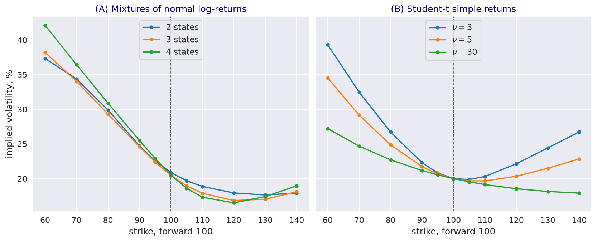

---
myst:
  html_meta:
    description: >-
      Terminal-distribution smile models in stochvolmodels: a mixture of normal log-returns and a
      Student-t simple return floored at zero, their closed-form prices and martingale conditions,
      the smiles they can produce, per-slice calibration, and why they have no term structure.
---

# Gaussian-mixture and Student-t smiles

*Author: [Artur Sepp](https://github.com/ArturSepp)*

Implemented in [stochvolmodels](https://github.com/ArturSepp/StochVolModels).
Software citation: [CITATION.cff](https://github.com/ArturSepp/StochVolModels/blob/main/CITATION.cff).

A terminal-distribution model specifies the law of the price at one maturity directly, without
dynamics. Its option prices are closed-form expectations under that law, so it fits one smile
quickly and gives a density consistent with it. The package has two: a mixture of normal
distributions of the log-return, and a Student-t distribution of the simple return, floored at zero.
This article explains both, the smiles they can produce, and what they cannot do.

```{note}
No publication of the author maps to these models; the article rests on the literature cited
below and on the package's code.
```

## Overview

Each model has a few parameters per maturity and one constraint, that the expected price equals
the forward. A mixture of normal log-returns is a weighted sum of Black-Scholes worlds, so its price
is a weighted sum of Black prices (Ritchey, 1990); with states of different means and volatilities
it produces skews and smiles of either sign. The Student-t model keeps a fixed shape of the
distribution and controls its tails by the degrees of freedom. Neither model has dynamics: the
parameters of one maturity say nothing about another, and fitting several maturities gives
unrelated sets of parameters.

## Inputs, notation, and assumptions

| Symbol | Code | Meaning |
|---|---|---|
| $w_i$, $\mu_i$, $\sigma_i$ | `GmmParams.gmm_weights`, `gmm_mus`, `gmm_vols` | Weight, annualised drift and volatility of mixture state $i$ |
| $\mu$, $\sigma$, $\nu$ | `TdistParams.drift`, `vol`, `nu` | Drift, volatility of the simple return and degrees of freedom of the Student-t |
| $T$ | `ttm` of either | The single maturity the parameters belong to |

Rates are zero in the examples, the forward is $F = 100$, and the maturity is six months.

## Methodology

### Mixture of normal log-returns

The log-return $X = \ln (S_T / F)$ has the density $\sum_i w_i n(x; \mu_i T, \sigma_i^2 T)$ with
weights summing to one. A call is the weighted sum of Black calls on shifted forwards,

$$
C(K) = \sum_i w_i \mathrm{Black}\left( F_i, K, T, \sigma_i \right) , \qquad F_i = F e^{(\mu_i + \sigma_i^2 / 2) T} ,
$$

and the price is a martingale if $\sum_i w_i e^{(\mu_i + \sigma_i^2 / 2) T} = 1$. Brigo and Mercurio
(2002) give local-volatility dynamics whose marginal laws are such mixtures. Every moment of the
price is finite, so the implied variance grows less than linearly in log-strike in both wings
(Lee, 2004).

### Student-t simple return

The price is $S_T = F \max(1 + \mu T + X, 0)$, where $X$ has a Student-t law with $\nu > 2$ degrees
of freedom, scaled so that its variance is $\sigma^2 T$. The drift $\mu$ is solved so that
$E[S_T] = F$. Calls and puts are closed-form in the Student-t distribution function and its
partial mean; the floor puts a mass at zero price with probability
$P(X \le -(1 + \mu T))$. Because the return, not the log-return, has the Student-t law, the
expected price is finite; the exponential of a Student-t variable has no finite mean, a difficulty
that log-Student-t pricing has to address (Cassidy, Hamp and Ouyed, 2010). Moments of the price exist
only up to order $\nu$, so the right wing of the smile rises with a slope set by $\nu$
(Lee, 2004). Student-t laws describe the fat tails of stock returns (Blattberg and Gonedes, 1974).

### Calibration

`GmmPricer.calibrate_model_params_to_chain` fits each maturity separately, by sequential least
squares on implied volatilities weighted by vegas, with the two equality constraints on the
weights and the forward; the default has four states, and each slice starts from the previous fit.
`TdistPricer.calibrate_model_params_to_chain` fits $\sigma$ and $\nu$ per maturity and solves the
drift at every trial. Both return a dictionary of parameters by slice.

## Worked example

Every block below is an excerpt of
[`examples/docs/terminal_distribution_models.py`](../examples/docs/terminal_distribution_models.py),
which asserts every number quoted here. A mixture is set by weights, volatilities and log-mean
shifts; one common constant in the drifts makes it a martingale:

```python
def gmm_params(weights, vols, shifts, ttm: float = TTM) -> svm.GmmParams:
    """A mixture of normal log-returns; a common constant in the drifts matches the forward."""
    w, s, m = (np.asarray(v, dtype=float) for v in (weights, vols, shifts))
    c = -np.log(np.sum(w * np.exp(m * ttm))) / ttm
    return svm.GmmParams(gmm_weights=w, gmm_mus=m + c - 0.5 * s ** 2, gmm_vols=s, ttm=ttm)
```

The Student-t drift is solved by the package:

```python
def tdist_params(vol: float, nu: float, ttm: float = TTM) -> svm.TdistParams:
    """A Student-t simple return floored at zero; the drift is implied so that E[S_T] = F."""
    drift = svm.imply_drift_tdist(rf_rate=0.0, vol=vol, nu=nu, ttm=ttm)
    return svm.TdistParams(drift=drift, vol=vol, nu=nu, ttm=ttm)
```

**Closed forms.** For mixtures of two, three and four states and Student-t laws with $\nu$ of 3, 5
and 30, the closed-form prices at eleven strikes from 60 to 140 agree with numerical integration of
the densities to $10^{-12}$, and a call struck at zero is worth the forward.

**Mixture smiles.** The example mixtures add states with lower means and higher volatilities. The
log-return then has skewness of -1.60, -1.82 and -2.56 and excess kurtosis of 3.97, 5.32 and 10.40
for two, three and four states. The implied volatility at a strike of 60 rises from 37.32% to
38.20% and 42.11%, with 20.88%, 20.47% and 20.51% at the forward; the smile reaches its minimum of
17.64%, 16.84% and 16.51% above the forward and rises again to 17.92%, 18.10% and 18.95% at 140.

**Student-t smiles.** With $\sigma$ chosen so that the implied volatility at the forward is 20%,
0.2518, 0.2170 and 0.2016 for $\nu$ of 3, 5 and 30, small $\nu$ adds curvature to both wings: from
39.31% at 60 to 26.73% at 140 for $\nu = 3$, and from 34.52% to 22.84% for $\nu = 5$. For
$\nu = 30$ the law is close to normal simple returns and the smile falls across all strikes, from
27.21% to 17.91%. The probability of a zero price is 0.12% for $\nu = 3$ and 0.019% for $\nu = 5$.

[](images/terminal_distribution_smiles.png)

*Synthetic teaching exhibit. Six-month Black implied volatilities against strike, forward 100: (A)
mixtures of two, three and four normal log-returns; (B) Student-t simple returns with $\nu$ of 3, 5
and 30, each with a 20% volatility at the forward.*

**One maturity only.** The four-state mixture of six months, priced at three months, values a
call struck at zero at 0.152 below the forward, and at one year 1.063 above it; the Student-t law
with $\nu = 5$ misses by 0.0016 and 0.0161. The constraint that makes each model a martingale
holds only at the maturity it was solved for.

**Fits to the S&P 500 ETF chain.** Fitted slice by slice to the bundled chain of 15 July 2022, four
normal states give root-mean-square errors below 30 bp against mid volatilities at two weeks,
one, two and six months. The exact errors vary because constrained optimization can reach
different local optima. The Student-t law, whose skew is fixed by its two parameters, misses by
231.4, 273.2, 294.2 and 314.5 bp.

## Implementation in stochvolmodels

| Name | Role |
|---|---|
| `GmmParams` | States of the mixture; `compute_pdf` and `compute_state_pdfs` give the density of the log-return |
| `GmmPricer` | Closed-form prices; `calibrate_model_params_to_chain` and `calibrate_model_params_to_chain_slice`, with `n_mixtures` |
| `TdistParams` | Drift, volatility, degrees of freedom and maturity of the Student-t law |
| `TdistPricer` | Closed-form prices; per-slice calibration of `vol` and `nu` |
| `imply_drift_tdist`, `pdf_tdist`, `cdf_tdist` | Drift of the martingale condition, density and distribution function (compatibility tier) |

The provisional terminal models `GmmTerminalModel` and `TdistTerminalModel` wrap the same laws and
validate the martingale condition for a slice (see
[provisional surfaces](api.md#provisional-and-experimental-surfaces)). Neither pricer has a Monte
Carlo engine: `model_mc_price_chain` raises. Run the example from a checkout with
`python examples/docs/terminal_distribution_models.py`.

## Interpretation and limitations

- **No term structure.** Each set of parameters belongs to one maturity; the fits of different
  maturities are unrelated and cannot price a forward-starting or path-dependent payoff.
- **The mixture fit is not convex.** Its states can be relabelled and its objective has several
  minima; the result depends on the starting point, and extra states may receive zero weight.
- **The Student-t law is symmetric in the return.** Its skew in Black volatility comes from
  modelling the simple rather than the log-return, and from the floor at zero; with only $\sigma$
  and $\nu$ free it cannot fit an equity skew.
- **Mass at zero.** The Student-t price is zero with positive probability, which makes the implied
  volatility of far out-of-the-money puts rise steeply.

## See also

- [The Heston model as a benchmark](heston_model.md)
- [Log-normal stochastic volatility model with quadratic drift](logsv_model.md)
- [Calibration to implied volatilities](calibration.md)

## References

- Blattberg, R. C. and Gonedes, N. J. (1974). A comparison of the stable and Student distributions
  as statistical models for stock prices. *The Journal of Business* 47(2), 244.
  [DOI 10.1086/295634](https://doi.org/10.1086/295634).
- Brigo, D. and Mercurio, F. (2002). Lognormal-mixture dynamics and calibration to market volatility
  smiles. *International Journal of Theoretical and Applied Finance* 5(4), 427-446.
  [DOI 10.1142/S0219024902001511](https://doi.org/10.1142/S0219024902001511).
- Cassidy, D. T., Hamp, M. J. and Ouyed, R. (2010). Pricing European options with a log Student's
  t-distribution: a Gosset formula. *Physica A* 389(24), 5736-5748.
  [DOI 10.1016/j.physa.2010.08.037](https://doi.org/10.1016/j.physa.2010.08.037).
- Lee, R. W. (2004). The moment formula for implied volatility at extreme strikes. *Mathematical
  Finance* 14(3), 469-480. [DOI 10.1111/j.0960-1627.2004.00200.x](https://doi.org/10.1111/j.0960-1627.2004.00200.x).
- Ritchey, R. J. (1990). Call option valuation for discrete normal mixtures. *Journal of Financial
  Research* 13(4), 285-296. [DOI 10.1111/j.1475-6803.1990.tb00633.x](https://doi.org/10.1111/j.1475-6803.1990.tb00633.x).
- [stochvolmodels software citation](https://github.com/ArturSepp/StochVolModels/blob/main/CITATION.cff).
